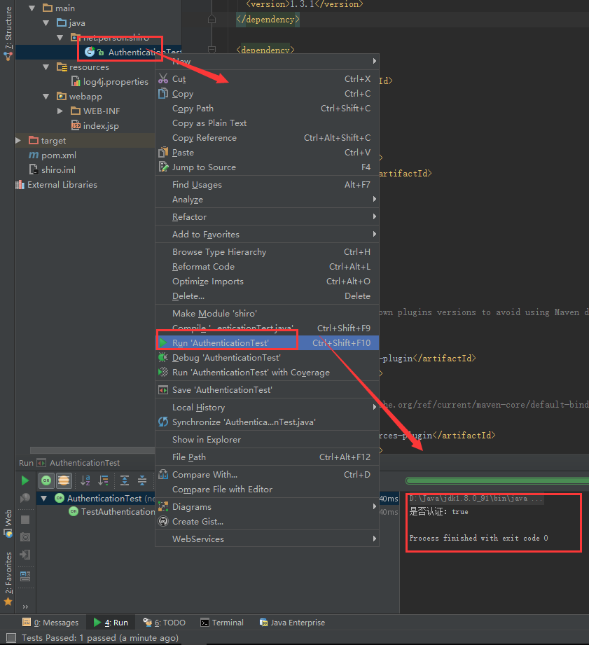

[](https://www.imooc.com/video/16958)


总操作流程：
- 1、[pom.xml引用包](#java-01)
- 2、[创建文件](#java-02)
- 3、[测试](#java-03)

***

## pom.xml引用包 <a name="java-01" href="#" >:house:</a>

<details>
<summary>代码</summary>

```xml
    <dependency>
      <groupId>junit</groupId>
      <artifactId>junit</artifactId>
      <version>4.12</version>
    </dependency>

    <dependency>
      <groupId>org.apache.shiro</groupId>
      <artifactId>shiro-core</artifactId>
      <version>1.3.1</version>
    </dependency>

    <dependency>
      <groupId>log4j</groupId>
      <artifactId>log4j</artifactId>
      <version>1.2.17</version>
    </dependency>

    <dependency>
      <groupId>org.slf4j</groupId>
      <artifactId>slf4j-log4j12</artifactId>
      <version>1.7.25</version>
      <scope>test</scope>
    </dependency>

    <dependency>
      <groupId>mysql</groupId>
      <artifactId>mysql-connector-java</artifactId>
      <version>6.0.5</version>
    </dependency>

    <dependency>
      <groupId>com.alibaba</groupId>
      <artifactId>druid</artifactId>
      <version>1.1.9</version>
    </dependency>

```

</details>

## 创建文件 <a name="java-02" href="#" >:house:</a>
- CustomRealm的java文件

<details>
<summary>代码</summary>

```java
import org.apache.shiro.authc.AuthenticationException;
import org.apache.shiro.authc.AuthenticationInfo;
import org.apache.shiro.authc.AuthenticationToken;
import org.apache.shiro.authc.SimpleAuthenticationInfo;
import org.apache.shiro.authz.AuthorizationInfo;
import org.apache.shiro.authz.SimpleAuthorizationInfo;
import org.apache.shiro.realm.AuthorizingRealm;
import org.apache.shiro.subject.PrincipalCollection;

import java.util.HashMap;
import java.util.HashSet;
import java.util.Map;
import java.util.Set;

/**
 * Created by admin on 2018/6/20.
 */
public class CustomRealm extends AuthorizingRealm {
    Map<String,String> userMap=new HashMap<>(16);
    {
        userMap.put("Mark","123456");
        super.setName("customRealm");
    }
    /**
     * 做授权
     * @param principalCollection
     * @return
     */
    @Override
    protected AuthorizationInfo doGetAuthorizationInfo(PrincipalCollection principalCollection) {
        String userName = (String) principalCollection.getPrimaryPrincipal();
        //从数据库或者缓存中获取角色数据
        Set<String> roles = getRolesByUserName(userName);

        Set<String> permissions=getPermissionsByUserName(userName);

        SimpleAuthorizationInfo simpleAuthorizationInfo=new SimpleAuthorizationInfo();
        simpleAuthorizationInfo.setStringPermissions(permissions);
        simpleAuthorizationInfo.setRoles(roles);
        return simpleAuthorizationInfo;
    }

    private Set<String> getRolesByUserName(String userName) {
        Set<String> sets=new HashSet<>();
        sets.add("admin");
        sets.add("user");
        return sets;
    }

    private Set<String> getPermissionsByUserName(String userName) {
        Set<String> sets=new HashSet<>();
        sets.add("user:delete");
        sets.add("user:add");
        return sets;
    }

    /**
     * 做认证
     * @param authenticationToken
     * @return
     * @throws AuthenticationException
     */
    @Override
    protected AuthenticationInfo doGetAuthenticationInfo(AuthenticationToken authenticationToken) throws AuthenticationException {
        //1、从主体传过来的认证信息中，获得用户名
        String userName=(String)authenticationToken.getPrincipal();

        //2、通过用户名到数据库中获取凭证
        String password=getPasswordByUserName(userName);
        if(password==null){
            return null;
        }
        SimpleAuthenticationInfo authenticationInfo=new SimpleAuthenticationInfo("Mark",password,"customRealm");
        return authenticationInfo;
    }

    /**
     * 模拟数据库查询凭证
     * @param userName
     * @return
     */
    private String getPasswordByUserName(String userName) {

        return userMap.get(userName);
    }
}

```

</details>

- CustomRealmTest的Java文件

<details>
<summary>代码</summary>

```java
import org.apache.shiro.SecurityUtils;
import org.apache.shiro.authc.UsernamePasswordToken;
import org.apache.shiro.mgt.DefaultSecurityManager;
import org.apache.shiro.subject.Subject;
import org.junit.Test;

/**
 * Created by admin on 2018/6/20.
 */
public class CustomRealmTest {
    @Test
    public void TestJdbcRealm(){
        CustomRealm customRealm=new CustomRealm();
        //1、创建SecurityManager环境
        DefaultSecurityManager defaultSecurityManager=new DefaultSecurityManager();
        defaultSecurityManager.setRealm(customRealm);
        //2、主体提交认证请求
        SecurityUtils.setSecurityManager(defaultSecurityManager);
        Subject subject = SecurityUtils.getSubject();

        UsernamePasswordToken token = new UsernamePasswordToken("Mark","123456");//用户名，密码
        subject.login(token);
        System.out.println("是否认证："+subject.isAuthenticated());
        subject.checkRole("admin");
        subject.checkPermissions("user:add","user:delete");
    }

}

```

</details>

- 日志文件log4j.properties

<details>
<summary>代码</summary>

```js
# Configure logging for testing: optionally with log file
log4j.rootLogger=WARN, stdout
# log4j.rootLogger=WARN, stdout, logfile

log4j.appender.stdout=org.apache.log4j.ConsoleAppender
log4j.appender.stdout.layout=org.apache.log4j.PatternLayout
log4j.appender.stdout.layout.ConversionPattern=%d %p [%c] - %m%n

log4j.appender.logfile=org.apache.log4j.FileAppender
log4j.appender.logfile.File=target/spring.log
log4j.appender.logfile.layout=org.apache.log4j.PatternLayout
log4j.appender.logfile.layout.ConversionPattern=%d %p [%c] - %m%n
```

</details>

## 测试 <a name="java-03" href="#" >:house:</a>

