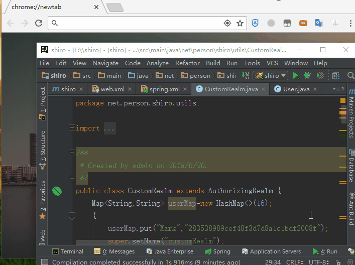

[](https://www.imooc.com/video/16959/0)


总操作流程：
- 1、[pom.xml引用包](#java-01)
- 2、[创建文件](#java-02)
- 3、[测试](#java-03)

[](https://github.com/lidekai/shiro.git)

***

- 代码结构


- 项目目录


## pom.xml引用包 <a name="java-01" href="#" ></a>

<details>
<summary>代码</summary>

```xml
 <properties>
    <project.build.sourceEncoding>UTF-8</project.build.sourceEncoding>
    <junit.version>4.11</junit.version>
    <spring.version>5.0.6.RELEASE</spring.version>
    <shiro.version>1.3.2</shiro.version>
  </properties>

  <dependencies>
    <!--====================================junit==========================================-->
    <dependency>
      <groupId>junit</groupId>
      <artifactId>junit</artifactId>
      <version>${junit.version}</version>
      <scope>test</scope>
    </dependency>
    <!--====================================spring==========================================-->
    <dependency>
      <groupId>org.springframework</groupId>
      <artifactId>spring-context</artifactId>
      <version>${spring.version}</version>
    </dependency>

    <dependency>
      <groupId>org.springframework</groupId>
      <artifactId>spring-webmvc</artifactId>
      <version>${spring.version}</version>
    </dependency>

    <!--====================================shiro==========================================-->
    <dependency>
      <groupId>org.apache.shiro</groupId>
      <artifactId>shiro-core</artifactId>
      <version>${shiro.version}</version>
    </dependency>

    <dependency>
      <groupId>org.apache.shiro</groupId>
      <artifactId>shiro-spring</artifactId>
      <version>${shiro.version}</version>
    </dependency>

    <dependency>
      <groupId>org.apache.shiro</groupId>
      <artifactId>shiro-web</artifactId>
      <version>${shiro.version}</version>
    </dependency>

  </dependencies>
```

</details>

## 创建文件 <a name="java-02" href="#" ></a>
### 1、login.html

<details>
<summary>代码</summary>

```html
<!DOCTYPE html>
<html lang="en">
<head>
    <meta charset="UTF-8">
    <title>Title</title>
</head>
<body>
        <form action="subLogin" method="post">
            用户名：<input type="text" name="username"/><br>
            密码：  <input type="password" name="password"/><br>
            <input type="submit" value="登陆">
        </form>
</body>
</html>
```

</details>

### 2、web.xml

<details>
<summary>代码</summary>

```xml
<?xml version="1.0" encoding="UTF-8"?>
<web-app xmlns:xsi="http://www.w3.org/2001/XMLSchema-instance"
         xmlns="http://java.sun.com/xml/ns/javaee"
         xsi:schemaLocation="http://java.sun.com/xml/ns/javaee http://java.sun.com/xml/ns/javaee/web-app_3_0.xsd"
         version="3.0">
  <filter>
    <filter-name>shiroFilter</filter-name>
    <filter-class>org.springframework.web.filter.DelegatingFilterProxy</filter-class>
  </filter>
  <filter-mapping>
    <filter-name>shiroFilter</filter-name>
    <url-pattern>/*</url-pattern>
  </filter-mapping>

  <context-param>
    <param-name>contextConfigLocation</param-name>
    <param-value>classpath*:spring/spring.xml</param-value>
  </context-param>
  <listener>
    <listener-class>org.springframework.web.context.ContextLoaderListener</listener-class>
  </listener>

  <servlet>
    <servlet-name>DispatcherServlet</servlet-name>
    <servlet-class>org.springframework.web.servlet.DispatcherServlet</servlet-class>
    <init-param>
      <param-name>contextConfigLocation</param-name>
      <param-value>classpath*:spring/springmvc.xml</param-value>
    </init-param>
    <load-on-startup>1</load-on-startup>
    <async-supported>true</async-supported>
  </servlet>

  <servlet-mapping>
    <servlet-name>DispatcherServlet</servlet-name>
    <url-pattern>/</url-pattern>
  </servlet-mapping>

  <!-- 注册spring提供的针对POST请求的中文乱码问题 -->
  <filter>
    <filter-name>CharacterEncodingFilter</filter-name>
    <filter-class>org.springframework.web.filter.CharacterEncodingFilter</filter-class>
    <init-param>
      <param-name>encoding</param-name>
      <param-value>UTF-8</param-value>
    </init-param>
  </filter>
  <filter-mapping>
    <filter-name>CharacterEncodingFilter</filter-name>
    <url-pattern>/*</url-pattern>
  </filter-mapping>
</web-app>

```

</details>

### 3、spring.xml

<details>
<summary>代码</summary>

```xml
<?xml version="1.0" encoding="UTF-8"?>
<beans xmlns="http://www.springframework.org/schema/beans"
       xmlns:xsi="http://www.w3.org/2001/XMLSchema-instance"
       xsi:schemaLocation="http://www.springframework.org/schema/beans http://www.springframework.org/schema/beans/spring-beans.xsd">
    <bean id="shiroFilter" class="org.apache.shiro.spring.web.ShiroFilterFactoryBean">
        <property name="securityManager" ref="securityManager"/>
        <property name="loginUrl" value="login.html"/>
        <property name="unauthorizedUrl" value="403.html"/>
        <property name="filterChainDefinitions">
            <value>
                /login.html = anon
                /subLogin = anon
                /* = authc
            </value>
        </property>
    </bean>
    <!--创建SecurityManager对象-->
    <bean id="securityManager" class="org.apache.shiro.web.mgt.DefaultWebSecurityManager">
        <property name="realm" ref="realm"/>
    </bean>
    <bean id="realm" class="net.person.shiro.utils.CustomRealm">
        <property name="credentialsMatcher" ref="credentialsMatcher"/>
    </bean>
    <bean id="credentialsMatcher" class="org.apache.shiro.authc.credential.HashedCredentialsMatcher">
        <property name="hashAlgorithmName" value="md5"/>
        <property name="hashIterations" value="1"/>
    </bean>
</beans>
```

</details>

### 4、springmvc.xml

<details>
<summary>代码</summary>

```xml
<?xml version="1.0" encoding="UTF-8"?>
<beans xmlns="http://www.springframework.org/schema/beans"
       xmlns:xsi="http://www.w3.org/2001/XMLSchema-instance"
       xmlns:context="http://www.springframework.org/schema/context"
       xmlns:mvc="http://www.springframework.org/schema/mvc"
       xsi:schemaLocation="http://www.springframework.org/schema/beans
                           http://www.springframework.org/schema/beans/spring-beans.xsd
                           http://www.springframework.org/schema/context
                           http://www.springframework.org/schema/context/spring-context.xsd
                           http://www.springframework.org/schema/mvc
                           http://www.springframework.org/schema/mvc/spring-mvc.xsd">
    <context:component-scan base-package="net.person.shiro.controller"/>
    <mvc:annotation-driven/>
    <mvc:resources mapping="/*" location="/"/>
</beans>
```

</details>

### 5、User

<details>
<summary>代码</summary>

```java
package net.person.shiro.model;

/**
 * Created by admin on 2018/6/20.
 */
public class User {
    private String userName;
    private  String password;

    public String getUserName() {
        return userName;
    }

    public void setUserName(String userName) {
        this.userName = userName;
    }

    public String getPassword() {
        return password;
    }

    public void setPassword(String password) {
        this.password = password;
    }
}

```

</details>

### 6、UserController

<details>
<summary>代码</summary>

```java
package net.person.shiro.controller;

import net.person.shiro.model.User;
import org.apache.shiro.SecurityUtils;
import org.apache.shiro.authc.AuthenticationException;
import org.apache.shiro.authc.UsernamePasswordToken;
import org.apache.shiro.subject.Subject;
import org.springframework.stereotype.Controller;
import org.springframework.web.bind.annotation.RequestMapping;
import org.springframework.web.bind.annotation.RequestMethod;
import org.springframework.web.bind.annotation.ResponseBody;

/**
 * Created by admin on 2018/6/20.
 */
@Controller
public class UserController {
    @RequestMapping(value="/subLogin",
                    method = RequestMethod.POST,
                    produces = "application/json;charset=utf-8")
    @ResponseBody
    public String subLogin(User user){
        Subject subject= SecurityUtils.getSubject();
        UsernamePasswordToken token=new UsernamePasswordToken(user.getUserName(),user.getPassword());
        try {
            subject.login(token);
        } catch (AuthenticationException e) {
            e.printStackTrace();
        }
        return "登陆成功";
    }
}

```

</details>

### 7、CustomRealm

<details>
<summary>代码</summary>

```java
package net.person.shiro.utils;

import org.apache.shiro.authc.AuthenticationException;
import org.apache.shiro.authc.AuthenticationInfo;
import org.apache.shiro.authc.AuthenticationToken;
import org.apache.shiro.authc.SimpleAuthenticationInfo;
import org.apache.shiro.authz.AuthorizationInfo;
import org.apache.shiro.authz.SimpleAuthorizationInfo;
import org.apache.shiro.crypto.hash.Md5Hash;
import org.apache.shiro.realm.AuthorizingRealm;
import org.apache.shiro.subject.PrincipalCollection;
import org.apache.shiro.util.ByteSource;
import java.util.HashMap;
import java.util.HashSet;
import java.util.Map;
import java.util.Set;

/**
 * Created by admin on 2018/6/20.
 */
public class CustomRealm extends AuthorizingRealm {
    Map<String,String> userMap=new HashMap<>(16);
    {
        userMap.put("Mark","283538989cef48f3d7d8a1c1bdf2008f");
        super.setName("customRealm");
    }
    /**
     * 做授权
     * @param principalCollection
     * @return
     */
    @Override
    protected AuthorizationInfo doGetAuthorizationInfo(PrincipalCollection principalCollection) {
        String userName = (String) principalCollection.getPrimaryPrincipal();
        //从数据库或者缓存中获取角色数据
        Set<String> roles = getRolesByUserName(userName);

        Set<String> permissions=getPermissionsByUserName(userName);

        SimpleAuthorizationInfo simpleAuthorizationInfo=new SimpleAuthorizationInfo();
        simpleAuthorizationInfo.setStringPermissions(permissions);
        simpleAuthorizationInfo.setRoles(roles);
        return simpleAuthorizationInfo;
    }

    private Set<String> getRolesByUserName(String userName) {
        Set<String> sets=new HashSet<>();
        sets.add("admin");
        sets.add("user");
        return sets;
    }

    private Set<String> getPermissionsByUserName(String userName) {
        Set<String> sets=new HashSet<>();
        sets.add("user:delete");
        sets.add("user:add");
        return sets;
    }

    /**
     * 做认证
     * @param authenticationToken
     * @return
     * @throws AuthenticationException
     */
    @Override
    protected AuthenticationInfo doGetAuthenticationInfo(AuthenticationToken authenticationToken) throws AuthenticationException {
        //1、从主体传过来的认证信息中，获得用户名
        String userName=(String)authenticationToken.getPrincipal();

        //2、通过用户名到数据库中获取凭证
        String password=getPasswordByUserName(userName);
        if(password==null){
            return null;
        }
        SimpleAuthenticationInfo authenticationInfo=new SimpleAuthenticationInfo("Mark",password,"customRealm");
        authenticationInfo.setCredentialsSalt(ByteSource.Util.bytes("Mark"));

        return authenticationInfo;
    }

    /**
     * 模拟数据库查询凭证
     * @param userName
     * @return
     */
    private String getPasswordByUserName(String userName) {

        return userMap.get(userName);
    }
/*    public static void main(String[] args){
        Md5Hash md5Hash=new Md5Hash("123456","Mark");
        System.out.println(md5Hash.toString());
    }*/
}

```

</details>

## 测试 <a name="java-03" href="#" ></a>


