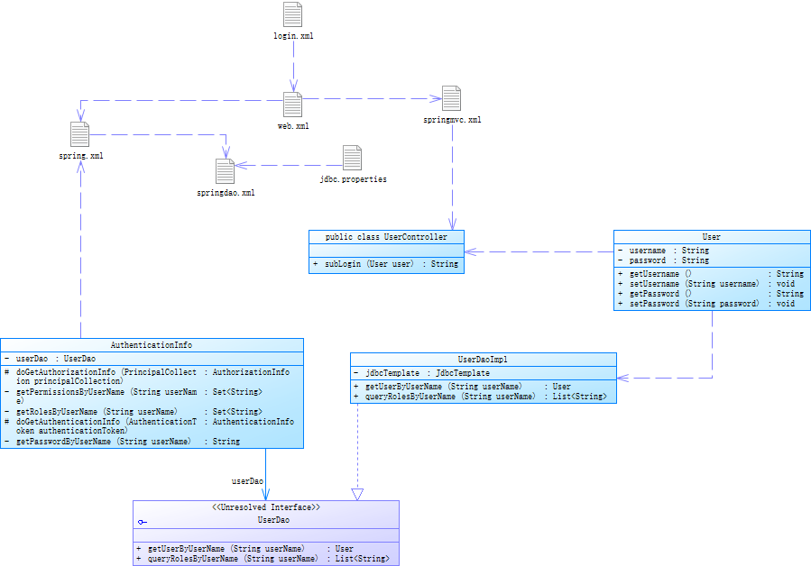

[](https://www.imooc.com/video/16959/0)


总操作流程：
- 1、[pom.xml引用包](#java-01)
- 2、[创建文件](#java-02)
- 3、[测试](#java-03)

[](https://github.com/lidekai/shiro-mysql.git)

***
- 代码结构



## pom.xml引用包 <a name="java-01" href="#" >:house:</a>

<details>
<summary>代码</summary>

```xml
  <properties>
    <project.build.sourceEncoding>UTF-8</project.build.sourceEncoding>
    <junit.version>4.11</junit.version>
    <spring.version>5.0.6.RELEASE</spring.version>
    <shiro.version>1.3.2</shiro.version>
    <mysql.version>5.1.46</mysql.version>
    <dbcp.version>1.4</dbcp.version>
  </properties>

  <dependencies>
      <!--====================================junit==========================================-->
      <dependency>
        <groupId>junit</groupId>
        <artifactId>junit</artifactId>
        <version>${junit.version}</version>
        <scope>test</scope>
      </dependency>
      <!--====================================spring==========================================-->
      <dependency>
        <groupId>org.springframework</groupId>
        <artifactId>spring-context</artifactId>
        <version>${spring.version}</version>
      </dependency>

      <dependency>
        <groupId>org.springframework</groupId>
        <artifactId>spring-webmvc</artifactId>
        <version>${spring.version}</version>
      </dependency>

      <dependency>
        <groupId>org.springframework</groupId>
        <artifactId>spring-jdbc</artifactId>
        <version>${spring.version}</version>
      </dependency>

      <!--====================================shiro==========================================-->
      <dependency>
        <groupId>org.apache.shiro</groupId>
        <artifactId>shiro-core</artifactId>
        <version>${shiro.version}</version>
      </dependency>

      <dependency>
        <groupId>org.apache.shiro</groupId>
        <artifactId>shiro-spring</artifactId>
        <version>${shiro.version}</version>
      </dependency>

      <dependency>
        <groupId>org.apache.shiro</groupId>
        <artifactId>shiro-web</artifactId>
        <version>${shiro.version}</version>
      </dependency>
      <!--====================================mysql==========================================-->
      <dependency>
        <groupId>mysql</groupId>
        <artifactId>mysql-connector-java</artifactId>
        <version>${mysql.version}</version>
      </dependency>
      <!--====================================dbcp==========================================-->
      <dependency>
        <groupId>commons-dbcp</groupId>
        <artifactId>commons-dbcp</artifactId>
        <version>${dbcp.version}</version>
      </dependency>

    </dependencies>
```

</details>

## 创建文件 <a name="java-02" href="#" >:house:</a>
### 1、UserController

<details>
<summary>代码</summary>

```java
@Controller
public class UserController {
    @RequestMapping(value="/subLogin",
                    method = RequestMethod.POST,
                    produces = "application/json;charset=utf-8")
    @ResponseBody
    public String subLogin(User user) throws Exception{
        Subject subject= SecurityUtils.getSubject();
        UsernamePasswordToken token=new UsernamePasswordToken(
                                                                user.getUsername(),
                                                                user.getPassword()
                                                             );
        try {
            subject.login(token);
        } catch (AuthenticationException e) {
            return e.getMessage();
        }
    if(subject.hasRole("admin")){
            return "有admin权限";
        }
        return "无admin权限";
    }
}

```

</details>

### 2、User的model

<details>
<summary>代码</summary>

```java
public class User {
    private String username;
    private  String password;

    public String getUsername() {
        return username;
    }

    public void setUsername(String username) {
        this.username = username;
    }

    public String getPassword() {
        return password;
    }

    public void setPassword(String password) {
        this.password = password;
    }
}

```

</details>

### 3、UserDao的接口

<details>
<summary>代码</summary>

```java
public interface UserDao {
    User getUserByUserName(String userName);

    List<String> queryRolesByUserName(String userName);
}

```

</details>

### 4、UserDaoImpl

<details>
<summary>代码</summary>

```java
Component
public class UserDaoImpl implements UserDao {
    @Resource
    private JdbcTemplate jdbcTemplate;


    public User getUserByUserName(String userName) {
        String sql="select user_name ,password from users where user_name = ?";
        List<User> list = jdbcTemplate.query(sql, new String[]{userName}, new RowMapper<User>() {
            public User mapRow(ResultSet resultSet, int i) throws SQLException {
                User user=new User();
                user.setUsername(resultSet.getString("user_name"));
                user.setPassword(resultSet.getString("password"));
                return user;
            }
        });
        if(CollectionUtils.isEmpty(list)){
            return null;
        }
        return list.get(0);
    }

    public List<String> queryRolesByUserName(String userName) {
        String sql="select role_name from user_roles where user_name = ?";
        return jdbcTemplate.query(sql, new String[]{userName}, new RowMapper<String>() {
            public String mapRow(ResultSet resultSet, int i) throws SQLException {
                return resultSet.getString("role_name");
            }
        });
    }
}

```

</details>

### 6、CustomRealm

<details>
<summary>代码</summary>

```java
public class CustomRealm extends AuthorizingRealm {

    @Resource
    private UserDao userDao;

    /**
     * 做授权
     * @param principalCollection
     * @return
     */
    @Override
    protected AuthorizationInfo doGetAuthorizationInfo(PrincipalCollection principalCollection) {
        String userName = (String) principalCollection.getPrimaryPrincipal();
        //从数据库或者缓存中获取角色数据
        Set<String> roles = getRolesByUserName(userName);

        Set<String> permissions=getPermissionsByUserName(userName);

        SimpleAuthorizationInfo simpleAuthorizationInfo=new SimpleAuthorizationInfo();
        simpleAuthorizationInfo.setStringPermissions(permissions);
        simpleAuthorizationInfo.setRoles(roles);
        return simpleAuthorizationInfo;
    }

    private Set<String> getPermissionsByUserName(String userName) {
        Set<String> sets=new HashSet<String>();
        sets.add("user:delete");
        sets.add("user:add");
        return sets;
    }

    private Set<String> getRolesByUserName(String userName) {
        System.out.println("从数据库中获取授权数据");
        List<String> list = userDao.queryRolesByUserName(userName);
        Set<String> sets=new HashSet<String>(list);
        return sets;
    }


    /**
     * 做认证
     * @param authenticationToken
     * @return
     * @throws AuthenticationException
     */
    @Override
    protected AuthenticationInfo doGetAuthenticationInfo(AuthenticationToken authenticationToken) throws AuthenticationException {
        //1、从主体传过来的认证信息中，获得用户名
        String userName=(String)authenticationToken.getPrincipal();

        //2、通过用户名到数据库中获取凭证
        String password=getPasswordByUserName(userName);
        if(password==null){
            return null;
        }
        SimpleAuthenticationInfo authenticationInfo=new SimpleAuthenticationInfo(userName,password,"customRealm");
        authenticationInfo.setCredentialsSalt(ByteSource.Util.bytes(userName));

        return authenticationInfo;
    }

    /**
     * 模拟数据库查询凭证
     * @param userName
     * @return
     */
    private String getPasswordByUserName(String userName) {
        User user=userDao.getUserByUserName(userName);
        if (user!=null){
            return user.getPassword();
        }
        return null;
    }
/*
    public static void main(String[] args) {
        Md5Hash md5Hash=new Md5Hash("123456","Mark");
        System.out.println(md5Hash.toString());
    }*/
}

```

</details>

### 7、jdbc.properties

<details>
<summary>代码</summary>

```js
#dbcp????????mysql
db.driverLocation=/Users/imooc/mysql-connector-java-5.1.6-bin.jar
db.driverClassName=com.mysql.jdbc.Driver
db.url=jdbc:mysql://localhost:3306/shiro?characterEncoding=utf-8
db.username=root
db.password=123456


db.initialSize = 20
db.maxActive = 50
db.maxIdle = 20
db.minIdle = 10
db.maxWait = 10
db.defaultAutoCommit = true
db.minEvictableIdleTimeMillis = 3600000
```

</details>

### 8、spring.xml

<details>
<summary>代码</summary>

```xml
<?xml version="1.0" encoding="UTF-8"?>
<beans xmlns="http://www.springframework.org/schema/beans"
       xmlns:xsi="http://www.w3.org/2001/XMLSchema-instance"
       xmlns:context="http://www.springframework.org/schema/context"
       xsi:schemaLocation="http://www.springframework.org/schema/beans
                           http://www.springframework.org/schema/beans/spring-beans.xsd
                           http://www.springframework.org/schema/context
                           http://www.springframework.org/schema/context/spring-context.xsd">

    <context:component-scan base-package="net.person.shiro"/>
    <import resource="springdao.xml"/>
    <bean id="shiroFilter" class="org.apache.shiro.spring.web.ShiroFilterFactoryBean">
        <property name="securityManager" ref="securityManager"/>
        <property name="loginUrl" value="login.html"/>
        <property name="unauthorizedUrl" value="403.html"/>
        <property name="filterChainDefinitions">
            <value>
                /login.html = anon
                /subLogin = anon
                /* = authc
            </value>
        </property>
    </bean>
    <!--创建SecurityManager对象-->
    <bean id="securityManager" class="org.apache.shiro.web.mgt.DefaultWebSecurityManager">
        <property name="realm" ref="realm"/>
    </bean>
    <bean id="realm" class="net.person.shiro.utils.CustomRealm">
        <property name="credentialsMatcher" ref="credentialsMatcher"/>
    </bean>
    <bean id="credentialsMatcher" class="org.apache.shiro.authc.credential.HashedCredentialsMatcher">
        <property name="hashAlgorithmName" value="MD5"/>
        <property name="hashIterations" value="1"/>
    </bean>
</beans>
```

</details>

### 9、springdao.xml

<details>
<summary>代码</summary>

```xml
<?xml version="1.0" encoding="UTF-8"?>
<beans xmlns="http://www.springframework.org/schema/beans"
       xmlns:xsi="http://www.w3.org/2001/XMLSchema-instance"
       xsi:schemaLocation="http://www.springframework.org/schema/beans http://www.springframework.org/schema/beans/spring-beans.xsd">

    <bean id="propertyConfigurer"
          class="org.springframework.beans.factory.config.PropertyPlaceholderConfigurer">
        <property name="order" value="2"/>
        <property name="ignoreUnresolvablePlaceholders" value="true"/>
        <property name="locations">
            <list>
                <value>classpath:properties/jdbc.properties</value>
            </list>
        </property>
        <property name="fileEncoding" value="utf-8"/>
    </bean>

    <!-- =========================配置数据源 ，使用的dbcp的数据库========================= -->
    <bean id="dataSource" class="org.apache.commons.dbcp.BasicDataSource" destroy-method="close">
        <property name="driverClassName" value="${db.driverClassName}"/>
        <property name="url" value="${db.url}"/>
        <property name="username" value="${db.username}"/>
        <property name="password" value="${db.password}"/>
        <!-- 连接池启动时的初始值 -->
        <property name="initialSize" value="${db.initialSize}"/>
        <!-- 连接池的最大值 -->
        <property name="maxActive" value="${db.maxActive}"/>
        <!-- 最大空闲值.当经过一个高峰时间后，连接池可以慢慢将已经用不到的连接慢慢释放一部分，一直减少到maxIdle为止 -->
        <property name="maxIdle" value="${db.maxIdle}"/>
        <!-- 最小空闲值.当空闲的连接数少于阀值时，连接池就会预申请去一些连接，以免洪峰来时来不及申请 -->
        <property name="minIdle" value="${db.minIdle}"/>
        <!-- 最大建立连接等待时间。如果超过此时间将接到异常。设为－1表示无限制 -->
        <property name="maxWait" value="${db.maxWait}"/>
        <!--#给出一条简单的sql语句进行验证 -->
        <!--<property name="validationQuery" value="select getdate()" />-->
        <property name="defaultAutoCommit" value="${db.defaultAutoCommit}"/>
        <!-- 回收被遗弃的（一般是忘了释放的）数据库连接到连接池中 -->
        <!--<property name="removeAbandoned" value="true" />-->
        <!-- 数据库连接过多长时间不用将被视为被遗弃而收回连接池中 -->
        <!--<property name="removeAbandonedTimeout" value="120" />-->
        <!-- #连接的超时时间，默认为半小时。 -->
        <property name="minEvictableIdleTimeMillis" value="${db.minEvictableIdleTimeMillis}"/>

        <!--# 失效检查线程运行时间间隔，要小于MySQL默认-->
        <property name="timeBetweenEvictionRunsMillis" value="40000"/>
        <!--# 检查连接是否有效-->
        <property name="testWhileIdle" value="true"/>
        <!--# 检查连接有效性的SQL语句-->
        <property name="validationQuery" value="SELECT 1 FROM dual"/>
    </bean>

    <bean id="jdbcTemplate" class="org.springframework.jdbc.core.JdbcTemplate">
        <property name="dataSource" ref="dataSource"/>
    </bean>
</beans>
```

</details>

### 10、springmvc.xml

<details>
<summary>代码</summary>

```xml
<?xml version="1.0" encoding="UTF-8"?>
<beans xmlns="http://www.springframework.org/schema/beans"
       xmlns:xsi="http://www.w3.org/2001/XMLSchema-instance"
       xmlns:context="http://www.springframework.org/schema/context"
       xmlns:mvc="http://www.springframework.org/schema/mvc"
       xsi:schemaLocation="http://www.springframework.org/schema/beans
                           http://www.springframework.org/schema/beans/spring-beans.xsd
                           http://www.springframework.org/schema/context
                           http://www.springframework.org/schema/context/spring-context.xsd
                           http://www.springframework.org/schema/mvc
                           http://www.springframework.org/schema/mvc/spring-mvc.xsd">
    <context:component-scan base-package="net.person.shiro.controller"/>
    <mvc:annotation-driven/>
    <mvc:resources mapping="/*" location="/"/>
</beans>
```

</details>

### 11、login.html

<details>
<summary>代码</summary>

```html
<!DOCTYPE html>
<html lang="en">
<head>
    <meta charset="UTF-8">
    <title>Title</title>
</head>
<body>
        <form action="subLogin" method="post">
            用户名：<input type="text" name="username"/><br>
            密码：  <input type="password" name="password"/><br>
            <input type="submit" value="登陆">
        </form>
</body>
</html>
```

</details>

### 12、web.xml

<details>
<summary>代码</summary>

```xml
<?xml version="1.0" encoding="UTF-8"?>
<web-app xmlns:xsi="http://www.w3.org/2001/XMLSchema-instance"
         xmlns="http://java.sun.com/xml/ns/javaee"
         xsi:schemaLocation="http://java.sun.com/xml/ns/javaee http://java.sun.com/xml/ns/javaee/web-app_3_0.xsd"
         version="3.0">
  <filter>
    <filter-name>shiroFilter</filter-name>
    <filter-class>org.springframework.web.filter.DelegatingFilterProxy</filter-class>
  </filter>
  <filter-mapping>
    <filter-name>shiroFilter</filter-name>
    <url-pattern>/*</url-pattern>
  </filter-mapping>

  <context-param>
    <param-name>contextConfigLocation</param-name>
    <param-value>classpath*:spring/spring.xml</param-value>
  </context-param>
  <listener>
    <listener-class>org.springframework.web.context.ContextLoaderListener</listener-class>
  </listener>

  <servlet>
    <servlet-name>DispatcherServlet</servlet-name>
    <servlet-class>org.springframework.web.servlet.DispatcherServlet</servlet-class>
    <init-param>
      <param-name>contextConfigLocation</param-name>
      <param-value>classpath*:spring/springmvc.xml</param-value>
    </init-param>
    <load-on-startup>1</load-on-startup>
    <async-supported>true</async-supported>
  </servlet>

  <servlet-mapping>
    <servlet-name>DispatcherServlet</servlet-name>
    <url-pattern>/</url-pattern>
  </servlet-mapping>

  <!-- 注册spring提供的针对POST请求的中文乱码问题 -->
  <filter>
    <filter-name>CharacterEncodingFilter</filter-name>
    <filter-class>org.springframework.web.filter.CharacterEncodingFilter</filter-class>
    <init-param>
      <param-name>encoding</param-name>
      <param-value>UTF-8</param-value>
    </init-param>
  </filter>
  <filter-mapping>
    <filter-name>CharacterEncodingFilter</filter-name>
    <url-pattern>/*</url-pattern>
  </filter-mapping>
</web-app>

```

</details>

## 测试 <a name="java-03" href="#" >:house:</a>
