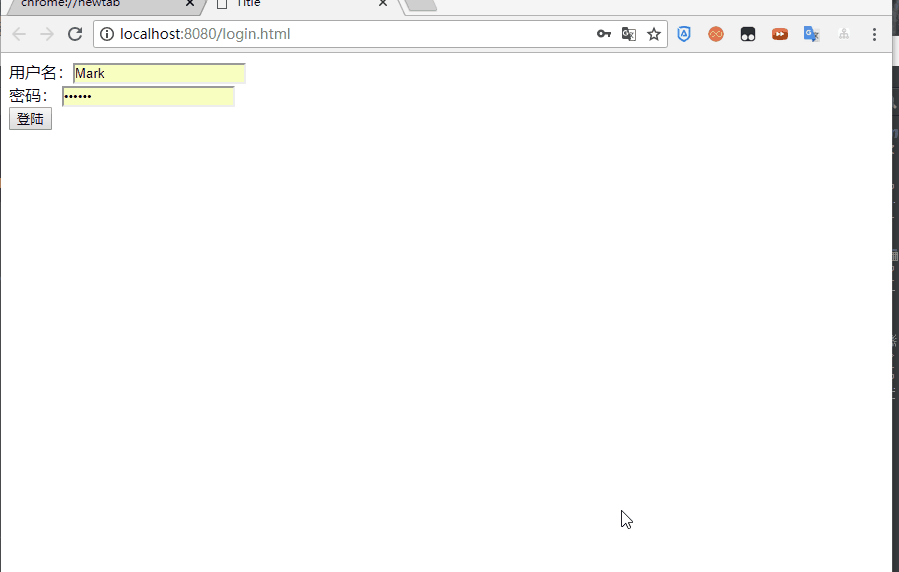

[](https://www.imooc.com/video/16959/0)


总操作流程：
- 1、[pom.xml引用包](#java-01)
- 2、[修改文件](#java-02)
- 3、[测试](#java-03)

***

使用这个[](https://github.com/lidekai/shiro-mysql.git)在其基础上修改

## pom.xml引用包 <a name="java-01" href="#" >:house:</a>
> 添加

```xml
<aspectjweaver.version>1.9.0</aspectjweaver.version>

    <dependency>
      <groupId>org.springframework</groupId>
      <artifactId>spring-aop</artifactId>
      <version>${spring.version}</version>
    </dependency>

        <dependency>
          <groupId>org.aspectj</groupId>
          <artifactId>aspectjweaver</artifactId>
          <version>${aspectjweaver.version}</version>
        </dependency>


```
## 修改文件 <a name="java-02" href="#" >:house:</a>

> 在UserController添加文件

```java
   @RequiresRoles("admin")
    @RequestMapping(value = "/testRole",method = RequestMethod.GET)
    @ResponseBody
    public String testRole(){
        return "testRole success";
    }
```
## 测试 <a name="java-03" href="#" >:house:</a>

