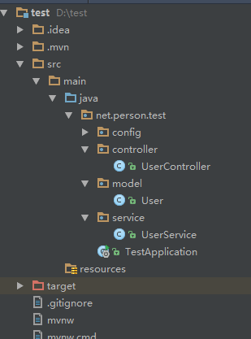

总操作流程：
- 1、[写程序](springBoot-01)
- 2、[测试](springBoot-02)

***

## 写程序 <a name="springBoot-01" href="#" ></a>

- 项目目录结构



- 在springBoot之创建项目基础上修改

> 创建RouterFunctionConfiguration代码

<details>
<summary>代码</summary>

```java
import net.person.test.model.User;
import net.person.test.service.UserService;
import org.springframework.beans.factory.annotation.Autowired;
import org.springframework.context.annotation.Bean;
import org.springframework.context.annotation.Configuration;
import org.springframework.web.reactive.function.server.RequestPredicates;
import org.springframework.web.reactive.function.server.RouterFunction;
import org.springframework.web.reactive.function.server.RouterFunctions;
import org.springframework.web.reactive.function.server.ServerResponse;
import reactor.core.publisher.Flux;
import java.util.Collection;

/**
 * Created by admin on 2019/3/1.
 */
@Configuration
public class RouterFunctionConfiguration {
    @Bean
    @Autowired
    public RouterFunction<ServerResponse> personFindAll(UserService userService){
        return  RouterFunctions.route(RequestPredicates.GET("/person/find/all"),
                request->{
                            Collection<User> users=userService.findAll();
                            Flux<User> userFlux=Flux.fromIterable(users);
                            return ServerResponse.ok().body(userFlux,User.class);
                        }
                );
    }
}
```

</details>


> 2、修改sevice

<details>
<summary>代码</summary>

```java
import net.person.test.model.User;
import org.springframework.stereotype.Repository;

import java.util.Collection;
import java.util.concurrent.ConcurrentHashMap;
import java.util.concurrent.ConcurrentMap;
import java.util.concurrent.atomic.AtomicInteger;

/**
 * Created by admin on 2019/2/28.
 */
@Repository
public class UserService {
    /**
     * 采用内存型的存储方式->Map
     */
    private final ConcurrentMap<Integer,User> repository=new ConcurrentHashMap<>();
    private  final static AtomicInteger idCenerator=new AtomicInteger();
    /**
     * 保存用户对象
     * @param {@link User} 对象
     * @return 如果保存成功，返回<code>true</code>,否则，返回<code>false</code>
     */
    public boolean save(User user) {
        boolean success=false;
        Integer id=idCenerator.incrementAndGet();
        user.setId(id);
        return  repository.put(id,user)==null;
    }

    public Collection<User> findAll(){
        return repository.values();
    }
}
```

</details>


## 测试 <a name="springBoot-02" href="#" ></a>

- 使用Postman发送两次/person/save请求

- 使用Postman发送/person/find/all请求
