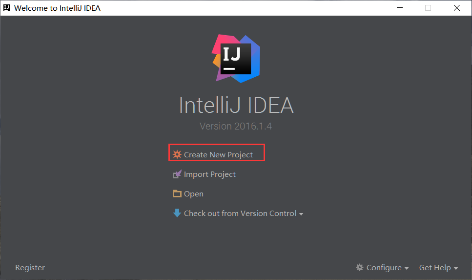
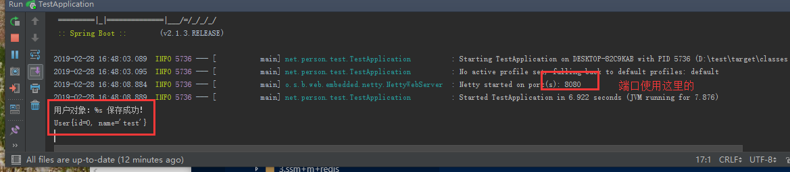

总操作流程：
- 1、[创建项目](springBoot-01)
- 2、[写程序](springBoot-02)
- 3、[配置编译环境](springBoot-03)
- 4、[测试](springBoot-04)

***

## 创建项目 <a name="springBoot-01" href="#" >:house:</a>

>1、创建




>2、删除


## 写程序 <a name="springBoot-02" href="#" >:house:</a>

> 1、创建model

<details>
<summary>代码</summary>

```java
public class User {
    public int id;
    public String name;

    public User() {
    }

    public User(int id, String name) {
        this.id = id;
        this.name = name;
    }

    public int getId() {
        return id;
    }

    public void setId(int id) {
        this.id = id;
    }

    public String getName() {
        return name;
    }

    public void setName(String name) {
        this.name = name;
    }

    @Override
    public String toString() {
        return "User{" +
                "id=" + id +
                ", name='" + name + '\'' +
                '}';
    }
}
```

</details>


> 2、创建Controller

<details>
<summary>代码</summary>

```java
import net.person.test.model.User;
import net.person.test.service.UserService;
import org.springframework.beans.factory.annotation.Autowired;
import org.springframework.web.bind.annotation.PostMapping;
import org.springframework.web.bind.annotation.RequestParam;
import org.springframework.web.bind.annotation.RestController;

/**
 * Created by admin on 2019/2/28.
 */
@RestController
public class UserController {

    private final UserService userService;

    @Autowired
    public UserController(UserService userService) {
        this.userService = userService;
    }

    @PostMapping("/person/save")
    public User save(@RequestParam String name){
        User user=new User();
        user.setName(name);
        if (userService.save(user)){
            System.out.println("用户对象：%s 保存成功！\n"+user);
        }
        return user;
    }
}

```

</details>


> 3、创建sevice

<details>
<summary>代码</summary>

```java
import net.person.test.model.User;
import org.springframework.stereotype.Repository;

import java.util.concurrent.ConcurrentHashMap;
import java.util.concurrent.ConcurrentMap;
import java.util.concurrent.atomic.AtomicInteger;

/**
 * Created by admin on 2019/2/28.
 */
@Repository
public class UserService {
    /**
     * 采用内存型的存储方式->Map
     */
    private final ConcurrentMap<Integer,User> repository=new ConcurrentHashMap<>();
    private  final static AtomicInteger idCenerator=new AtomicInteger();
    /**
     * 保存用户对象
     * @param {@link User} 对象
     * @return 如果保存成功，返回<code>true</code>,否则，返回<code>false</code>
     */
    public boolean save(User user) {
        boolean success=false;
        Integer id=idCenerator.incrementAndGet();
        user.setId(id);
        return  repository.put(id,user)==null;
    }
    
    public Collection<User> findAll(){
        return repository.values();
    }
}

```

</details>


> 4、创建RouterFunctionConfiguration代码

<details>
<summary>代码</summary>

```java
import net.person.test.model.User;
import net.person.test.service.UserService;
import org.springframework.beans.factory.annotation.Autowired;
import org.springframework.context.annotation.Bean;
import org.springframework.context.annotation.Configuration;
import org.springframework.web.reactive.function.server.RequestPredicates;
import org.springframework.web.reactive.function.server.RouterFunction;
import org.springframework.web.reactive.function.server.RouterFunctions;
import org.springframework.web.reactive.function.server.ServerResponse;
import reactor.core.publisher.Flux;
import java.util.Collection;

/**
 * Created by admin on 2019/3/1.
 */
@Configuration
public class RouterFunctionConfiguration {
    @Bean
    @Autowired
    public RouterFunction<ServerResponse> personFindAll(UserService userService){
        return  RouterFunctions.route(RequestPredicates.GET("/person/find/all"),
                request->{
                            Collection<User> users=userService.findAll();
                            Flux<User> userFlux=Flux.fromIterable(users);
                            return ServerResponse.ok().body(userFlux,User.class);
                        }
                );
    }
}
```

</details>


## 配置编译环境 <a name="springBoot-03" href="#" >:house:</a>

> 修改application的Java文件

- 类继承


```java
@SpringBootApplication(scanBasePackages ={"net.person.test.*"})
public class xxx extends SpringBootServletInitializer
```

- 重构函数

```java
@Override
    protected SpringApplicationBuilder configure(SpringApplicationBuilder application) {
        return application.sources(WebApplication.class);
    }
```


> application的配置方式


> tomcat的配置方式


##  <a name="springBoot-04" href="#" >:house:</a>

运行springboot

[](https://www.getpostman.com/)




