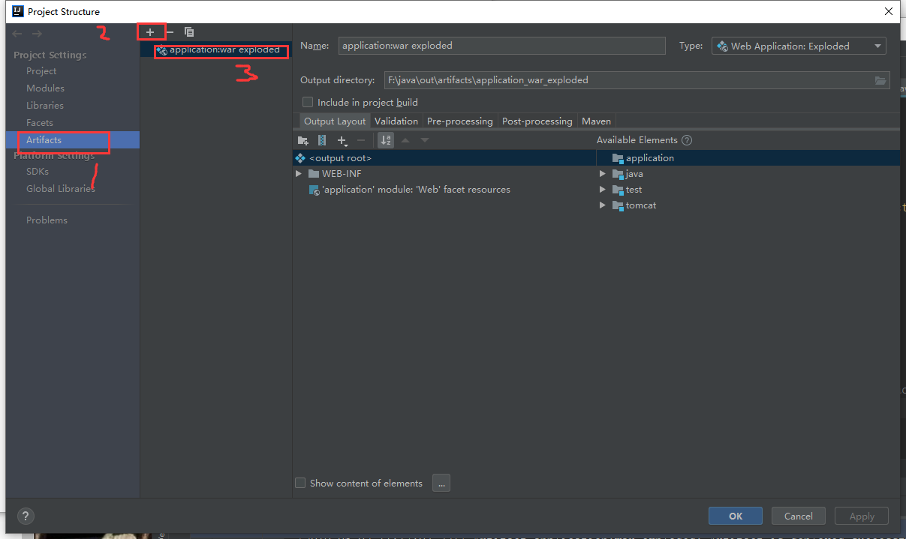
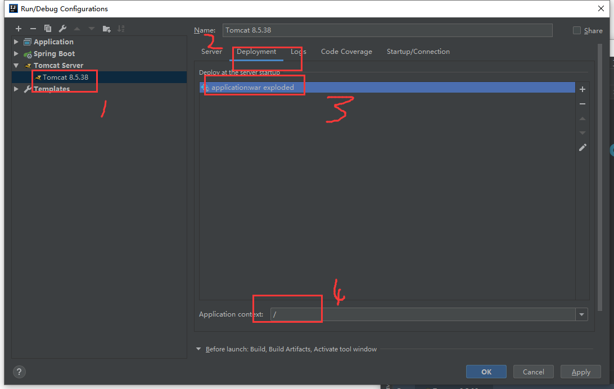

总操作流程：
- 1、[创建tomcat的配置类](springBoot-01)
- 2、[修改properties文件](springBoot-02)
- 3、[测试](springBoot-03)

***
> 注意springboot是2。以上版本

## 创建tomcat的配置类 <a name="springBoot-01" href="#" >:house:</a>

>去掉总的pom.xml
```xml
        <dependency>
            <groupId>org.springframework.boot</groupId>
            <artifactId>spring-boot-starter-tomcat</artifactId>
            <scope>provided</scope>
        </dependency>
```

> TomcatConfig

<details>
<summary>代码</summary>

```java
@Configuration
public class TomcatConfig {

    private TomcatProperties tomcatProperties;

    @Autowired
    public void setTomcatProperties(TomcatProperties tomcatProperties) {
        this.tomcatProperties = tomcatProperties;
    }

    @Bean
    public ServletWebServerFactory servletContainer() {
        TomcatServletWebServerFactory tomcat = new TomcatServletWebServerFactory() {
            @Override
            protected void postProcessContext(Context context) {
                SecurityConstraint securityConstraint = new SecurityConstraint();
                securityConstraint.setUserConstraint("CONFIDENTIAL");
                SecurityCollection collection = new SecurityCollection();
                collection.addPattern("/*");
                securityConstraint.addCollection(collection);
                context.addConstraint(securityConstraint);
            }
        };
        tomcat.addAdditionalTomcatConnectors(redirectConnector());
        return tomcat;
    }

    private Connector redirectConnector() {
        Connector connector = new Connector(tomcatProperties.getProtocol());
        connector.setAttribute("acceptorThreadCount",tomcatProperties.getAcceptorThreadCount());
        connector.setAttribute("minSpareThreads",tomcatProperties.getMinSpareThreads());
        connector.setAttribute("maxSpareThreads",tomcatProperties.getMaxSpareThreads());
        connector.setAttribute("maxThreads",tomcatProperties.getMaxThreads());
        connector.setAttribute("maxConnections",tomcatProperties.getMaxConnections());
        connector.setAttribute("connectionTimeout",tomcatProperties.getConnectionTimeout());
        connector.setAttribute("redirectPort",tomcatProperties.getRedirectPort());
        connector.setAttribute("compression",tomcatProperties.getCompression());
        connector.setAttribute("address",tomcatProperties.getAddress());
        connector.setAttribute("maxFileSize",tomcatProperties.getMaxFileSize());
        connector.setAttribute("maxRequestSize",tomcatProperties.getMaxRequestSize());
        return connector;
    }
}

```

</details>


- TomcatProperties

<details>
<summary>代码</summary>

```java
@Component
@ConfigurationProperties(prefix = "tomcat.apr")
public class TomcatProperties {
    private String protocol;
    private String acceptorThreadCount;
    private String minSpareThreads;
    private String maxSpareThreads;
    private String maxThreads;
    private String maxConnections;
    private String connectionTimeout;
    private String redirectPort;
    private String compression;
    private String address;
    private String maxFileSize;
    private String maxRequestSize;

    public String getProtocol() {
        return protocol;
    }

    public void setProtocol(String protocol) {
        this.protocol = protocol;
    }

    public String getAcceptorThreadCount() {
        return acceptorThreadCount;
    }

    public void setAcceptorThreadCount(String acceptorThreadCount) {
        this.acceptorThreadCount = acceptorThreadCount;
    }

    public String getMinSpareThreads() {
        return minSpareThreads;
    }

    public void setMinSpareThreads(String minSpareThreads) {
        this.minSpareThreads = minSpareThreads;
    }

    public String getMaxSpareThreads() {
        return maxSpareThreads;
    }

    public void setMaxSpareThreads(String maxSpareThreads) {
        this.maxSpareThreads = maxSpareThreads;
    }

    public String getMaxThreads() {
        return maxThreads;
    }

    public void setMaxThreads(String maxThreads) {
        this.maxThreads = maxThreads;
    }

    public String getMaxConnections() {
        return maxConnections;
    }

    public void setMaxConnections(String maxConnections) {
        this.maxConnections = maxConnections;
    }

    public String getConnectionTimeout() {
        return connectionTimeout;
    }

    public void setConnectionTimeout(String connectionTimeout) {
        this.connectionTimeout = connectionTimeout;
    }

    public String getRedirectPort() {
        return redirectPort;
    }

    public void setRedirectPort(String redirectPort) {
        this.redirectPort = redirectPort;
    }

    public String getCompression() {
        return compression;
    }

    public void setCompression(String compression) {
        this.compression = compression;
    }

    public String getAddress() {
        return address;
    }

    public void setAddress(String address) {
        this.address = address;
    }

    public String getMaxFileSize() {
        return maxFileSize;
    }

    public void setMaxFileSize(String maxFileSize) {
        this.maxFileSize = maxFileSize;
    }

    public String getMaxRequestSize() {
        return maxRequestSize;
    }

    public void setMaxRequestSize(String maxRequestSize) {
        this.maxRequestSize = maxRequestSize;
    }
}
```

</details>


## 修改properties文件 <a name="springBoot-02" href="#" >:house:</a>

```js
# tomcat
tomcat.apr.acceptorThreadCount=4
tomcat.apr.minSpareThreads=50
tomcat.apr.maxSpareThreads=50
tomcat.apr.maxThreads=1000
tomcat.apr.maxConnections=10000
tomcat.apr.connectionTimeout=10000
tomcat.apr.protocol=org.apache.coyote.http11.Http11NioProtocol
tomcat.apr.redirectPort=443
tomcat.apr.compression=on
tomcat.apr.maxFileSize=300MB
tomcat.apr.maxRequestSize=500MB
tomcat.apr.address=0.0.0.0
```

## 测试 <a name="springBoot-03" href="#" >:house:</a>





```
运行测试
```

