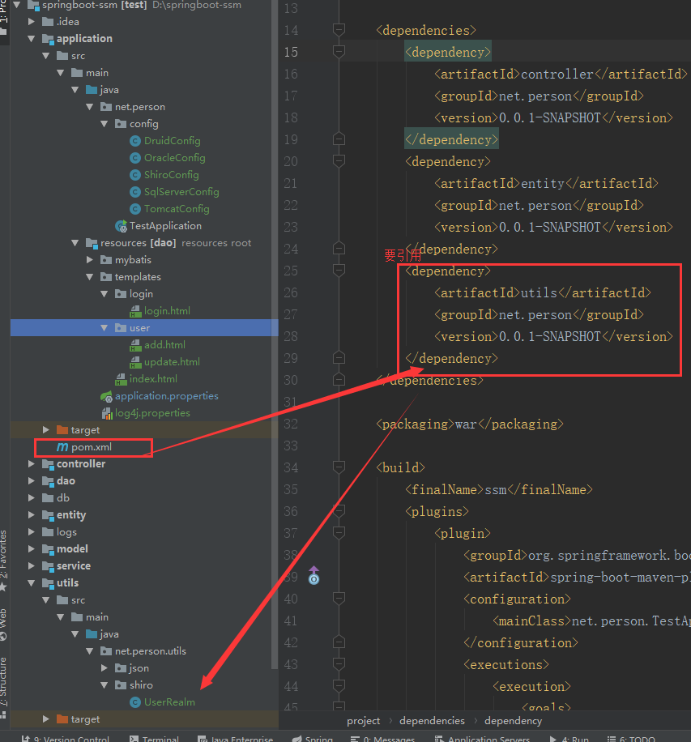

总操作流程：
- 1、[修改pom.xml](springBoot-01)
- 2、[写程序](springBoot-02)
- 3、[测试](springBoot-03)

***

- 项目目录结构



## 修改pom.xml <a name="springBoot-01" href="#" >:house:</a>

<details>
<summary>代码</summary>

```xml
		<!-- apache shiro 依赖 -->
		<dependency>
		    <groupId>org.apache.shiro</groupId>
		    <artifactId>shiro-core</artifactId>
		    <version>1.2.3</version>
		</dependency>
		<dependency>
		    <groupId>org.apache.shiro</groupId>
		    <artifactId>shiro-spring</artifactId>
		    <version>1.2.3</version>
		</dependency>
		<dependency>
		    <groupId>org.apache.shiro</groupId>
		    <artifactId>shiro-ehcache</artifactId>
		    <version>1.2.2</version>
		</dependency>

```

</details>


## 写程序 <a name="springBoot-02" href="#" >:house:</a>

- html

> index.xml

<details>
<summary>代码</summary>

```html
<!DOCTYPE html>
<html lang="en">
<head>
    <meta charset="UTF-8">
    <title>Title</title>
</head>
<body>

<h2 >拦截测试</h2>
<a href="/user/toAdd">跳转到添加页面</a>
<br>
<a href="/user/toUpdate">跳转到更新页面</a>
</body>
</html>
```

</details>


>add.xml

<details>
<summary>代码</summary>

```html
<!DOCTYPE html>
<html lang="en">
<head>
    <meta charset="UTF-8">
    <title>Title</title>
</head>
<body>
<h1>add</h1>
</body>
</html>
```

</details>


>update.xml

<details>
<summary>代码</summary>

```html
<!DOCTYPE html>
<html lang="en">
<head>
    <meta charset="UTF-8">
    <title>Title</title>
</head>
<body>
<h1>update</h1>
</body>
</html>
```

</details>


>login.xml

<details>
<summary>代码</summary>

```html
<!DOCTYPE html>
<html lang="en">
<head>
    <meta charset="UTF-8">
    <title>Title</title>
</head>
<body>
<h1>登录</h1>
</body>
</html>
```

</details>


- java

> UserRealm

<details>
<summary>代码</summary>

```java
public class UserRealm extends AuthorizingRealm {
    /**
     * 执行授权逻辑
     * @param principalCollection
     * @return
     */
    @Override
    protected AuthorizationInfo doGetAuthorizationInfo(PrincipalCollection principalCollection) {
        System.out.println("执行授权逻辑");
        return null;
    }

    /**
     * 执行认证逻辑
     * @param authenticationToken
     * @return
     * @throws AuthenticationException
     */
    @Override
    protected AuthenticationInfo doGetAuthenticationInfo(AuthenticationToken authenticationToken) throws AuthenticationException {
        System.out.println("执行认证逻辑");
        return null;
    }
}

```

</details>


> ShiroConfig

<details>
<summary>代码</summary>

```java
@Configuration
public class ShiroConfig {
    @Bean
    public ShiroFilterFactoryBean getShiroFilterFactoryBean(@Qualifier("securityManager")DefaultWebSecurityManager securityManager){
        ShiroFilterFactoryBean shiroFilterFactoryBean=new ShiroFilterFactoryBean();
        shiroFilterFactoryBean.setSecurityManager(securityManager);
        Map<String,String> filterMap=new LinkedHashMap<String,String>();
        //指定不用拦截的跳转连接
        filterMap.put("/user/toIndex","anon");

        //指定拦截的跳转连接
        /*filterMap.put("/user/toAdd","authc");
        filterMap.put("/user/toUpdate","authc");*/
        filterMap.put("/user/*","authc");

        //指定登录的页面的路径
        shiroFilterFactoryBean.setLoginUrl("/user/toLogin");
        shiroFilterFactoryBean.setFilterChainDefinitionMap(filterMap);
        return shiroFilterFactoryBean;
    }

    @Bean(name="securityManager")
    public DefaultWebSecurityManager getDefaultWebSecurityManager(@Qualifier("userRealm")UserRealm userRealm){
        DefaultWebSecurityManager securityManager=new DefaultWebSecurityManager();
        securityManager.setRealm(userRealm);
        return securityManager;
    }

    @Bean(name="userRealm")
    public UserRealm getUserRealm(){
        return new UserRealm();
    }
}

```

</details>


> UserController

<details>
<summary>代码</summary>

```java
@Controller
@RequestMapping("/user")
public class UserController {

    @RequestMapping("/toIndex")
    public  String toIndex(){
        return "index";
    }

    @RequestMapping("/toLogin")
    public  String toLogin(){
        return "login/login";
    }

    @RequestMapping("/toAdd")
    public  String toAdd(){
        return "user/add";
    }

    @RequestMapping("/toUpdate")
    public  String toUpdate(){
        return "user/update";
    }

}
```

</details>


## 测试 <a name="springBoot-03Pgp" href="#" >:house:</a>

运行测试
