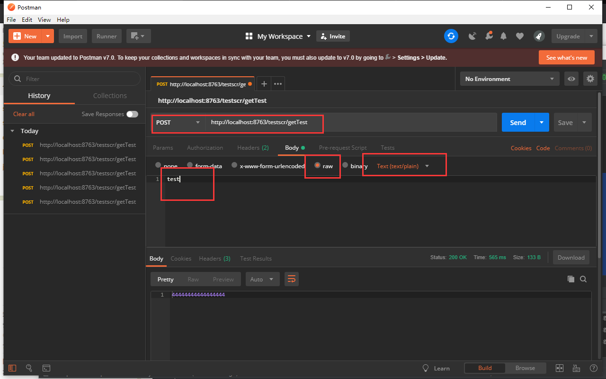

总操作流程：
- 1、[创建多一个Eureka Client](#SpringCloud-01)
- 2、[创建类](#SpringCloud-02)
- 3、[测试](#SpringCloud-03)

***

> 注意该教程基于：1.SpringCloud之项目创建(Eureka)的

## 创建多一个Eureka Client <a name="SpringCloud-01" href="#" >:house:</a>


> 在TestscrApplication里添加

- 1、头加入注解

```java
@EnableEurekaClient
```
- 2、加入函数

```java
    @Bean
    @LoadBalanced
    RestTemplate restTemplate() {
        return new RestTemplate();
    }
```

> 在application.properties里添加

```js
server.port=8763
eureka.client.serviceUrl.defaultZone=http://localhost:8761/eureka/
spring.application.name=service-ribbon
```

>在其pom.xml添加驱动

```xml
        <!--spring-cloud-starter-eureka 驱动-->
        <dependency>
            <groupId>org.springframework.cloud</groupId>
            <artifactId>spring-cloud-starter-eureka</artifactId>
        </dependency>
        <!--spring-cloud-starter-ribbon 驱动-->
        <dependency>
            <groupId>org.springframework.cloud</groupId>
            <artifactId>spring-cloud-starter-ribbon</artifactId>
        </dependency>
        <!--spring-boot-starter-web 驱动-->
        <dependency>
            <groupId>org.springframework.boot</groupId>
            <artifactId>spring-boot-starter-web</artifactId>
        </dependency>
```

## 修改文件 <a name="SpringCloud-02" href="#" >:house:</a>

> 1、在testscc的模块添加包和类

- net.person.testscc
    - controller
        - HelloControler


`HelloControler`

```java
@RestController
public class HelloControler {

    @RequestMapping(value = "/hi")
    public String hi(@RequestParam String name){
        System.out.println("33333333333333");
        return "44444444444444444";
    }
}
```

> 2、在testscr的模块添加包和类

- net.person.testscr
    - controller
        - TestControler
    - service
        - TestService
        - TestServiceImpl

`TestControler`

```java
@RestController
@RequestMapping("/testscr")
public class TestControler {

    public TestService testService;

    @Autowired
    public void setTestService(TestService testService) {
        this.testService = testService;
    }

    @CrossOrigin
    @PostMapping(path ="/getTest",produces ={ "text/plain;charset=UTF-8" })
    public String getTest(@RequestBody String jsonString){
        System.out.println("1111111111111");
        return testService.getTest(jsonString);
    }
}
```

`TestService`

```java
public interface TestService {
    public String getTest(String jsonString);
}

```

`TestServiceImpl`
```java
@Service
public class TestServiceImpl implements TestService{

    public RestTemplate restTemplate;

    @Autowired
    public void setRestTemplate(RestTemplate restTemplate) {
        this.restTemplate = restTemplate;
    }

    @Override
    public String getTest(String name) {
        System.out.println("22222222222");
        return restTemplate.getForObject("http://service-hi/hi?name="+name,String.class);
    }
}
```

## 测试 <a name="SpringCloud-03" href="#" >:house:</a>

运行testscs、testscc、testscr

```js
http://localhost:8763/testscr/getTest
```

