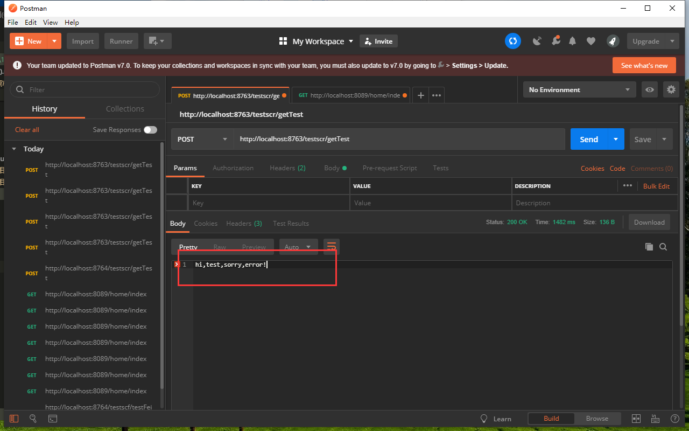

总操作流程：
- 1、[ribbon](#SpringCloud-01)
- 2、[feign](#SpringCloud-02)

***

## ribbon <a name="SpringCloud-01" href="#" >:house:</a>

>注意：该教程基于：2.SringCloud之两个服务互相通信(rest+ribbon)

### 导入驱动包

```xml
        <!--spring-cloud-starter-hystrix 驱动-->
        <dependency>
            <groupId>org.springframework.cloud</groupId>
            <artifactId>spring-cloud-starter-hystrix</artifactId>
        </dependency>
        <dependency>
            <groupId>com.netflix.hystrix</groupId>
            <artifactId>hystrix-javanica</artifactId>
            <version>RELEASE</version>
        </dependency>
```

### 修改代码

- 1、TestscrApplication加注解

```java
@EnableHystrix
```

- 2、TestServiceImpl修改代码

```java
@Service
public class TestServiceImpl implements TestService{

    public RestTemplate restTemplate;

    @Autowired
    public void setRestTemplate(RestTemplate restTemplate) {
        this.restTemplate = restTemplate;
    }

    @Override
    @HystrixCommand(fallbackMethod = "testscrError")
    public String getTest(String name) {
        System.out.println("22222222222");
        return restTemplate.getForObject("http://service-hi/hi?name="+name,String.class);
    }

    public String testscrError(String name) {
        return "hi,"+name+",sorry,error!";
    }
```

### 测试

- 1、将testscc停止运行



## feign <a name="SpringCloud-02" href="#" >:house:</a>

>注意：该教程基于：3.SringCloud之两个服务互相通信(Feign)

### 修改代码

- 1、在application.properties添加

```js
feign.hystrix.enabled=true
```

- 2、新增类

```java
@Component
public class FeignServiceImpl implements FeignService{
    @Override
    public String testFeign(String name) {
        return "sorry "+name;
    }
}
```

- 3、修改FeignService

```java
@FeignClient(value = "service-hi",fallback =FeignServiceImpl.class)
public interface FeignService {
    @RequestMapping(value = "/hi",method = RequestMethod.GET)
    public String testFeign(@RequestParam(value = "name") String name);
}
```

### 测试

- 停止testscc运行

