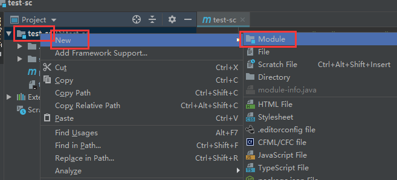
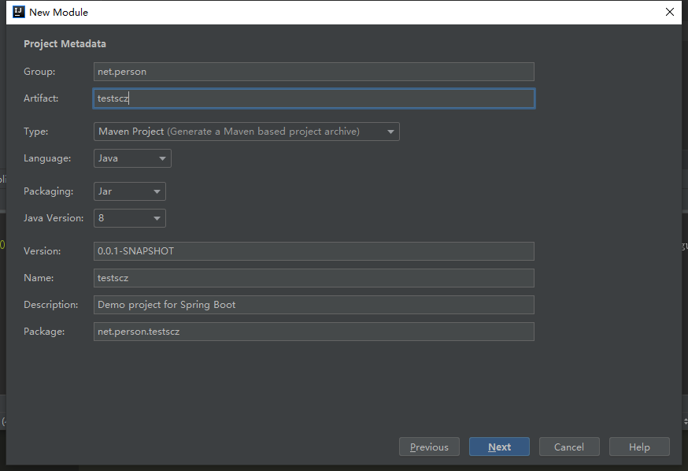
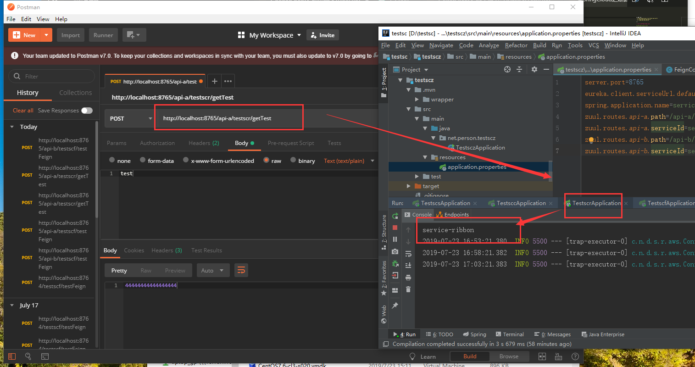
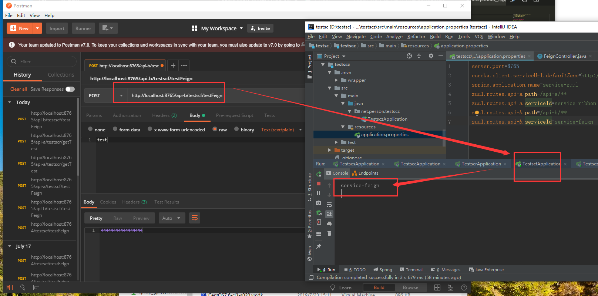

总操作流程：
- 1、[创建多一个Eureka Client](#SpringCloud-01)
- 2、[修改代码](#SpringCloud-02)
- 3、[测试](#SpringCloud-03)

***

>注意：该教程基于之前四个教程

## 创建多一个Eureka Client <a name="SpringCloud-01" href="#" >:house:</a>







## 修改代码 <a name="SpringCloud-02" href="#" >:house:</a>

> 1、导入驱动

<details>
<summary>代码</summary>

```xml
<!--spring-cloud-starter-eureka 驱动-->
        <dependency>
            <groupId>org.springframework.cloud</groupId>
            <artifactId>spring-cloud-starter-eureka</artifactId>
        </dependency>

        <!--spring-cloud-starter-zuul 驱动-->
        <dependency>
            <groupId>org.springframework.cloud</groupId>
            <artifactId>spring-cloud-starter-zuul</artifactId>
        </dependency>
        <dependency>
            <groupId>org.springframework.cloud</groupId>
            <artifactId>spring-cloud-starter-netflix-zuul</artifactId>
        </dependency>

        <!--spring-boot-starter-web 驱动-->
        <dependency>
            <groupId>org.springframework.boot</groupId>
            <artifactId>spring-boot-starter-web</artifactId>
        </dependency>
```

</details>


> 2、在TestsczApplication上加注解

```java
@EnableZuulProxy
@EnableEurekaClient
```

>3、在application.properties文件加内容

```js
server.port=8765
eureka.client.serviceUrl.defaultZone=http://localhost:8761/eureka/
spring.application.name=service-zuul
zuul.routes.api-a.path=/api-a/**
zuul.routes.api-a.serviceId=service-ribbon
zuul.routes.api-b.path=/api-b/**
zuul.routes.api-b.serviceId=service-feign
```

> 4、在FeignController的testFeign方法加入

```java
System.out.println("service-feign");
```

>5、在TestControler的getTest方法加入

```java
System.out.println("service-ribbon");
```

## 测试 <a name="SpringCloud-03" href="#" >:house:</a>

运行：testscs、testscc、testscr、testscf、testscz

使用postman分别测试两个接口就可以看到效果

- http://localhost:8765/api-a/testscr/getTest




- http://localhost:8765/api-b/testscf/testFeign

