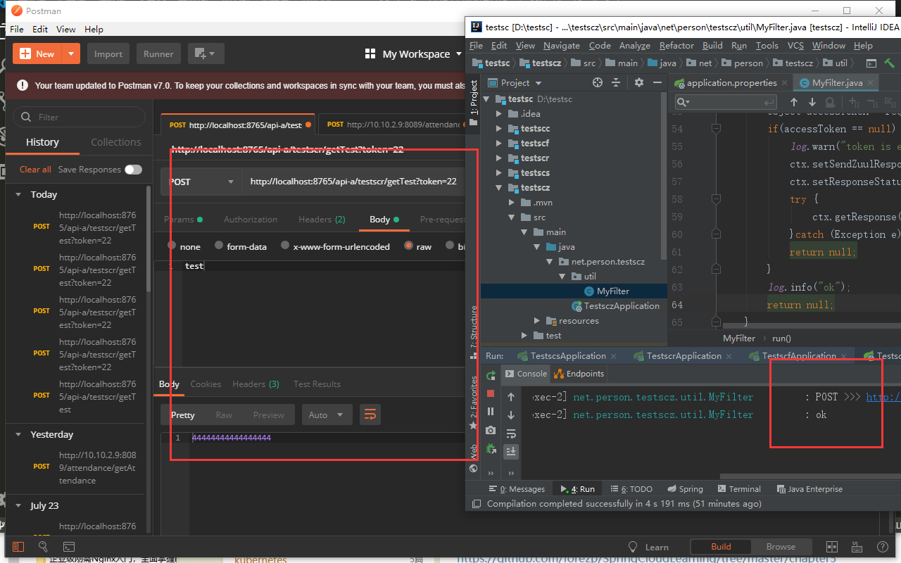

总操作流程：
- 1、[创建类](#SpringCloud-01)
- 2、[测试](#SpringCloud-02)

***

> 注意：该教程基于：5.SpringCloud之路由网关(zuul)

## 创建类 <a name="SpringCloud-01" href="#" >:house:</a>

>1、在net.person.testscz.util包下创建类

<details>
<summary>代码</summary>

```java
@Component
public class MyFilter extends ZuulFilter {
    private static Logger log = LoggerFactory.getLogger(MyFilter.class);
    /*
     * @MathodName:filterType
     * @Author:DK_Li
     * @Date:Created in 2019/7/25 9:57
     * @Description:
     * 1、pre：路由之前
     * 2、routing：路由之时
     * 3、post： 路由之后
     * 4、error：发送错误调用
     * @Params:[]
     * @Return:java.lang.String
     */
    @Override
    public String filterType() {
        return "pre";
    }

    @Override
    public int filterOrder() {
        return 0;
    }

    @Override
    public boolean shouldFilter() {
        return true;
    }

    @Override
    public Object run() throws ZuulException {
        RequestContext ctx = RequestContext.getCurrentContext();
        HttpServletRequest request = ctx.getRequest();
        log.info(String.format("%s >>> %s", request.getMethod(), request.getRequestURL().toString()));
        Object accessToken = request.getParameter("token");
        if(accessToken == null) {
            log.warn("token is empty");
            ctx.setSendZuulResponse(false);
            ctx.setResponseStatusCode(401);
            try {
                ctx.getResponse().getWriter().write("token is empty");
            }catch (Exception e){}
            return null;
        }
        log.info("ok");
        return null;
    }
}

```

</details>


## 测试 <a name="SpringCloud-02" href="#" >:house:</a>

> 不被拦截的

```js
http://localhost:8765/api-a/testscr/getTest?token=22
```



> 被拦截的

```js
http://localhost:8765/api-a/testscr/getTest
```

