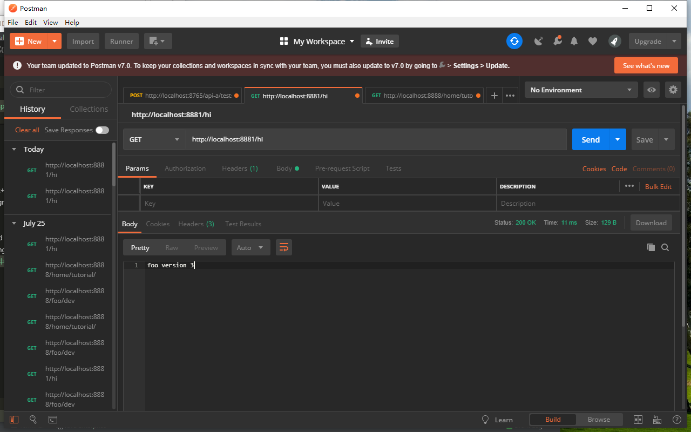

总操作流程：
- 1、[修改代码](#SpringCloud-01)
- 2、[测试](#SpringCloud-02)

***

## 修改代码 <a name="SpringCloud-01" href="#" >:house:</a>

> 1、改testscs

- 改pom.xml

`加驱动包`

```xml

        <!--spring-boot-starter-web 驱动-->
        <dependency>
            <groupId>org.springframework.boot</groupId>
            <artifactId>spring-boot-starter-web</artifactId>
        </dependency>

```

`加入配置`

```xml
    <!--https://repo.spring.io/milestone 驱动-->
    <repositories>
        <repository>
            <id>spring-milestones</id>
            <name>Spring Milestones</name>
            <url>https://repo.spring.io/milestone</url>
            <snapshots>
                <enabled>false</enabled>
            </snapshots>
        </repository>
    </repositories>
```

> 2、改testsccs

- 改application.properties

```js
spring.application.name=config-server
server.port=8888
spring.cloud.config.server.git.uri=git@10.10.2.152:/home/tutorial/tutorial.git
spring.cloud.config.server.git.searchPaths=respo
spring.cloud.config.label=master
spring.cloud.config.server.git.username=git
spring.cloud.config.server.git.password=DKLi123456!
eureka.client.serviceUrl.defaultZone=http://localhost:8761/eureka/
```

> 3、改testsccc

- 改bootstrap.properties

```js
spring.application.name=config-client
spring.cloud.config.label=master
spring.cloud.config.profile=dev

eureka.client.serviceUrl.defaultZone=http://localhost:8761/eureka/
spring.cloud.config.discovery.enabled=true
spring.cloud.config.discovery.serviceId=config-server
server.port=8881
```

## 测试 <a name="SpringCloud-02" href="#" >:house:</a>

