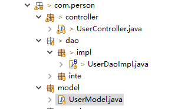
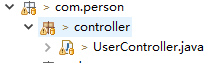
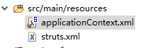

总操作流程：
- 1、[在pom.xml配置spring的架包+structs-spring集成的架包](#java-01)
- 2、[创建javabean类](#java-02)
- 3、[修改UserControl类](#java-03)
- 4、[创建applicationContext.xml文件](#java-04)
- 5、[修改web.xml配置文件](#java-05)
- 6、[修改show.jsp文件](#java-06)

[](https://github.com/lidekai/maven-structs2-spring.git)


----------
## 在pom.xml配置spring的架包+structs-spring集成的架包 <a name="java-01" href="#" >:house:</a>

`在原来的基础上添加`

<details>
<summary>代码</summary>

```xml
  	<!-- struts2-spring-plugin -->
  	<struts2-spring-plugin.version>2.5.13</struts2-spring-plugin.version>
  	<!-- spring -->
  	<spring.version>4.3.1.RELEASE</spring.version>
```

```xml
	<!-- ============================struts-spring=================================== -->
	<dependency>
	    <groupId>org.apache.struts</groupId>
	    <artifactId>struts2-spring-plugin</artifactId>
	    <version>${struts2-spring-plugin.version}</version>
	</dependency>
	
	<!-- ============================spring=================================== -->
	<dependency>
       <groupId>org.springframework</groupId>
       <artifactId>spring-context</artifactId>
       <version>${spring.version}</version>
    </dependency>
    
    <dependency>
       <groupId>org.springframework</groupId>
       <artifactId>spring-beans</artifactId>
       <version>${spring.version}</version>
    </dependency>
    
    <dependency>
       <groupId>org.springframework</groupId>
       <artifactId>spring-core</artifactId>
       <version>${spring.version}</version>
    </dependency>
    
    <dependency>
       <groupId>org.springframework</groupId>
       <artifactId>spring-web</artifactId>
       <version>${spring.version}</version>
    </dependency>
```

</details>

## 创建javabean类 <a name="java-02" href="#" >:house:</a>



<details>
<summary>代码</summary>

```java
package com.person.model;

public class UserModel {
    public int age;
    public String name;
    
	public UserModel(int age, String name) {
		super();
		this.age = age;
		this.name = name;
	}
	public int getAge() {
		return age;
	}
	public void setAge(int age) {
		this.age = age;
	}
	public String getName() {
		return name;
	}
	public void setName(String name) {
		this.name = name;
	}
    
}

```

</details>

## 修改UserControl类 <a name="java-03" href="#" >:house:</a>


<details>
<summary>代码</summary>

```java
package com.person.controller;
import java.util.List;
import java.util.Map;

import javax.servlet.ServletRequest;
import javax.servlet.http.HttpServletRequest;

import org.apache.struts2.ServletActionContext;
import org.springframework.beans.factory.annotation.Autowired;
import org.springframework.beans.factory.annotation.Qualifier;
import org.springframework.context.annotation.Scope;
import org.springframework.stereotype.Controller;

import com.opensymphony.xwork2.ActionContext;
import com.opensymphony.xwork2.ActionSupport;
import com.person.model.UserModel;
import com.person.service.inte.UserServiceInte;

@Scope("prototype")
@Controller("showUserController")
public class UserController extends ActionSupport{
	
	
	private UserServiceInte userServiceImpl;
	
	@Autowired
	@Qualifier("userServiceImpl")
	public void setUserServiceImpl(UserServiceInte userServiceImpl) {
		this.userServiceImpl = userServiceImpl;
	}

	public String showUser() {
		List<UserModel> list =userServiceImpl.showUser();
		Map session = ActionContext.getContext().getSession();
		session.put("user", list);
		return SUCCESS;  
    }


}
```

</details>


## 创建applicationContext.xml文件 <a name="java-04" href="#" >:house:</a>


<details>
<summary>代码</summary>


```xml
<?xml version="1.0" encoding="UTF-8"?>
<beans xmlns="http://www.springframework.org/schema/beans"
	xmlns:xsi="http://www.w3.org/2001/XMLSchema-instance"
	xmlns:aop="http://www.springframework.org/schema/aop"
	xmlns:context="http://www.springframework.org/schema/context"
	xmlns:util="http://www.springframework.org/schema/util"
	xsi:schemaLocation="http://www.springframework.org/schema/beans http://www.springframework.org/schema/beans/spring-beans.xsd
		http://www.springframework.org/schema/aop http://www.springframework.org/schema/aop/spring-aop-4.3.xsd
		http://www.springframework.org/schema/context http://www.springframework.org/schema/context/spring-context-4.3.xsd
		http://www.springframework.org/schema/util http://www.springframework.org/schema/util/spring-util-4.3.xsd">
	<!-- 配置注解扫描的包路径 -->
	<!-- 自动扫描dao和service包(自动注入) -->
	<context:component-scan base-package="com.person.dao.impl,com.person.service.impl" />

</beans>

```

</details>


## 修改web.xml配置文件 <a name="java-05" href="#" >:house:</a>

<details>
<summary>代码</summary>

```xml
<!DOCTYPE web-app PUBLIC
 "-//Sun Microsystems, Inc.//DTD Web Application 2.3//EN"
 "http://java.sun.com/dtd/web-app_2_3.dtd" >
<web-app>
  <display-name>Archetype Created Web Application</display-name>
    
      <context-param>
        <param-name>contextConfigLocation</param-name>
        <param-value>classpath:applicationContext.xml</param-value>
    </context-param>
    
    <!-- 配置Struts2框架的核心调度器 -->
    <filter>
        <filter-name>struts2</filter-name>
        <filter-class>org.apache.struts2.dispatcher.filter.StrutsPrepareAndExecuteFilter</filter-class>
    </filter>
    <filter-mapping>
        <filter-name>struts2</filter-name>
        <url-pattern>/*</url-pattern>
    </filter-mapping>
    
    <!-- Spring监听器 -->
    <listener>
        <listener-class>org.springframework.web.context.ContextLoaderListener</listener-class>
    </listener>
    
    <!-- 默认主界面 -->
    <welcome-file-list>
        <welcome-file>index.jsp</welcome-file>
    </welcome-file-list>
</web-app>
```

</details>

## 修改show.jsp文件 <a name="java-06" href="#" >:house:</a>

<details>
<summary>代码</summary>

```html
<%@ page contentType="text/html; charset=UTF-8" pageEncoding="UTF-8"%>
<%@ taglib prefix="s" uri="/struts-tags"%>
<!DOCTYPE html PUBLIC "-//W3C//DTD HTML 4.01 Transitional//EN" "http://www.w3.org/TR/html4/loose.dtd">
<html>
<body>
    <h2>第二页</h2>
    	<s:iterator value="#session.user" var="u">  
    		<li>名字：<s:property value="#u.name"/></li> 
    		<li>年龄：<s:property value="#u.age"/></li>
    		<hr> 
		</s:iterator>
</body>
</html>
```

</details>
