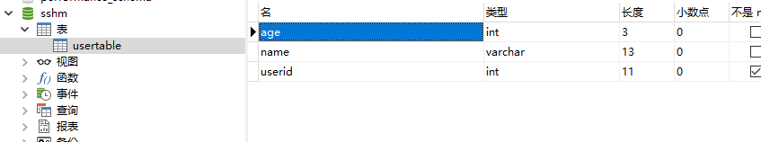

总操作流程：
- 1、[创建数据库](#java-01)
- 2、[创建数据库文件(jdbc.properties)](#java-02)
- 3、[修改pom.xml文件](#java-03)
- 4、[修改applicationContext.xml文件](#java-04)
- 5、[修改web.xml文件](#java-05)
- 6、[修改model，dao，service，jsp文件](#java-06)

[](https://github.com/lidekai/maven-structs2-spring-hibernate.git)

----------
## 创建数据库 <a name="java-01" href="#" >:house:</a>


<details>
<summary>代码</summary>

```sql
SET FOREIGN_KEY_CHECKS=0;

-- ----------------------------
-- Table structure for usertable
-- ----------------------------
DROP TABLE IF EXISTS `usertable`;
CREATE TABLE `usertable` (
  `age` int(3) DEFAULT NULL,
  `name` varchar(13) DEFAULT NULL,
  `userid` int(11) NOT NULL,
  PRIMARY KEY (`userid`)
) ENGINE=InnoDB DEFAULT CHARSET=gb2312;

-- ----------------------------
-- Records of usertable
-- ----------------------------
INSERT INTO `usertable` VALUES ('1', '一', '1');
INSERT INTO `usertable` VALUES ('2', '二', '2');
INSERT INTO `usertable` VALUES ('3', '三', '3');
INSERT INTO `usertable` VALUES ('4', '四', '4');
INSERT INTO `usertable` VALUES ('5', '五', '5');
INSERT INTO `usertable` VALUES ('6', '六', '6');
INSERT INTO `usertable` VALUES ('7', '七', '7');
INSERT INTO `usertable` VALUES ('8', '八', '8');

```

</details>

## 创建数据库文件(jdbc.properties) <a name="java-02" href="#" >:house:</a>

<details>
<summary>代码</summary>

```js
#c3p0连接池的mysql
c3p0.driverClass=com.mysql.jdbc.Driver
c3p0.url=jdbc:mysql://localhost:3306/sshm?useUnicode=true&characterEncoding=UTF-8&useJDBCCompliantTimezoneShift=true&useLegacyDatetimeCode=false&serverTimezone=UTC
c3p0.username=root
c3p0.password=123456

c3p0.minPoolSize=3
c3p0.maxPoolSize=5
c3p0.initialPoolSize=2

c3p0.maxIdleTime=0
c3p0.acquireIncrement=2
```

</details>


## 修改pom.xml文件 <a name="java-03" href="#" >:house:</a>

<details>
<summary>代码</summary>

```xml
<project xmlns="http://maven.apache.org/POM/4.0.0" xmlns:xsi="http://www.w3.org/2001/XMLSchema-instance"
  xsi:schemaLocation="http://maven.apache.org/POM/4.0.0 http://maven.apache.org/maven-v4_0_0.xsd">
  <modelVersion>4.0.0</modelVersion>
  <groupId>com.person.test</groupId>
  <artifactId>test</artifactId>
  <packaging>war</packaging>
  <version>0.0.1-SNAPSHOT</version>
  <name>test Maven Webapp</name>
  <url>http://maven.apache.org</url>
  <!-- 
          版本设置 
  -->
  <properties>
    <!-- junit -->
    <junit.version>3.8.1</junit.version>
    <!-- javax.servlet-api -->
    <servlet.version>4.0.0</servlet.version>
    <!-- struts2 -->
    <struts2.version>2.5.13</struts2.version>
    <!-- struts2-spring-plugin -->
    <struts2-spring-plugin.version>2.5.13</struts2-spring-plugin.version>
    <!-- spring -->
    <spring.version>4.3.1.RELEASE</spring.version>
    <!-- hibernate -->
    <hibernate.version>4.3.1.Final</hibernate.version>
    <!-- sql -->
    <mysql.version>6.0.6</mysql.version>
    <!-- c3p0 -->
    <c3p0.version>0.9.1</c3p0.version>
    <!-- aspectjweaver -->
    <aspectjweaver.version>1.8.5</aspectjweaver.version>
  </properties>
  <!-- 
          导入的包
  -->
  <dependencies>
    <dependency>
      <groupId>junit</groupId>
      <artifactId>junit</artifactId>
      <version>${junit.version}</version>
      <scope>test</scope>
    </dependency>
    
    <!-- ============================servlet=================================== -->
    <dependency>
        <groupId>javax.servlet</groupId>
        <artifactId>javax.servlet-api</artifactId>
        <version>${servlet.version}</version>
        <scope>provided</scope>
    </dependency>
    
    <!-- ============================struts=================================== -->
    <dependency>
        <groupId>org.apache.struts</groupId>
        <artifactId>struts2-core</artifactId>
        <version>${struts2.version}</version>
    </dependency>
    
    <dependency>
        <groupId>org.apache.struts</groupId>
        <artifactId>struts2-convention-plugin</artifactId>
        <version>${struts2.version}</version>
    </dependency>
    <dependency>
       <groupId>org.apache.struts</groupId>
       <artifactId>struts2-config-browser-plugin</artifactId>
       <version>${struts2.version}</version>
    </dependency>
    
    <!-- ============================struts-spring=================================== -->
    <dependency>
        <groupId>org.apache.struts</groupId>
        <artifactId>struts2-spring-plugin</artifactId>
        <version>${struts2-spring-plugin.version}</version>
    </dependency>
    
    <!-- ============================spring=================================== -->
    <dependency>
       <groupId>org.springframework</groupId>
       <artifactId>spring-context</artifactId>
       <version>${spring.version}</version>
    </dependency>
    <dependency>
       <groupId>org.springframework</groupId>
       <artifactId>spring-beans</artifactId>
       <version>${spring.version}</version>
    </dependency>
    <dependency>
       <groupId>org.springframework</groupId>
       <artifactId>spring-core</artifactId>
       <version>${spring.version}</version>
    </dependency>
    <dependency>
       <groupId>org.springframework</groupId>
       <artifactId>spring-web</artifactId>
       <version>${spring.version}</version>
    </dependency>
    <dependency>
       <groupId>org.springframework</groupId>
       <artifactId>spring-jdbc</artifactId>
       <version>${spring.version}</version>
    </dependency>
    <dependency>
       <groupId>org.springframework</groupId>
       <artifactId>spring-orm</artifactId>
       <version>${spring.version}</version>
    </dependency>
     
    <!-- ============================hibernate=================================== -->
    <dependency>
       <groupId>org.hibernate</groupId>
       <artifactId>hibernate-core</artifactId>
       <version>${hibernate.version}</version>
    </dependency>
    
    <!-- ============================sql=================================== -->
    <dependency>
       <groupId>mysql</groupId>
       <artifactId>mysql-connector-java</artifactId>
       <version>${mysql.version}</version>
    </dependency>
    
    <!-- ============================c3p0=================================== -->
    <dependency>
       <groupId>c3p0</groupId>
       <artifactId>c3p0</artifactId>
       <version>${c3p0.version}</version>
    </dependency>
    
    <!-- ============================aspectjweaver=================================== -->
    <dependency>
       <groupId>org.aspectj</groupId>
       <artifactId>aspectjweaver</artifactId>
       <version>${aspectjweaver.version}</version>
    </dependency>
    
  </dependencies>
  <build>
    <finalName>test</finalName>
  </build>
</project>
```

</details>

## 修改applicationContext.xml文件 <a name="java-04" href="#" >:house:</a>

<details>
<summary>代码</summary>

```xml
<?xml version="1.0" encoding="UTF-8"?>
<beans xmlns="http://www.springframework.org/schema/beans"
	xmlns:xsi="http://www.w3.org/2001/XMLSchema-instance"
	xmlns:aop="http://www.springframework.org/schema/aop"
	xmlns:context="http://www.springframework.org/schema/context"
	xmlns:util="http://www.springframework.org/schema/util"
	xmlns:tx="http://www.springframework.org/schema/tx"
	xmlns:jdbc="http://www.springframework.org/schema/jdbc"
	xsi:schemaLocation="http://www.springframework.org/schema/jdbc http://www.springframework.org/schema/jdbc/spring-jdbc-4.3.xsd
		http://www.springframework.org/schema/beans http://www.springframework.org/schema/beans/spring-beans.xsd
		http://www.springframework.org/schema/context http://www.springframework.org/schema/context/spring-context-4.3.xsd
		http://www.springframework.org/schema/aop http://www.springframework.org/schema/aop/spring-aop-4.3.xsd
		http://www.springframework.org/schema/tx http://www.springframework.org/schema/tx/spring-tx-4.3.xsd
		http://www.springframework.org/schema/util http://www.springframework.org/schema/util/spring-util-4.3.xsd">
	
	<!-- 自动扫描dao和service包(自动注入) -->
	<context:component-scan base-package="com.person.dao.impl,com.person.service.impl" />

	<!-- 扫描jdbc配置文件的位置 -->
    <context:property-placeholder location="classpath:jdbc.properties"/>
	
	<!--配置c3p0数据连接  -->
	<bean id="Datasource" class="com.mchange.v2.c3p0.ComboPooledDataSource" destroy-method="close">
        <property name="driverClass" value="${c3p0.driverClass}"></property>
		<property name="jdbcUrl">
			<value><![CDATA[${c3p0.url}]]></value>
		</property>
        <property name="user" value="${c3p0.username}"></property>
		<property name="password" value="${c3p0.password}"></property>
		<property name="minPoolSize" value="${c3p0.minPoolSize}" />
		<property name="maxPoolSize" value="${c3p0.maxPoolSize}" />
		<property name="initialPoolSize" value="${c3p0.initialPoolSize}" />
		<property name="maxIdleTime" value="${c3p0.maxIdleTime}" />
		<property name="acquireIncrement" value="${c3p0.acquireIncrement}" />
    	<property name="idleConnectionTestPeriod">
			<value>60</value>
		</property>
    </bean>
        
    <!-- 配置hibernate到Spring -->
    <bean id="sessionFactory" class="org.springframework.orm.hibernate4.LocalSessionFactoryBean">
        <property name="dataSource" ref="Datasource"></property>
        <!-- packagesToScan扫描与数据库表对应的实体类以确定映射关系 -->
        <property name="packagesToScan" value="com.person.model"></property>
        <property name="hibernateProperties">
            <props>
                <prop key="hibernate.dialect">org.hibernate.dialect.MySQLDialect</prop>
                <prop key="hibernate.show_sql">true</prop> 
                <prop key="hibernate.hbm2ddl.auto">update</prop>
                <prop key="hibernate.format_sql">true</prop>
            </props>
        </property>
    </bean>
    
    <!-- 配置事物管理ACID:原子性，一致性，隔离性，持久性-->
    <bean id="transactionManager" class="org.springframework.orm.hibernate4.HibernateTransactionManager">
        <property name="sessionFactory" ref="sessionFactory"></property>
    </bean>
    <tx:annotation-driven transaction-manager="transactionManager"/>
    
</beans>

```

</details>

## 修改web.xml文件 <a name="java-05" href="#" >:house:</a>

<details>
<summary>代码</summary>

```xml
<?xml version="1.0" encoding="UTF-8"?>
<web-app id="WebApp_ID" version="2.5" xmlns="http://java.sun.com/xml/ns/javaee" xmlns:xsi="http://www.w3.org/2001/XMLSchema-instance" xsi:schemaLocation="http://java.sun.com/xml/ns/javaee http://java.sun.com/xml/ns/javaee/web-app_2_5.xsd">
  <display-name>Archetype Created Web Application</display-name>
    <!-- 根应用上下文配置 -->
     <context-param>
        <param-name>contextConfigLocation</param-name>
        <param-value>classpath:applicationContext.xml</param-value>
    </context-param>
   
       <!-- Spring监听器 -->
    <listener>
        <listener-class>org.springframework.web.context.ContextLoaderListener</listener-class>
    </listener>
    
    <!-- 防止spring内存溢出监听器 -->
    <listener>
        <listener-class>org.springframework.web.util.IntrospectorCleanupListener</listener-class>
    </listener>
   
    <!-- 配置Struts2框架的核心调度器 -->
    <filter>
        <filter-name>struts2</filter-name>
        <filter-class>org.apache.struts2.dispatcher.filter.StrutsPrepareAndExecuteFilter</filter-class>
    </filter>
    <filter-mapping>
        <filter-name>struts2</filter-name>
        <url-pattern>/*</url-pattern>
    </filter-mapping>
    
    <!-- openSessionInView配置 -->
    <filter>
        <filter-name>openSessionInViewFilter</filter-name>
        <filter-class>org.springframework.orm.hibernate4.support.OpenSessionInViewFilter</filter-class>
        <init-param>
            <param-name>singleSession</param-name>
            <param-value>true</param-value>
        </init-param>
    </filter>
    <filter-mapping>
        <filter-name>openSessionInViewFilter</filter-name>
        <url-pattern>/*</url-pattern>
    </filter-mapping>
    
    <!-- 用于解决中文乱码问题 -->
    <filter>
        <filter-name>encoding</filter-name>
        <filter-class>org.springframework.web.filter.CharacterEncodingFilter</filter-class>
        <init-param>
            <param-name>encoding</param-name>
            <param-value>UTF-8</param-value>
        </init-param>
    </filter>
    <filter-mapping>
        <filter-name>encoding</filter-name>
        <url-pattern>/*</url-pattern>
    </filter-mapping>
     
    <!-- 默认主界面 -->
    <welcome-file-list>
        <welcome-file>index.jsp</welcome-file>
    </welcome-file-list>
</web-app>
```

</details>

## 修改model，dao，service，jsp文件 <a name="java-06" href="#" >:house:</a>
### 1、model

<details>
<summary>代码</summary>

```java
package com.person.model;

import javax.persistence.Column;
import javax.persistence.Entity;
import javax.persistence.Id;
import javax.persistence.Table;

@Entity
@Table(name ="usertable")
public class UserModel {
	public int userID;
    public int age;
    public String name;
    
	
	public UserModel() {
		super();
	}

	public UserModel(int userID, int age, String name) {
		super();
		this.userID = userID;
		this.age = age;
		this.name = name;
	}
	
    @Id
    @Column(name = "userid", unique = true, nullable = false,length = 11)
	public int getUserID() {
		return userID;
	}
	public void setUserID(int userID) {
		this.userID = userID;
	}
	
	@Column(name = "age",nullable = false, length = 3)
	public int getAge() {
		return age;
	}
	public void setAge(int age) {
		this.age = age;
	}
	
	@Column(name = "name",nullable = false, length = 13)
	public String getName() {
		return name;
	}
	public void setName(String name) {
		this.name = name;
	}
    
}

```

</details>

### 2、dao

<details>
<summary>代码</summary>

```java
package com.person.dao.impl;

import java.util.List;

import org.hibernate.Session;
import org.hibernate.SessionFactory;
import org.springframework.beans.factory.annotation.Autowired;
import org.springframework.stereotype.Repository;
import org.springframework.transaction.annotation.Transactional;

import com.person.dao.inte.UserDaoInte;
import com.person.model.UserModel;

@Repository(value="userDaoImpl")
public class UserDaoImpl implements UserDaoInte{
	
    @Autowired
    private SessionFactory sessionFactory;

    private Session getSession() {
        return sessionFactory.getCurrentSession();
    }

	@SuppressWarnings("unchecked")
	@Transactional
	public List<UserModel> showUser() {
		List<UserModel> list = this.getSession().createQuery("from UserModel").list();
		return list;
	}

}

```

</details>

### 3、service

<details>
<summary>代码</summary>

```java
package com.person.service.impl;

import java.util.List;

import org.springframework.beans.factory.annotation.Autowired;
import org.springframework.beans.factory.annotation.Qualifier;
import org.springframework.stereotype.Service;

import com.person.dao.inte.UserDaoInte;
import com.person.model.UserModel;
import com.person.service.inte.UserServiceInte;

@Service(value="userServiceImpl")
public class UserServiceImpl implements UserServiceInte{
	
	private UserDaoInte userDaoImpl;
	
	@Autowired
	@Qualifier("userDaoImpl")
	public void setUserDaoImpl(UserDaoInte userDaoImpl) {
		this.userDaoImpl = userDaoImpl;
	}

	public List<UserModel> showUser() {
		return userDaoImpl.showUser();
	}
}

```

</details>

### 4、jsp

<details>
<summary>代码</summary>

```html
<%@ page contentType="text/html; charset=UTF-8" pageEncoding="UTF-8"%>
<%@ taglib prefix="s" uri="/struts-tags"%>
<!DOCTYPE html PUBLIC "-//W3C//DTD HTML 4.01 Transitional//EN" "http://www.w3.org/TR/html4/loose.dtd">
<html>
<body>
    <h2>第二页</h2>
    	<s:iterator value="#session.user" var="u">  
    		<li>userID：<s:property value="#u.userID"/></li>
    		<li>名字：<s:property value="#u.name"/></li> 
    		<li>年龄：<s:property value="#u.age"/></li>
    		<hr> 
		</s:iterator>
</body>
</html>
```

</details>
