操作总流程：
- 1、[创建Maven项目](#java-01)
- 2、[配置Tomcat](#java-02)
- 3、[创建Java文件](#java-03)

----------
## 创建Maven项目 <a name="java-01" href="#" >:house:</a>
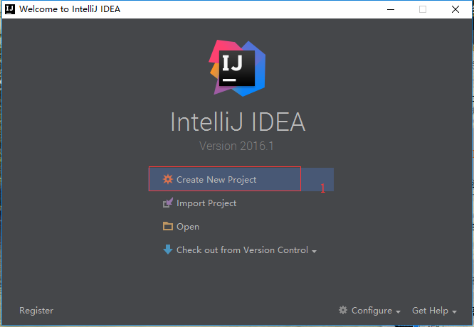

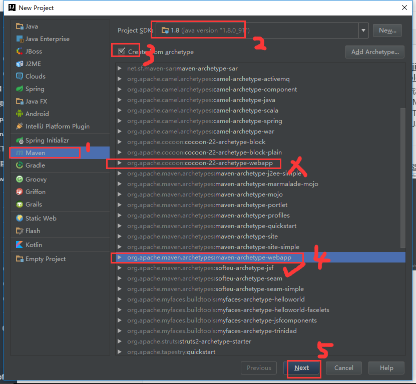

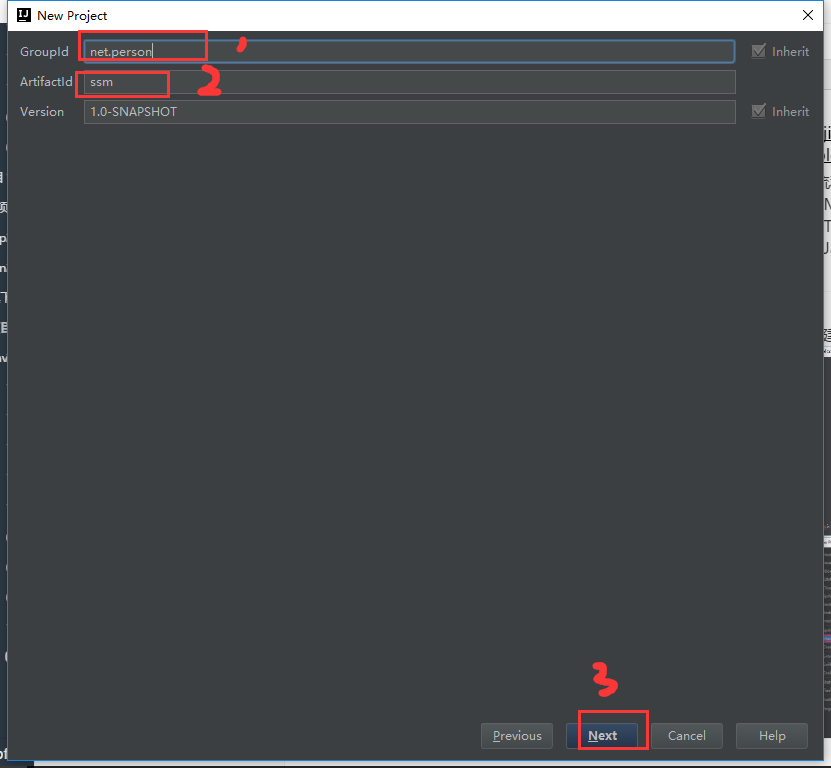

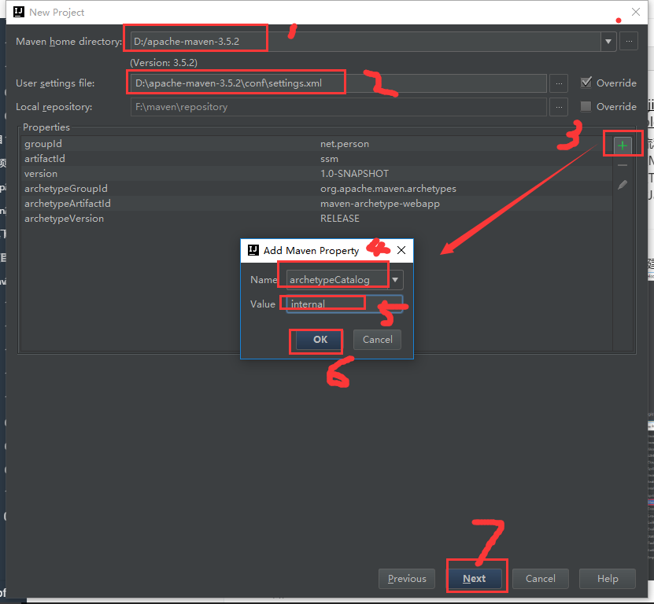

```
archetypeCatalog
internal
```
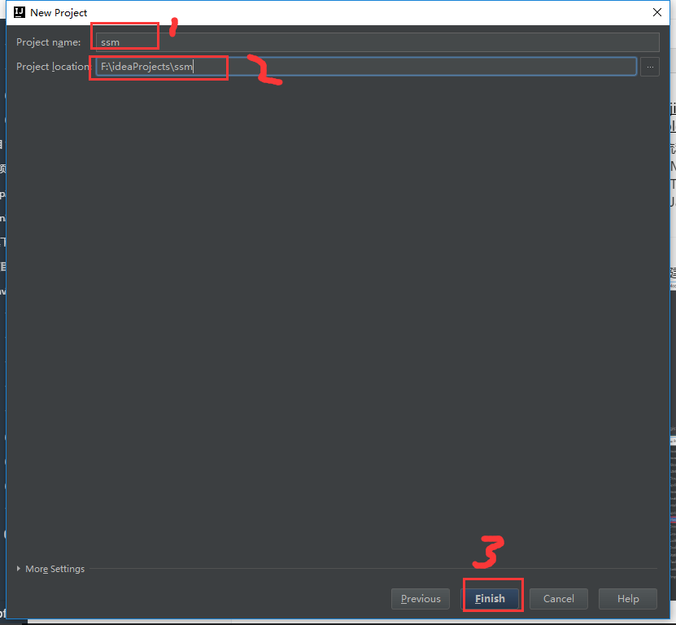


## 配置Tomcat <a name="java-02" href="#" >:house:</a>
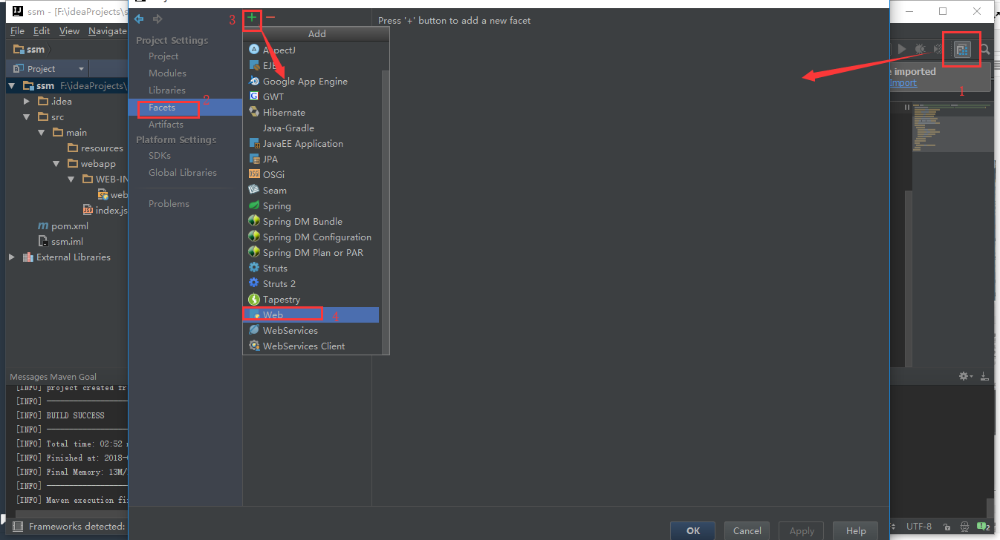

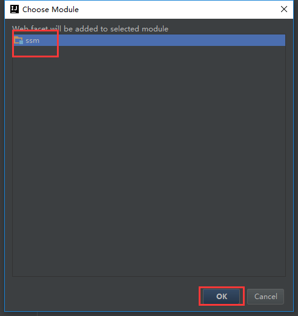

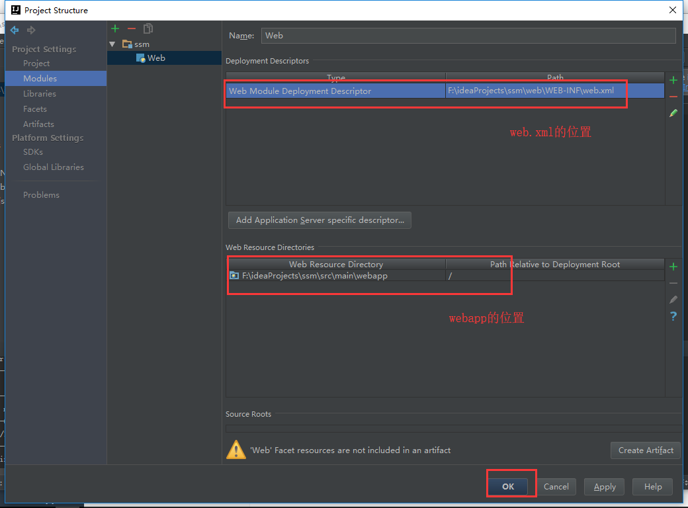

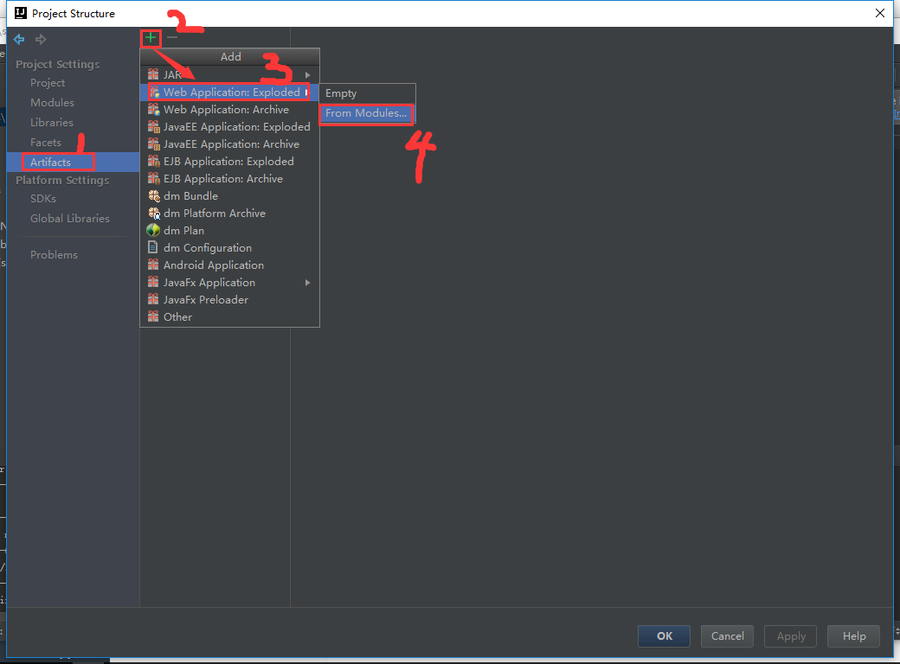

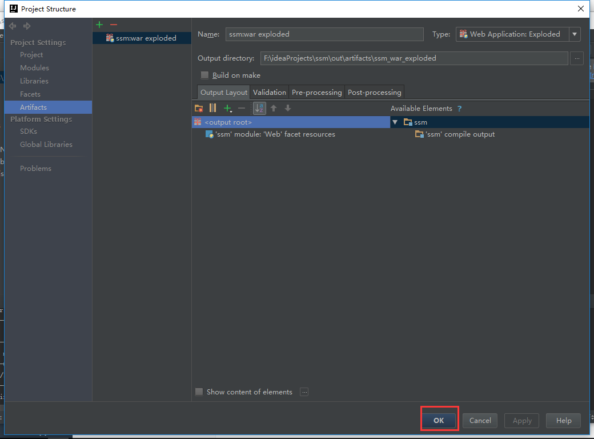

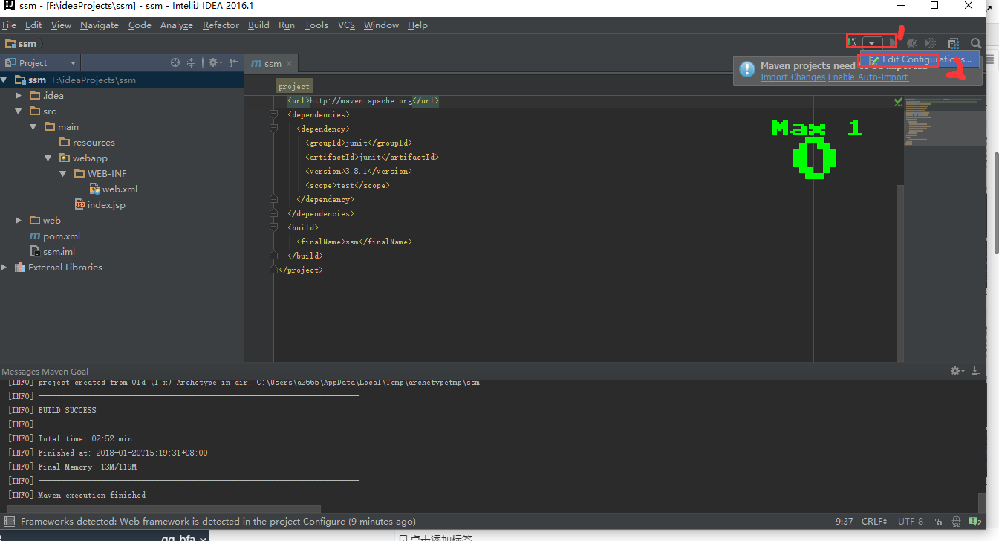

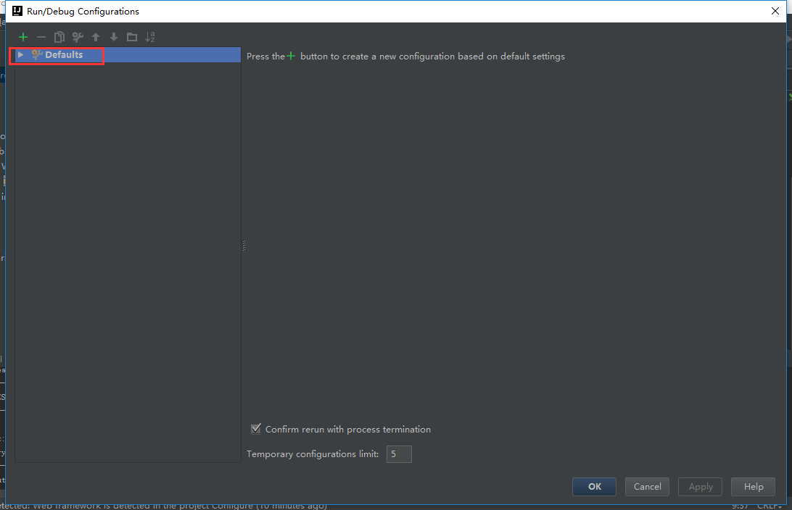

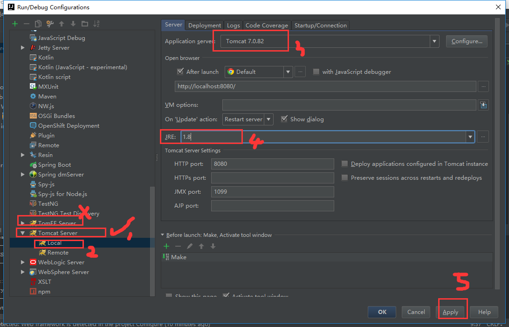

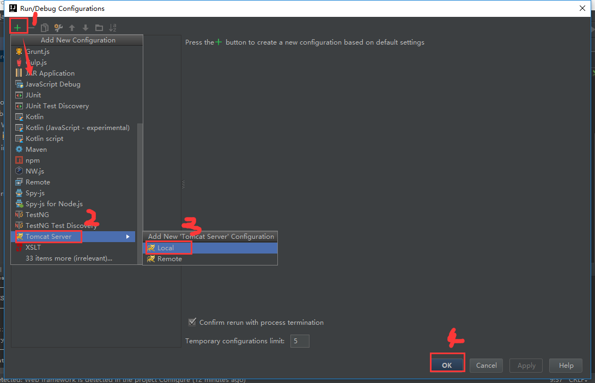

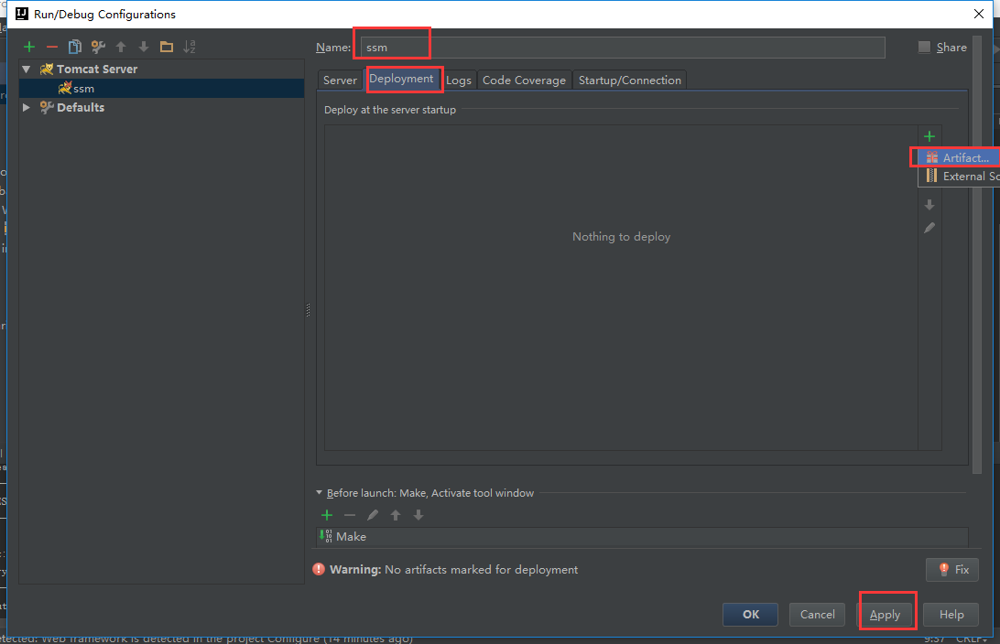

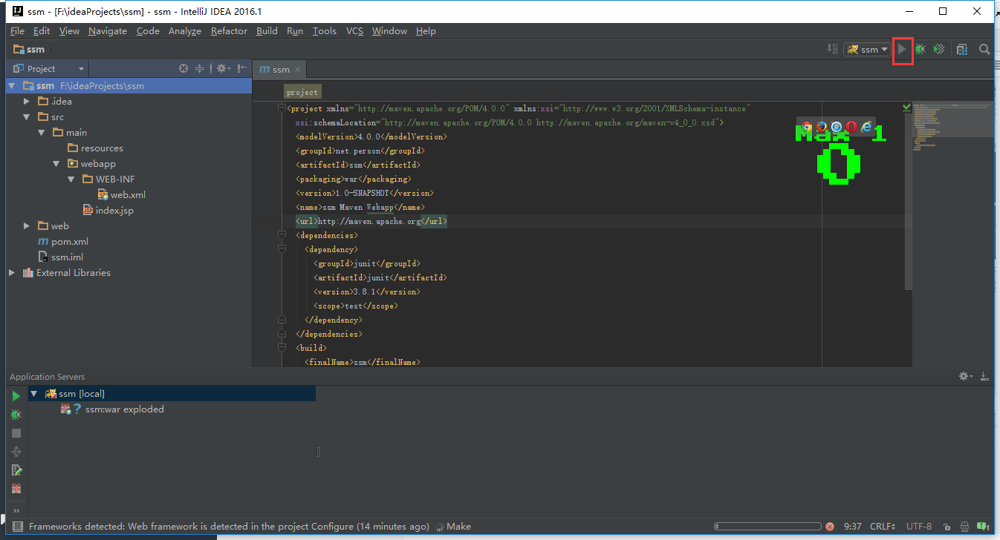

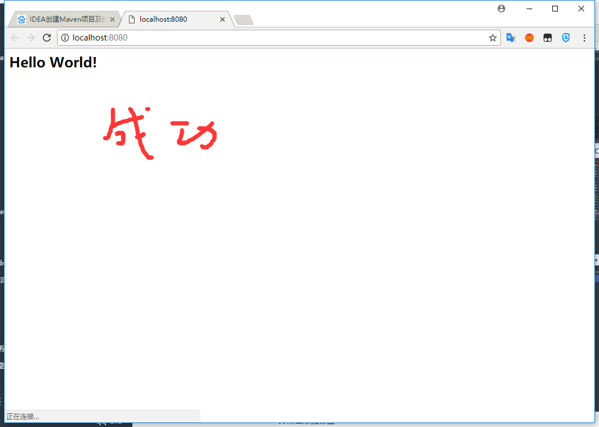

## 创建Java文件 <a name="java-03" href="#" >:house:</a>


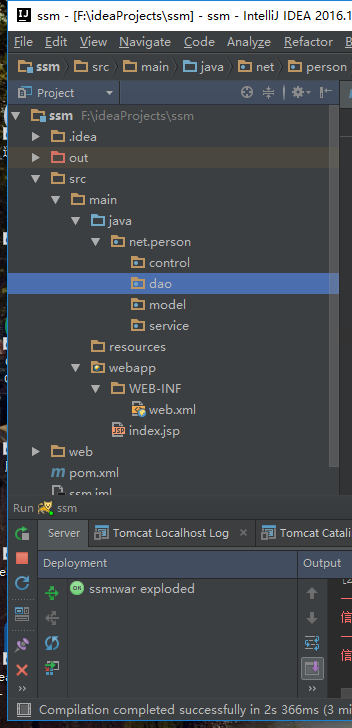