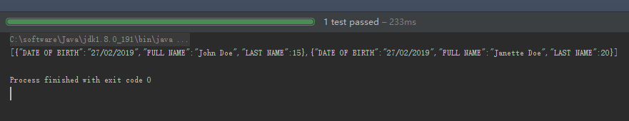
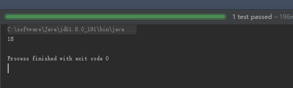
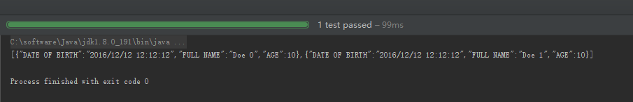
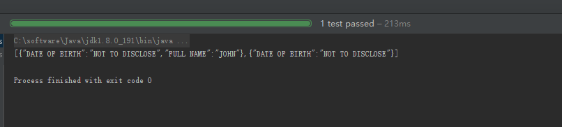
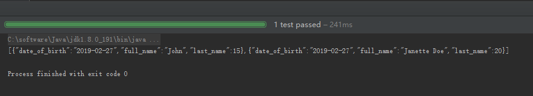

总操作流程：
- 1、[创建maven项目](#java-01)
- 2、[配置pom.xml](#java-02)
- 3、[创建Java文件和测试](#java-03)

***

## 创建maven项目 <a name="java-01" href="#" >:house:</a>

[](/后台/Java/11.01.ssm整合之用maven创建web项目.md)

## 配置pom.xml <a name="java-02" href="#" >:house:</a>

<details>
<summary>代码</summary>

```xml
<project xmlns="http://maven.apache.org/POM/4.0.0" xmlns:xsi="http://www.w3.org/2001/XMLSchema-instance"
         xsi:schemaLocation="http://maven.apache.org/POM/4.0.0 http://maven.apache.org/maven-v4_0_0.xsd">
  <modelVersion>4.0.0</modelVersion>
  <groupId>com.imooc.jiangzh</groupId>
  <artifactId>memcached-api</artifactId>
  <packaging>jar</packaging>
  <version>1.0-SNAPSHOT</version>
  <name>Maven Quick Start Archetype</name>
  <url>http://maven.apache.org</url>
  <dependencies>
    <dependency>
      <groupId>junit</groupId>
      <artifactId>junit</artifactId>
      <version>4.12</version>
    </dependency>
    <dependency>
      <groupId>com.alibaba</groupId>
      <artifactId>fastjson</artifactId>
      <version>1.2.56</version>
    </dependency>
  </dependencies>
</project>

```

</details>


## 创建Java文件 <a name="java-03" href="#" >:house:</a>

> 创建model文件

<details>
<summary>代码</summary>


```java
package net.person.model;

import com.alibaba.fastjson.annotation.JSONField;

import java.util.Date;

/**
 * 测试模型
 */
public class TestModel {
    //@JSONField(name = "AGE")
    @JSONField(name="LAST NAME", ordinal = 2)
    private int age;

    //@JSONField(name = "FULL NAME")
    @JSONField(name="FULL NAME", ordinal = 2)
    private String fullName;

    //@JSONField(name = "DATE OF BIRTH")
    @JSONField(name="DATE OF BIRTH", format="dd/MM/yyyy", ordinal = 1)
    private Date dateOfBirth;

    public TestModel() {
    }

    public TestModel(int age, String fullName, Date dateOfBirth) {
        this.age = age;
        this.fullName = fullName;
        this.dateOfBirth = dateOfBirth;
    }

    public int getAge() {
        return age;
    }

    public void setAge(int age) {
        this.age = age;
    }

    public String getFullName() {
        return fullName;
    }

    public void setFullName(String fullName) {
        this.fullName = fullName;
    }

    public Date getDateOfBirth() {
        return dateOfBirth;
    }

    public void setDateOfBirth(Date dateOfBirth) {
        this.dateOfBirth = dateOfBirth;
    }
}
```

</details>


### 1、JavaToJson。将 Java 对象转换换为 JSON 对象

<details>
<summary>代码</summary>


```java
package net.person.fastjson;

import com.alibaba.fastjson.JSON;
import net.person.model.TestModel;
import org.junit.Before;
import org.junit.Test;

import java.util.ArrayList;
import java.util.Date;
import java.util.List;


/**
 * 将 Java 对象转换换为 JSON 对象
 */
public class JavaToJson {
    private List<TestModel> listTest = new ArrayList<TestModel>();

    @Before
    public void setJavaData() {
        listTest.add(new TestModel(15, "John Doe", new Date()));
        listTest.add(new TestModel(20, "Janette Doe", new Date()));
    }

    @Test
    public void toJSONS() {
        String jsonOutput= JSON.toJSONString(listTest);
        System.out.println(jsonOutput);
    }
}


```

</details>



### 2、JsonToJava。JSON 字符串转换为 Java 对象

<details>
<summary>代码</summary>


```java
package net.person.fastjson;

import com.alibaba.fastjson.JSON;
import net.person.model.TestModel;
import org.junit.Before;
import org.junit.Test;

import java.util.Date;

/**
 * JSON 字符串转换为 Java 对象
 */

public class JsonToJava {

    String jsonObject;

    @Before
    public void creatJsonData() {
        TestModel test = new TestModel(18, "John Doe", new Date());
        jsonObject = JSON.toJSONString(test);

    }

    @Test
    public void toJava(){
        TestModel newPerson = JSON.parseObject(jsonObject, TestModel.class);
        System.out.println(newPerson.getAge());
    }

}

```

</details>



### 3、CreatJson。创建 JSON 对象

<details>
<summary>代码</summary>


```java
package net.person.fastjson;

import com.alibaba.fastjson.JSONArray;
import com.alibaba.fastjson.JSONObject;
import com.sun.org.apache.xerces.internal.impl.xpath.regex.ParseException;
import org.junit.Before;
import org.junit.Test;

/**
 * 创建 JSON 对象
 */
public class CreatJson {
    JSONArray jsonArray = new JSONArray();

    @Before
    public void creatJsonData() {
        for (int i = 0; i < 2; i++) {
            JSONObject jsonObject = new JSONObject();
            jsonObject.put("AGE", 10);
            jsonObject.put("FULL NAME", "Doe " + i);
            jsonObject.put("DATE OF BIRTH", "2016/12/12 12:12:12");
            jsonArray.add(jsonObject);
        }
    }

    @Test
    public void toJSON() throws ParseException {
        String jsonOutput = jsonArray.toJSONString();
        System.out.println(jsonOutput);
    }

}
```

</details>



### 4、ContextValueFilter。对Value做过滤

<details>
<summary>代码</summary>


```java
package net.person.fastjson;

import com.alibaba.fastjson.JSON;
import com.alibaba.fastjson.serializer.ValueFilter;
import net.person.model.TestModel;
import org.junit.Before;
import org.junit.Test;

import java.util.ArrayList;
import java.util.Date;
import java.util.List;

/**
 * 对Value做过滤
 */
public class ContextValueFilter implements ValueFilter {

    public Object process(Object object, String name, Object value) {
        if (name.equals("DATE OF BIRTH")) {
            return "NOT TO DISCLOSE";
        }
        if (value.equals("John")) {
            return ((String) value).toUpperCase();
        } else {
            return null;
        }
    }

    private List<TestModel> listTest = new ArrayList<TestModel>();

    @Before
    public void setJavaData() {
        listTest.add(new TestModel(15, "John", new Date()));
        listTest.add(new TestModel(20, "Janette Doe", new Date()));
    }

    @Test
    public void toContextValueFilter() {
        String jsonOutput = JSON.toJSONString(listTest, new ContextValueFilter());
        System.out.println(jsonOutput);
    }
}

```

</details>



### 5、NameFilterSerializeConfig。对kay和Value做过滤

<details>
<summary>代码</summary>


```java
package net.person.fastjson;

import com.alibaba.fastjson.JSON;
import com.alibaba.fastjson.serializer.NameFilter;
import com.alibaba.fastjson.serializer.SerializeConfig;
import net.person.model.TestModel;
import org.junit.Before;
import org.junit.Test;

import java.util.ArrayList;
import java.util.Date;
import java.util.List;

/**
 * 对kay和Value做过滤
 */
public class NameFilterSerializeConfig implements NameFilter {

    public String process(Object object, String name, Object value) {
        return name.toLowerCase().replace(" ", "_");
    }

    private List<TestModel> listTest = new ArrayList<TestModel>();

    @Before
    public void setJavaData() {
        listTest.add(new TestModel(15, "John", new Date()));
        listTest.add(new TestModel(20, "Janette Doe", new Date()));
    }

    @Test
    public void toNameFilter() {
        SerializeConfig.getGlobalInstance().addFilter(TestModel.class,new NameFilterSerializeConfig());
        String jsonOutput =JSON.toJSONStringWithDateFormat(listTest, "yyyy-MM-dd");
        System.out.println(jsonOutput);
    }
}
```

</details>


