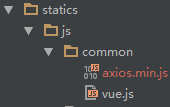

总操作流程：
- 1、[添加vue、axios文件](#java-01)
- 2、[修改contro层](#java-02)
- 3、[修改test.html文件](#java-03)
- 4、[修改index.html文件](#java-04)

[](https://github.com/lidekai/ssm2.git)


[](https://www.npmjs.com/package/axios)


----------
## 添加vue文件 <a name="java-01" href="#" >:house:</a>


## 修改contro层 <a name="java-02" href="#" >:house:</a>

<details>
<summary>代码</summary>

```java
package net.person.controller;

import net.person.service.TestService;
import org.springframework.beans.factory.annotation.Autowired;
import org.springframework.stereotype.Controller;
import org.springframework.ui.Model;
import org.springframework.web.bind.annotation.RequestMapping;
import org.springframework.web.bind.annotation.RequestMethod;

import javax.servlet.http.HttpServletResponse;


/**
 * 测试springMVC映射
 * Created by admin on 2018/1/31.
 */
@Controller
@RequestMapping("/home")
public class TestController {
    public TestService testServiceImpl;
    @Autowired
    public void setTestService(TestService testServiceImpl) {
        this.testServiceImpl = testServiceImpl;
    }

    /**
     * 跳转页面
     * @return
     * @throws Exception
     */
    @RequestMapping(value="/toTest")
    public String toTest() throws Exception{
        return "test";
    }

    /**
     * 获取json数据
     * @param response
     * @throws Exception
     */
    @RequestMapping(value="/getTest",method= RequestMethod.GET)
    public void getTest(HttpServletResponse response) throws Exception{
        testServiceImpl.getAllTest(response);
    }
}

```

</details>

## 修改test.html文件 <a name="java-03" href="#" >:house:</a>
### 1、test.html

<details>
<summary>代码</summary>

```html
<!DOCTYPE html>
<html lang="en">
<head>
    <meta charset="UTF-8">
    <title>Title</title>
</head>
<body>
    <div id="test">
        <h1>{{test}}</h1>
    </div>
    <script src="/statics/js/common/vue.js"></script>
    <script src="/statics/js/common/axios.min.js"></script>
    <script src="/statics/js/test-service.js"></script>
</body>
</html>
```

</details>

### 2、test-service.js

<details>
<summary>代码</summary>

```js
/**
 * Created by a2665 on 2018/2/7.
 */
new Vue({
    el:"#test",
    data:{
        test:"你好！"
    },
    filters:{

    },
    mounted: function(){
        this.$nextTick(function () {
            axios.get('getTest')
                .then(function (response) {
                    console.log(response);
                })
                .catch(function (error) {
                    console.log(error);
                });
        })
    },
    methods:{
    }
});
```

</details>

## 修改index.html文件 <a name="java-04" href="#" >:house:</a>

<details>
<summary>代码</summary>

```html
<!DOCTYPE html>
<html lang="en">
<head>
    <meta charset="UTF-8">
    <title>Title</title>
</head>
<body>
    <form action="home/toTest">
        <button type="submit">跳转</button>
    </form>
</body>
</html>
```

</details>
