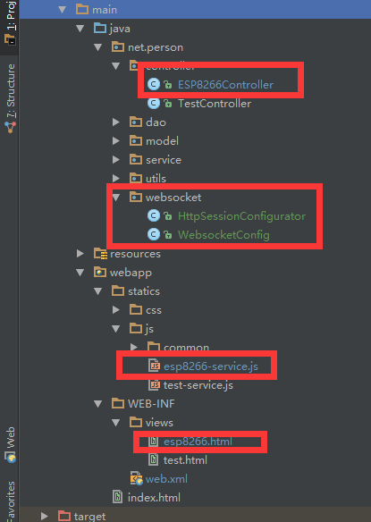
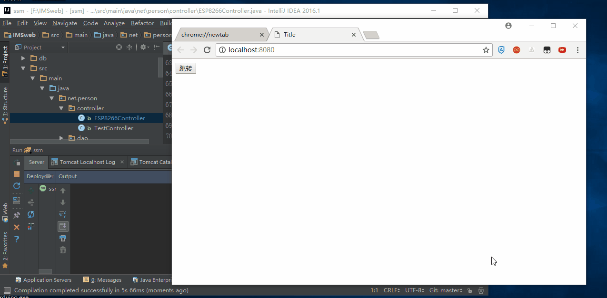

总操作流程：
- 1、[pom.xml添加包](#java-01)
- 2、[添加sockjs和修改js、html](#java-02)
- 3、[创建Websocket](#java-03)
- 4、[测试](#java-04)

***
- 项目目录结构



## pom.xml添加包 <a name="java-01" href="#" >:house:</a>

<details>
<summary>代码</summary>

```xml
<javaxWebsocketApi.version>1.0</javaxWebsocketApi.version>

    <!--============================websocket============================-->
    <dependency>
      <groupId>javax.websocket</groupId>
      <artifactId>javax.websocket-api</artifactId>
      <version>${javaxWebsocketApi.version}</version>
    </dependency>
```

</details>

## 添加sockjs和修改js、html <a name="java-02" href="#" >:house:</a>

[](https://pan.baidu.com/s/13IPH-lSyGgKSQA1ZG4TviA)

### 修改html

```html
<script src="/statics/js/common/sockjs.min.js"></script>
```
### 修改js
```js
new Vue({
    el: '#esp8266',
    data: {
        websock: null,
        inputTem:"",
        inputHum:"",
        inputDay:""
    },
    filters:{

    },
    created(){
        //页面刚进入时开启长连接
        this.initWebSocket()
    },
    destroyed: function() {
        //页面销毁时关闭长连接
        this.websocketclose();
    },
    mounted:function(){

    },
    methods: {
        threadPoxi(){  // 实际调用的方法
            //参数
            const agentData = "getTemHumDay";
            //若是ws开启状态
            if (this.websock.readyState === this.websock.OPEN) {
                this.websocketsend(agentData)
            }
            // 若是 正在开启状态，则等待300毫秒
            else if (this.websock.readyState === this.websock.CONNECTING) {
                let that = this;//保存当前对象this
                setTimeout(function () {
                    that.websocketsend(agentData)
                }, 300);
            }
            // 若未开启 ，则等待500毫秒
            else {
                this.initWebSocket();
                let that = this;//保存当前对象this
                setTimeout(function () {
                    that.websocketsend(agentData)
                }, 500);
            }
        },
        /**
         * 初始化weosocket
         */
        initWebSocket(){
            const wsuri ='ws://' + window.location.host +"/websocket";
            this.websock = new WebSocket(encodeURI(wsuri));
            this.websock.onopen=this.websocketonopen;
            this.websock.onerror=this.websocketonerror;
            this.websock.onmessage = this.websocketonmessage;
            this.websock.onclose = this.websocketclose;
            this.threadPoxi();
        },
        /**
         * 连接建立时触发
         */
        websocketsend(agentData){//数据发送
            this.websock.send(agentData);
        },
        /**
         * 客户端接收服务端数据时触发
         * @param e
         */
        websocketonmessage(e){
            const redata = JSON.parse(e.data);
            this.inputTem=redata.items[0].tem;
            this.inputHum=redata.items[0].hum;
            this.inputDay=redata.items[0].day;
        },
        /**
         * 连接WebSocket
         */
        websocketonopen() {
            console.log("WebSocket连接成功");
        },
        /**
         * 错误
         * @param e
         */
        websocketonerror(e) {
            console.log("WebSocket连接发生错误");
        },
        /**
         * 连接关闭时触发
         * @param e
         */
        websocketclose(){
            console.log("connection closed ");
        }
    }
})
```

</details>

## 创建Websocket <a name="java-03" href="#" >:house:</a>
### WebsocketConfig

<details>
<summary>代码</summary>

```java
package net.person.websocket;

import net.person.service.TemHumDayService;
import org.springframework.beans.factory.annotation.Autowired;

import javax.servlet.http.HttpSession;
import javax.websocket.*;
import javax.websocket.server.ServerEndpoint;
import java.io.IOException;
import java.util.concurrent.CopyOnWriteArraySet;

/**
 * Created by DK on 2018/6/4.
 */
@ServerEndpoint(value = "/websocket", configurator = HttpSessionConfigurator.class)
public class WebsocketConfig {
    private Session session;
    private static CopyOnWriteArraySet<WebsocketConfig> webSocketSet = new CopyOnWriteArraySet<WebsocketConfig>();
    private static int onlineCount = 0;
    private HttpSession httpSession;

    public TemHumDayService temHumDayServiceImpl;
    @Autowired
    public void setTemHumDayService(TemHumDayService temHumDayServiceImpl) {
        this.temHumDayServiceImpl = temHumDayServiceImpl;
    }

    /**
     * 连接建立成功调用的方法
     * @param session  可选的参数。session为与某个客户端的连接会话，需要通过它来给客户端发送数据
     */
    @OnOpen
    public void onOpen(Session session, EndpointConfig config){
        this.session = session;
        webSocketSet.add(this);
        addOnlineCount();
        this.httpSession = (HttpSession) config.getUserProperties().get(HttpSession.class.getName());
        System.out.println("成功连接");
    }

    /**
     * 连接关闭调用的方法
     */
    @OnClose
    public void onClose(){
        webSocketSet.remove(this);  //从set中删除
        subOnlineCount();           //在线数减1
        System.out.println("链接关闭");
    }
    /**
     * 接收客户端的message
     * @param message
     */
    @OnMessage
    public void onMessage(String message) {
        System.out.println("=========已接收客户端的信息=============");
        System.out.println(message);
    }
    /**
     * 发生错误时调用
     * @param error
     */
    @OnError
    public void onError(Throwable error){
        error.printStackTrace();
    }
    /**
     * 发送消息给所用客户端
     * @param message
     */
    public void allSend(String message){
        System.out.println("=========已发送信息到客户端=============");
        for(WebsocketConfig chat: webSocketSet){
            try {
                chat.session.getBasicRemote().sendText(message);
            } catch (IOException e) {
                e.printStackTrace();
                continue;
            }
        }
    }

    public  int getOnlineCount() {
        return onlineCount;
    }

    public  void addOnlineCount() {
        WebsocketConfig.onlineCount++;
    }

    public  void subOnlineCount() {
        WebsocketConfig.onlineCount--;
    }
}


```

</details>

### HttpSessionConfigurator

<details>
<summary>代码</summary>

```java
package net.person.websocket;

import javax.servlet.http.HttpSession;
import javax.websocket.HandshakeResponse;
import javax.websocket.server.HandshakeRequest;
import javax.websocket.server.ServerEndpointConfig;

/**
 * Created by DK on 2018/6/4.
 */
public class HttpSessionConfigurator extends ServerEndpointConfig.Configurator  {
    @Override
    public void modifyHandshake(ServerEndpointConfig config, HandshakeRequest request, HandshakeResponse response){
        HttpSession httpSession = (HttpSession)request.getHttpSession();
        config.getUserProperties().put(HttpSession.class.getName(),httpSession);
    }
}


```

</details>

其它的类调用：

```java
WebsocketConfig websocketConfig=new WebsocketConfig();
websocketConfig.allSend(xxxxx);
```
## 测试 <a name="java-04" href="#" >:house:</a>

