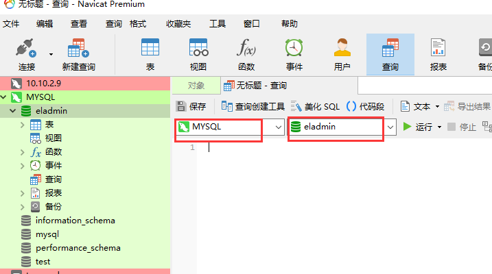
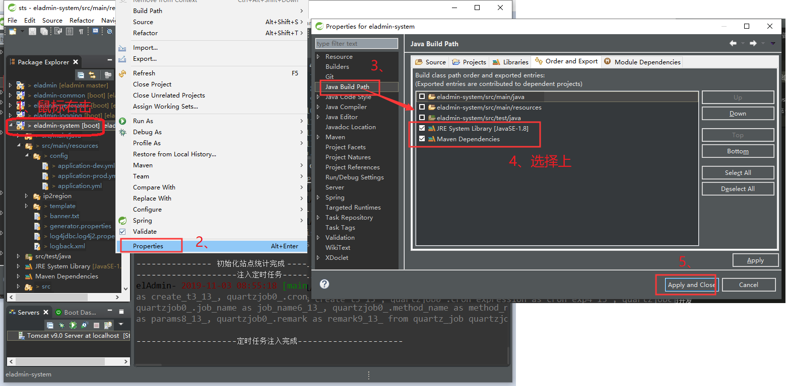

总操作流程：
- 1、[下载项目](#java-01) 
- 2、[配置项目](#java-02) 
- 3、[测试](#java-03) 

`编辑工具：sts`

***

## 下载项目 <a name="java-01" href="#" >:house:</a>

> 运行git bash here，使用命令

```
git clone https://github.com/elunez/eladmin.git
```

## 配置项目 <a name="java-02" href="#" >:house:</a>

> 1、导入项目

- 代码导入

file > import... > Naven > Existing Maven Projects (NEXT) > 选择eladmin项目(finish)

- 数据库导入

`建立eladmin数据库,
运行eladmin下的sql文件夹下的.sql文件`



`eladmin的sql链接密码修改到：/eladmin-system/src/main/resources/config下的.yml文件`

> 2、maven编译项目

```
clean compile
```


`注意：eladmin-system这个maven模块也要进行clean compile的编译`

> 3、加入jdk和maven的环境



## 测试 <a name="java-03" href="#" >:house:</a>

> 运行java后台


> 运行vue前端

- 浏览器输入地址：http://localhost:8013
