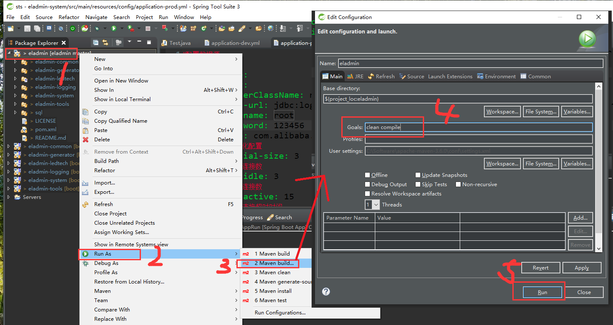

总操作流程：
- 1、[下载安装](#eladmin-01) 
- 2、[eladmin](#eladmin-02) 
    - 2.1、[项目打包](#eladmin-02-01) 
    - 2.2、[配置](#eladmin-02-02) 
- 3、[eladmin-web](#eladmin-03) 
    - 3.1、[项目打包](#eladmin-03-01) 
    - 3.1、[配置](#eladmin-03-02) 
- 4、[看效果](#eladmin-04) 

***

## 下载安装 <a name="eladmin-01" href="#" >:house:</a>

> 1、下载

[](http://nginx.org/en/docs/windows.html)


> 2、解压到指定路径


## eladmin <a name="eladmin-02" href="#" >:house:</a>

### <a name="eladmin-02-01" href="#" >项目打包</a>

> 1、项目清理


> 2、maven 编译

```
clean compile
```



> 3、maven打包

- 一次不行，多运行一次


> 4、复制包：/eladmin-system/target/eladmin-system-2.3.jar


### <a name="eladmin-02-02" href="#" >配置</a>

> 将eladmin-system-2.3.jar指定存放路径


> 运行

- 进入到eladmin-system-2.3.jar存放路径下，鼠标右键，运行Git Bash Here ，输入命令

```
nohup java -jar eladmin-system-2.3.jar --spring.profiles.active=prod &

tail -f nohup.out
```

快捷键<kbd>Ctrl</kbd>+<kbd>C</kbd> 退出tail -f nohup.out的状态

- 停止


## eladmin-web <a name="eladmin-03" href="#" >:house:</a>

### <a name="eladmin-03-01" href="#" >项目打包</a>

> vs code 安装快捷键<kbd>Ctrl</kbd>+<kbd>`</kbd> 进入终端，输入命令

- 1、修改接口地址（文件在config\prod.env.js）

`BASE_API是指定ip:端口`

```json
'use strict'
module.exports = {
  NODE_ENV: '"production"',
  //BASE_API: '"https://api.auauz.net"'
  BASE_API: '"http://localhost:8000"'
}

```

- 2、打包

```
cnpm run build
```

> 打包完成后会在根目录生成 dist 文件夹，将 dist文件夹内容指定存放路径


### <a name="eladmin-03-02" href="#" >配置</a>

> 修改配置文件：nginx/conf/nginx.conf,里面添加内容

```js
    server {
        listen       82;
        server_name  localhost;
        index index.html index.htm;
         root C:/Software/web/vue;
        error_page 404 /index.html;
        location / {
            proxy_pass http://127.0.0.1:8000; 
            proxy_set_header X-Forwarded-Proto $scheme;
            proxy_set_header X-Forwarded-Port $server_port;
            proxy_set_header X-Forwarded-For $proxy_add_x_forwarded_for;
            proxy_set_header Upgrade $http_upgrade;
            proxy_set_header Connection "upgrade";
        }
    }
       
```

`属性说明`

- listen：端口
- server_name：域名/外网IP;
- index：html的文件名
- root:前端打包后存放的路径
- error_page:这个配置，预防页面刷新后跳转到404页面

## 测试 <a name="eladmin-04" href="#" >:house:</a>

- 运行cmd，输入命令
```
cd C:\Software\nginx-1.15.8

start nginx
```

- 其他命令

```shell
nginx -s quit #停止命令
nginx -s reload #重启命令
```

`浏览器输入地址：http://localhost:82 并且登录成功，能看到之前添加的业务模块，就表示成功`


