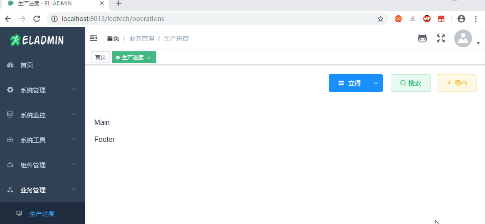
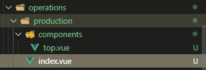

总操作流程：
- 1、[看效果](#eladmin-01)
- 2、[运行代码](#eladmin-02)
- 3、[写代码](#eladmin-03)

***

## 看效果 <a name="eladmin-01" href="#" >:house:</a>



## 运行代码 <a name="eladmin-02" href="#" >:house:</a>

> 1、使用sts运行eladmin源码或者运行其jar

> 2、运行eladmin-web项目

```
cnpm run dev
```

## 写代码 <a name="eladmin-03" href="#" >:house:</a>

> 1、进入element的官方api，复制需要的代码

- 目录结构



- index.vue

<details>
<summary>代码</summary>

```html
<template>
  <div id="Production">
    <el-container>
      <el-header><Top/></el-header>
      <el-main>Main</el-main>
      <el-footer>Footer</el-footer>
    </el-container>
  </div>
</template>

<script>
import Top from './components/top'
export default {
  name: 'Production',
  components: {
    Top
  },
  data() {
    return {}
  }
}

</script>

<style scoped>
.el-header {
  margin: 20px 0
}
</style>

```

</details>

- top.vue

<details>
<summary>代码</summary>

```html
<template>
  <div id="Top">
    <el-dropdown split-button type="primary" @command="handleCommand">
      <svg-icon icon-class="menu" />&nbsp;
      {{ company }}
      <el-dropdown-menu slot="dropdown">
        <el-dropdown-item command="LED7">立得</el-dropdown-item>
        <el-dropdown-item command="LEDA">立能</el-dropdown-item>
      </el-dropdown-menu>
    </el-dropdown>&nbsp;&nbsp;&nbsp;
    <el-button type="success" plain icon="el-icon-search">搜索</el-button>
    <el-button type="warning" plain icon="el-icon-download" >导出</el-button>
  </div>
</template>

<script>

export default {
  name: 'Top',
  data() {
    return {
      company: '立得'
    }
  },
  methods: {
    handleCommand(command) {
      switch (command) {
        case 'LEDA':
          this.company = '立能'
          break
        default:
          this.company = '立得'
          break
      }
    }
  }
}
</script>

<style scoped>
  .el-dropdown {
    vertical-align: top;
  }
  .el-dropdown + .el-dropdown {
    margin-left: 15px;
  }
  .el-icon-arrow-down {
    font-size: 12px;
  }
  #Top{
    float: right;
  }
</style>

```

</details>

> 看效果