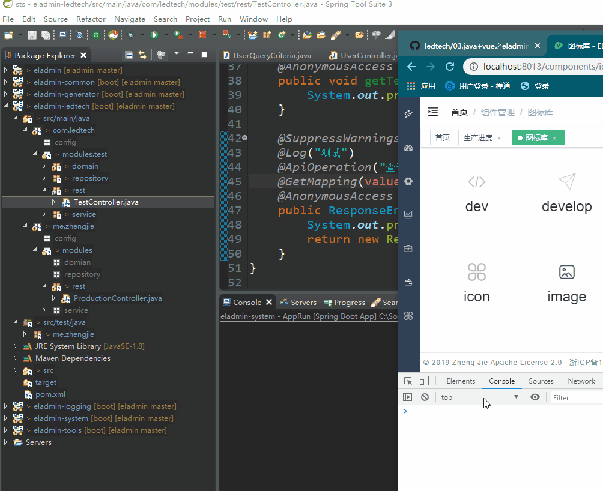
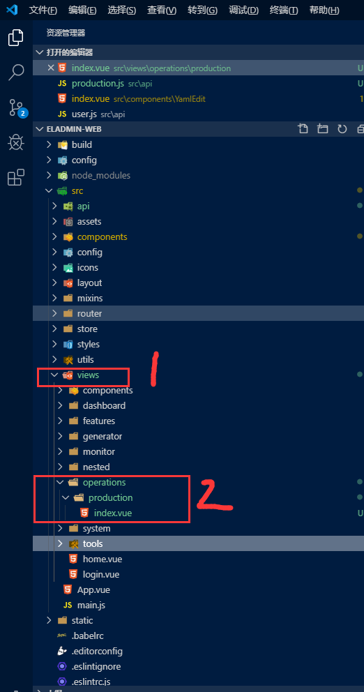

总操作流程：
- 1、[看效果](#eladmin-01)
- 2、[写代码](#eladmin-02)

'注意：本教程基于：06.java+vue之eladmin后台加多个数据源(oracle)'

***

## 看效果 <a name="eladmin-01" href="#" >:house:</a>



## 写代码 <a name="eladmin-02" href="#" >:house:</a>

### 后台的接口开发使用：06.java+vue之eladmin后台加多个数据源(oracle)

> 接口开发成功后，使用sts运行eladmin源码，使用postman测试接口

### 前端的代码

> 1、运行eladmin-web项目

> 2、创建production.js

- 路径在src/api文件夹下

```js
import request from '@/utils/request'

export function getTestAll() {
  return request({
    url: 'api/test/testAll',
    method: 'get'
  })
}

```


> 3、创建index.vue

- operations
    - production



<details>
<summary>代码</summary>

```html
<template>
  <div>
    <h1>222222222222222222222</h1>
  </div>
</template>

<script>
import { getTestAll } from '@/api/production'
export default {
  name: 'Production',
  data() {
    return {}
  },
  mounted: function() {
    this.getTestList()
  },
  methods: {
    getTestList() {
      getTestAll().then(result => {
        console.log(result) // 浏览器按F12 进入调试模式，选择Console选项卡，可以看到后台输入
      })
    }
  }
}
</script>

<style scoped>
</style>

```

</details>


