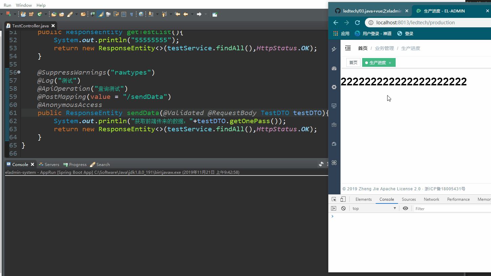
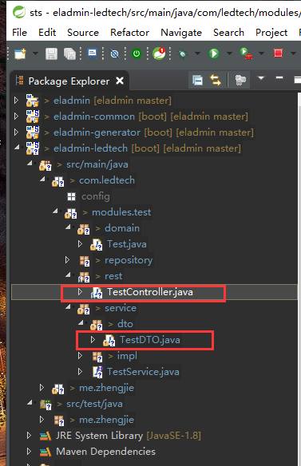
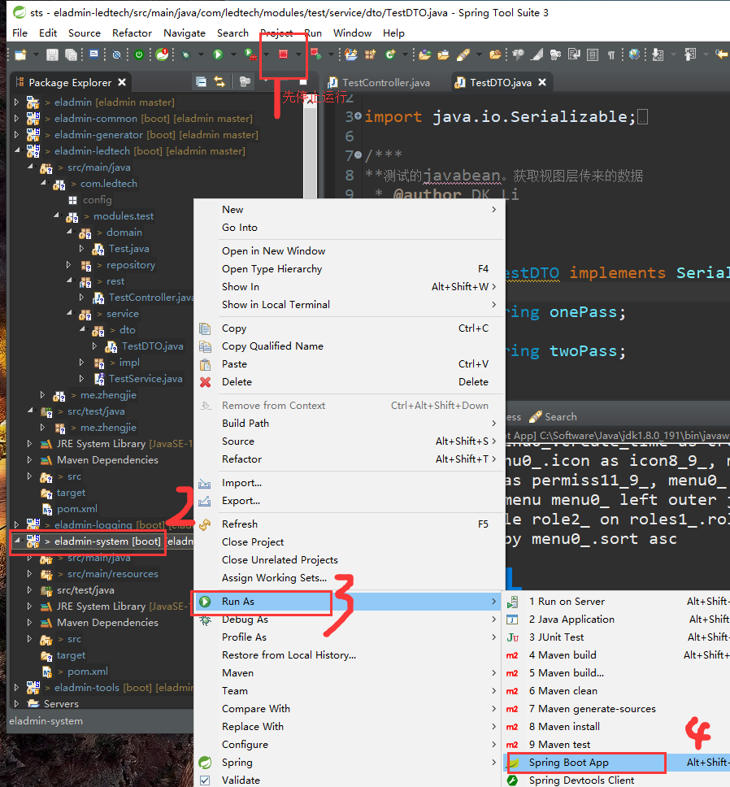
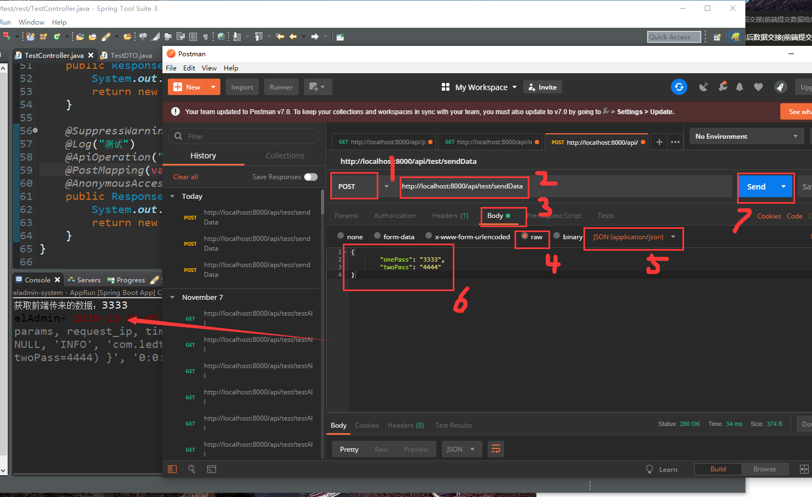

总操作流程：
- 1、看效果
- 2、写代码

'注意：本教程基于：06.java+vue之eladmin后台加多个数据源(oracle)'

***

## 看效果



## 写代码

### 写后台接口

- 目录结构



> 写控制层

- TestController

<details>
<summary>代码</summary>

```java
@Api(tags = "测试")
@RestController
@RequestMapping("/api/test")
@SuppressWarnings("unused")
public class TestController {
	
	private final TestService testService;
	
	public TestController(TestService testService) {
		this.testService=testService;
	}
	
	@SuppressWarnings("rawtypes")
	@Log("测试")
    @ApiOperation("获取前端数据测试")
	@PostMapping(value = "/sendData")
	@AnonymousAccess
    public ResponseEntity sendData(@Validated @RequestBody TestDTO testDTO){
		System.out.println("获取前端传来的数据："+testDTO.getOnePass());
		return new ResponseEntity<>(testService.findAll(),HttpStatus.OK);
	}
}

```

</details>

> 写javabean（DTO）

- TestDTO

<details>
<summary>代码</summary>

```java
/***
**测试的javabean。获取视图层传来的数据
 * @author DK_Li
 *
 */
@Data
public class TestDTO implements Serializable{
	@Query
	private String onePass;
	@Query
	private String twoPass;
}

```

</details>

> 使用sts运行eladmin，使用postman测试

- 1、使用sts运行eladmin



- 2、使用postman测试



### 写前端代码

> 1、运行eladmin-web项目

> 2、创建production.js

- 路径在src/api文件夹下

```js
import request from '@/utils/request'

export function sendData(data) {
  return request({
    url: 'api/test/sendData',
    method: 'post',
    data
  })
}

```


> 2、创建index.vue

- operations
    - production


<details>
<summary>代码</summary>

```html
<template>
  <div>
    <h1>222222222222222222222</h1>
  </div>
</template>

<script>
import { sendData } from '@/api/production'
export default {
  name: 'Production',
  data() {
    return {
      sendData: {
        onePass: '11111',
        twoPass: '22222'
      }
    }
  },
  mounted: function() {
    this.getTestList()
  },
  methods: {
    getTestList() {
      sendData(this.sendData).then(result => {
        console.log(result) // 浏览器按F12 进入调试模式，选择Console选项卡，可以看到后台输入
      })
    }
  }
}
</script>

<style scoped>
</style>

```

</details>

> 按F5刷新浏览器就可以看到修改