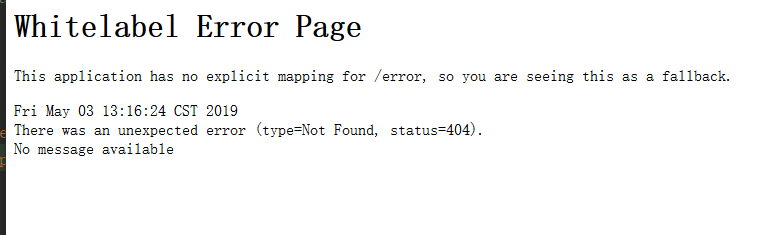

## 错误



```
springboot一直报404的错误信息
```

## 解决

> 可能一
```
Application类与controller包同级别
```

- 入口应用加

```java
@SpringBootApplication(scanBasePackages={"com.ledtech.java.controller"})
```

- 入口的应用模块pom.xml加

```xml
<packaging>war</packaging>
```

