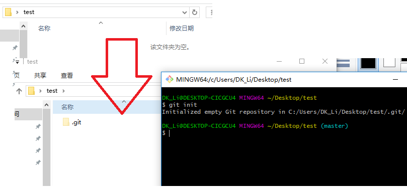
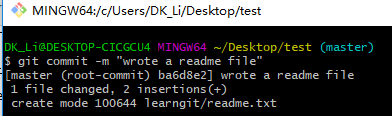

操作总流程：
- 1、[目录变成Git可以管理的仓库](#git-01)
- 2、[文件添加到仓库](#git-02)
- 3、[把文件提交到仓库](#git-03)

----------

## 目录变成Git可以管理的仓库 <a name="git-01" href="#" >:house:</a>

```shell
git init
```
`注：新建一个文件夹在里面进行“Git Bash Here”对文件夹初始化`

- 效果展现：



## 文件添加到仓库 <a name="git-02" href="#" >:house:</a>

- 创建learngit目录，创建readme.txt文件，添加内容如下

```shell
Git is a version control system.
Git is free software.
```

`注：readme.txt文件放到learngit目录下，用Notepad++编写readme.txt文件（UTF-8 without BOM格式）`

- 命令如下：

```shell
git add readme.txt
```

`注:进入到存放文件的地方执行命令`

## 把文件提交到仓库  <a name="git-03" href="#" >:house:</a>

```shell
git commit -m "wrote a readme file"
```

- 效果展现：

