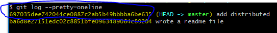

本页目录：
- 1、[显示从最近到最远的提交日志](#git-01)
- 2、[回退到上一个版本](#git-02)
- 3、[指定回退某个版本](#git-03)
- 4、[查看每一次命令](#git-04)

----------
## 显示从最近到最远的提交日志 <a name="git-01" href="#" >:house:</a>
- 语法：

```shell
git log 选择
```

- 选择：

--pretty=oneline ：如果嫌输出信息太多，看得眼花缭乱的，可以试试加上

## 回退到上一个版本 <a name="git-02" href="#" >:house:</a>
- 语法：

```shell
git reset --hard HEAD^
```
## 指定回到某个版本 <a name="git-03" href="#" >:house:</a>
- 语法：

```shell
git reset --hard (commit id)
```

commit id:



## 查看每一次命令 <a name="git-04" href="#" >:house:</a>
- 语法：

```shell
git reflog
```

- 效果展现：


