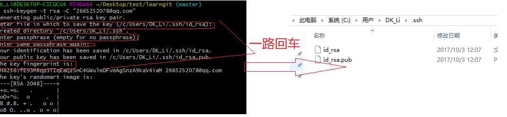
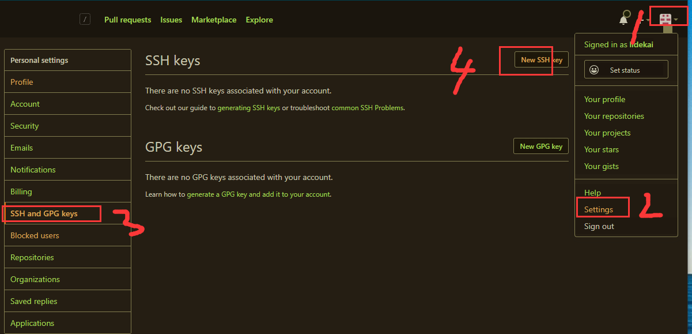
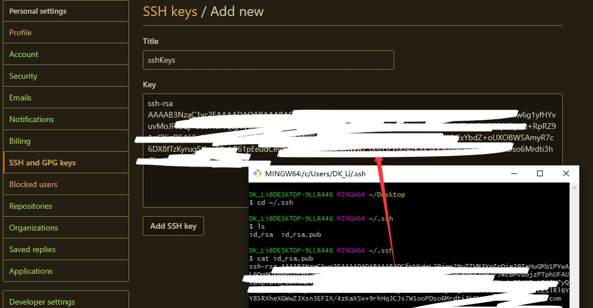

操作总流程：
- 1、[命令创建SSH Key](#git-01)
- 2、[GitHub设置](#git-02)

----------

## 命令创建SSH Key <a name="git-01" href="#" >:house:</a>

- 语法：

```shell
git config --global user.name "github的用户名"
git config --global user.email  "github注册的邮箱"
ssh-keygen -t rsa -C "github注册的邮箱"
```

- 效果展现：




`注：id_rsa和id_rsa.pub两个文件，这两个就是SSH Key的秘钥对，id_rsa是私钥，不能泄露出去，id_rsa.pub是公钥，可以放心地告诉任何人。`

## GitHub设置 <a name="git-02" href="#" >:house:</a>

- 操作流程：




