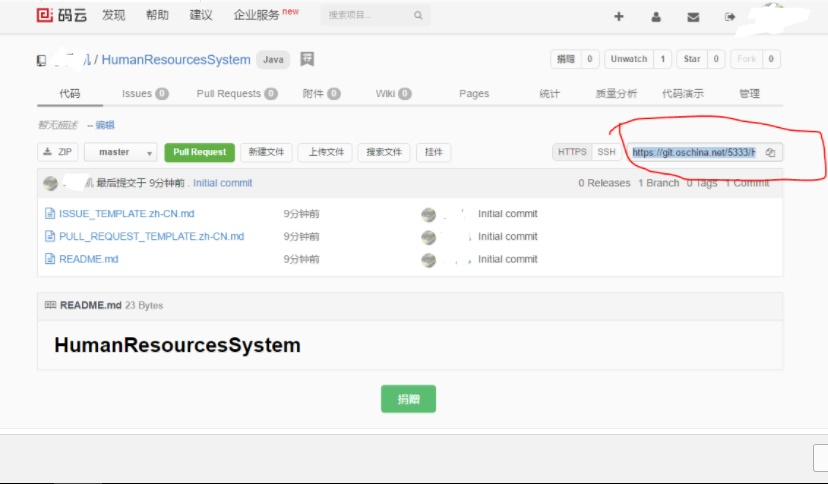

操作总流程：
- 1、[在项目的托管平台创建项目，获取链接](#git-01)
- 2、[写命令提交代码](#git-02)

----------

## 在项目的托管平台创建项目，获取链接 <a name="git-01" href="#" >:house:</a>



## 写命令提交代码 <a name="git-02" href="#" >:house:</a>

> 在项目的文件夹里打开“Git Bash Here”

<details>
<summary>语法</summary>

```shell
流程：初始化--》添加--》提交--》上传
git init      #初始化--在项目的文件夹里右键点击“Git Bash Here”
touch README.md   #添加一个文件。文件名叫：README.md;
git add README.md   #将README.md添加到索引库中。
git add *   #添加整个目录 （git add 文件名  #添加当前目录中的某个文件到索引--该方法是更新代码的 ）
git commit -m "创建项目"
git remote add origin https://git.oschina.net/5333/TrainingBuildingManagementSystem.git
git push -u origin master  #提交
git remote rm origin #断开远程仓库连接
```

</details>