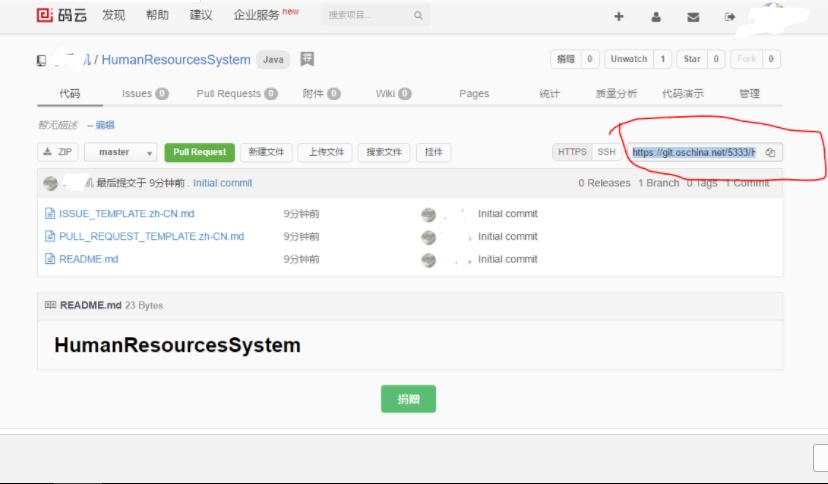

操作总流程：
- 1、[在项目的托管平台创建项目，获取链接](#git-01)
- 2、[写命令提交代码](#git-02)

----------

## 在项目的托管平台创建项目，获取链接 <a name="git-01" href="#" >:house:</a>



## 写命令提交代码 <a name="git-02" href="#" >:house:</a>

<details>
<summary>语法</summary>

```shell
流程：查看状态--》添加--》提交--》上传
git status # 查看状态
git add 文件名   #添加要修改的文件
git commit -m "创建项目"
git remote add origin https://git.oschina.net/5333/TrainingBuildingManagementSystem.git
git push -u origin master  #提交
git remote rm origin #断开远程仓库连接
```

</details>