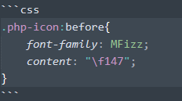

本页目录
- 1、[普通代码块](#Markdown-01)
- 2、[语法高亮代码块](#Markdown-02)
- 2、[diff符号](#Markdown-03)


***

## 普通代码块 <a name="Markdown-01" href="#" >:house:</a>

> 效果

```
q
e
```

***

> 语法


## 语法高亮代码块 <a name="Markdown-02" href="#" >:house:</a>

> 效果

```css
.php-icon:before{
    font-family: MFizz;
    content: "\f147";
}
```

***

> 语法




- 三个反引号后面写对应得代号，如


## diff符号 <a name="Markdown-01" href="#" >:house:</a>

> 效果


```diff
+ 人闲桂花落，
- 夜静春山空。
! 月出惊山鸟，
# 时鸣春涧中。
```

***

> 语法


