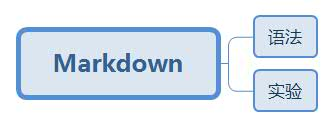

## 学习路线



[](https://shd101wyy.github.io/markdown-preview-enhanced/#/zh-cn/presentation?id=presentation-front-matter)

## 学习思路
- Markdown是什么？
```
一种可以使用普通文本编辑器编写的标记语言，通过简单的标记语法，它可以使普通文本内容具有一定的格式。
```
- Markdown能干什么？

```
写作文、批改作文、记读书笔记，课堂笔记
```
- Markdown怎么应用？
```
见下拉菜单
```