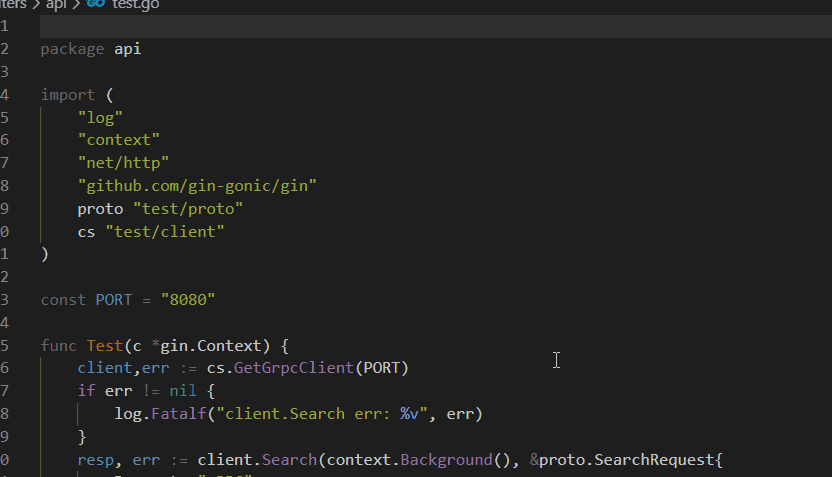

## 效果



## 操作

<!-- @import "[TOC]" {cmd="toc" depthFrom=1 depthTo=6 orderedList=false} -->

> 1、下载安装：KoroFileHeader

> 2、配置.设置>扩展>json>在setting.json中编辑

<details>
<summary>配置</summary>

```json
    // 文件头部注释
    "fileheader.customMade": {
        "Descripttion": "",
        "version": "0.1",
        "Author": "DK_Li",
        "Date": "{createTime}",
        "LastEditors": "DK_Li",
        "LastEditTime": "{updateTime}"
    },
    //函数注释
    "fileheader.cursorMode": {
        "description": "",
        "param": "",
        "return": ""
    },
```

</details>

> 使用快捷键

- 文件头部注释：ctrl+alt+i
- 函数注释注释：ctrl+alt+t
