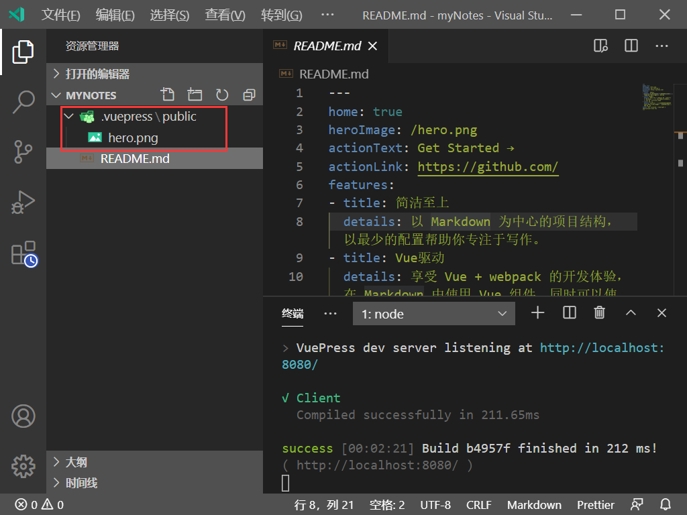

总操作流程：
- 1、[写配置](#VuePress-01)
- 2、[看效果](#VuePress-02)

***

## 写配置 <a name="VuePress-01" href="#" >:house:</a>

- 项目目录



> 在README.md写配置

```md
---
home: true
heroImage: /hero.png
actionText: Get Started →
actionLink: https://github.com/
features:
- title: 简洁至上
  details: 以 Markdown 为中心的项目结构，以最少的配置帮助你专注于写作。
- title: Vue驱动
  details: 享受 Vue + webpack 的开发体验，在 Markdown 中使用 Vue 组件，同时可以使用 Vue 来开发自定义主题。
- title: 高性能
  details: VuePress 为每个页面预渲染生成静态的 HTML，同时在页面被加载的时候，将作为 SPA 运行。
footer: MIT Licensed | Copyright © 2018-present Evan You
---
```

## 看效果 <a name="VuePress-02" href="#" >:house:</a>

> 运行

```shell
# 开始写作
vuepress dev .
```

> 看效果：http://localhost:8080/