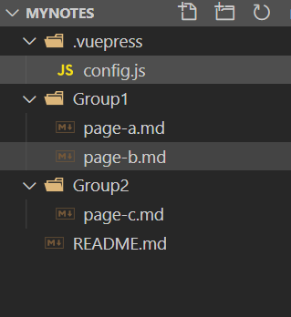

总操作流程：
- 1、[写配置](#VuePress-01)
- 2、[看效果](#VuePress-02)

***

## 写配置 <a name="VuePress-01" href="#" >:house:</a>

- 项目目录



> Group1\page-a.md写配置

```md
# test page-a
```

> Group1\page-b.md写配置

```md
# test page-b
```

> Group2\page-c.md写配置

```md
# test page-c
```
> README.md写配置

```md
# test README
```

> .vuepress\config.js写配置

```js
module.exports = {
    themeConfig: {
        sidebar: [
            '/',
            {
                title: 'Group1', // 分组名
                collapsable: true, // 可折叠,
                children: [
                    ['/Group1/page-a', 'a'],
                    ['/Group1/page-b', 'b'],
                ]
            }, {
                title: 'Group2',
                collapsable: true,
                children: [
                    ['/Group2/page-c', 'c'],
                ]
            },
        ]
    }
}
```


## 测试 <a name="VuePress-02" href="#" >:house:</a>

> 运行

```shell
# 开始写作
vuepress dev .
```

> 看效果：http://localhost:8080/