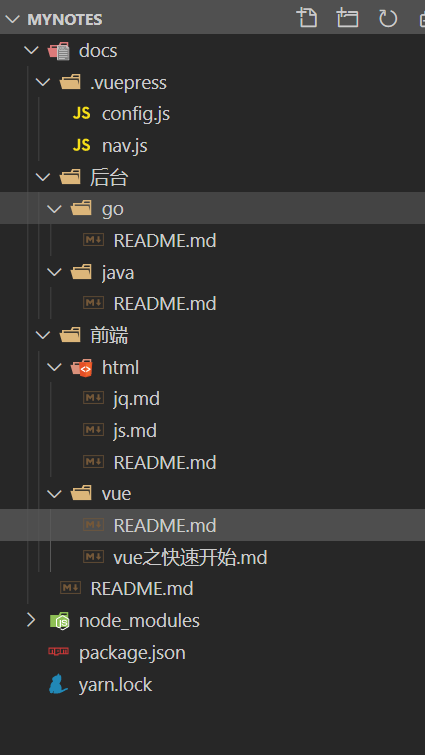
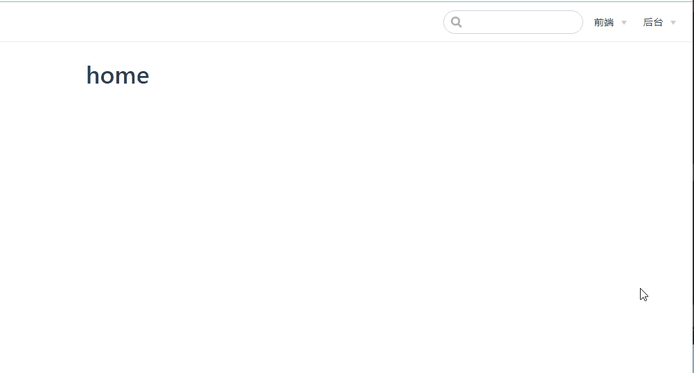

总操作流程：
- 1、[下载安装](#VuePress-01)
- 2、[配置](#VuePress-02)
- 3、[看效果](#VuePress-03)

***

## 下载安装 <a name="VuePress-01" href="#" >:house:</a>

```shell
npm i vuepress-plugin-auto-sidebar -D
# 或者
yarn add vuepress-plugin-auto-sidebar
```

## 配置 <a name="VuePress-02" href="#" >:house:</a>

- 项目目录



> docs\README.md写配置

```md
---
title: home
---

# home
```

> docs\后台\go\README.md写配置

```md
---
title: go
---

# go说明
```

> docs\后台\java\README.md写配置

```md
---
title: java
---

# java说明
```

> docs\前端\vue\README.md写配置

```md
---
title: vue
---

# vue说明
```

> docs\前端\vue\vue之快速开始.md写配置

```md
---
title: vue之快速开始
---

# vue之快速开始
```

- 使用autoGroup划分二级层次


> docs\前端\html\README.md写配置

```md
---
autoGroup-1: 简介
title: html
---

# html说明
```

> docs\前端\html\js.md写配置

```md
---
autoGroup-2: 脚本
title: js
---

# js说明
```

> docs\前端\html\jq.md写配置

```md
---
autoGroup-2: 脚本
title: jq
---

# jq说明
```

> docs/.vuepress/config.js写配置

```js
module.exports = {
    plugins: {
        "vuepress-plugin-auto-sidebar": {
            nav: true
        }
    },
}
```

- 运行命令：vuepress dev docs  后自动生成docs/.vuepress/nav.js


- 停止程序，修改docs/.vuepress/config.js
```js
const nav = require("./nav.js");

module.exports = {
  plugins: {
    "vuepress-plugin-auto-sidebar": {
      nav: true
    }
  },
  themeConfig: {
    nav
  },
}
```

# <a name="VuePress-03" href="#" >看效果:house:</a>

> 运行

```shell
# 开始写作
vuepress dev docs
```

> 看效果：http://localhost:8080/

