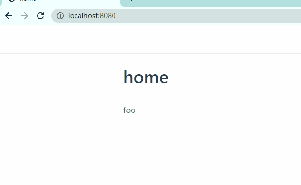
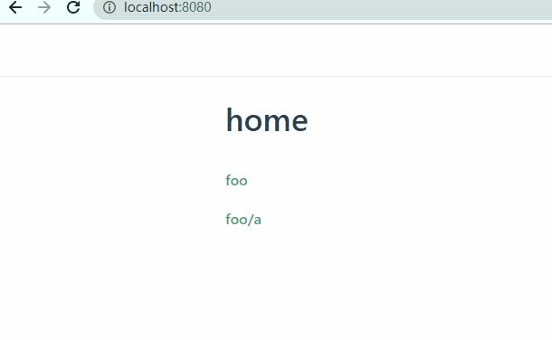

本页目录：
- 1、[跳转到根部的](#VuePress-01)
- 2、[指定跳转到的md文件](#VuePress-02)
- 3、[指定跳转到的md文件中具体位置](#VuePress-03)

***

## 跳转到根部的 <a name="VuePress-01" href="#" >:house:</a>

> 效果



> 语法

```shell
[命名](文件相对路径)
```


## 指定跳转到的md文件 <a name="VuePress-02" href="#" >:house:</a>

> 效果



> 语法

```md
[命名](文件相对路径/文件名.md)
```


## 指定跳转到的md文件中具体位置 <a name="VuePress-03" href="#" >:house:</a>

> 语法

- 本地的md

```shell
# 目录
[位置标题](#heading)

# 锚点
## 位置标题 <a name="heading" id="heading" href="#" >:house:</a>
```

- 别的md跳转指定位置

[命名](文件相对路径/文件名.md#heading)