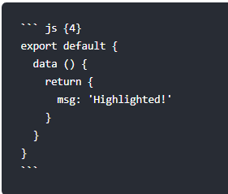
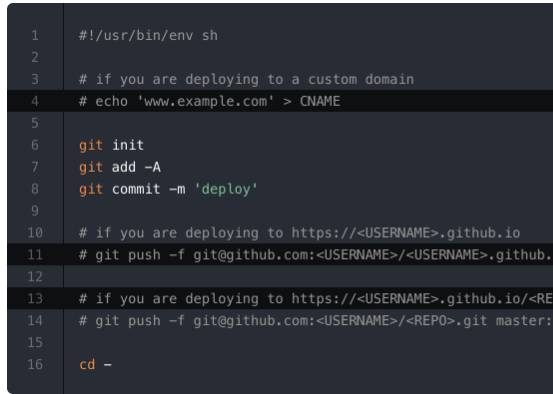

本页目录：
- 1、[代码块中高亮](#VuePress-01)
- 2、[代码块中行号](#VuePress-02)

***

## 代码块中高亮 <a name="VuePress-01" href="#" >:house:</a>

> 效果

``` js {4}
export default {
  data () {
    return {
      msg: 'Highlighted!'
    }
  }
}
```

> 语法



## 代码块中行号 <a name="VuePress-02" href="#" >:house:</a>

> 效果



> 语法

- .vuepress\config.js配置

```js{2,3,4}
module.exports = {
    markdown: {
        lineNumbers: true
    }
}
```

