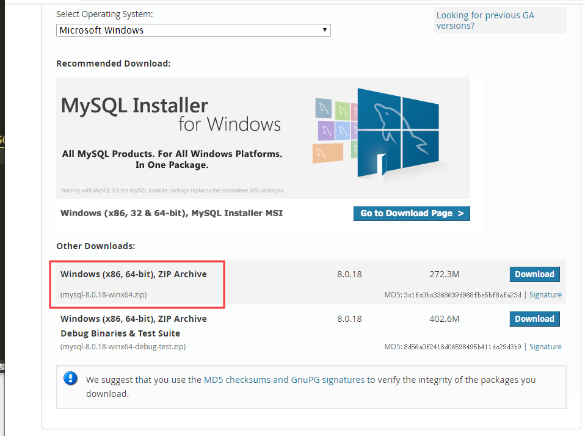
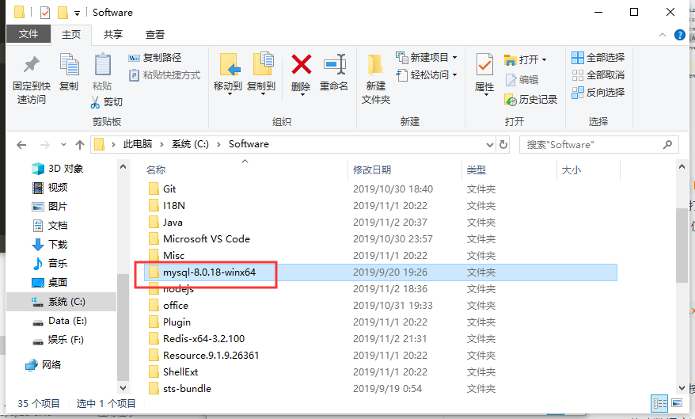

总操作流程：
- 1、[下载安装](#sql-01) 
- 2、[配置](#sql-02) 
- 3、[测试](#sql-03) 

***

## 下载安装 <a name="sql-01" href="#" >:house:</a>

> 下载

[](https://dev.mysql.com/downloads/mysql/)



> 解压指定的路径



## 配置 <a name="sql-02" href="#" >:house:</a>

> 配置系统变量环境

- 加MYSQL_HOME
```
变量名:MYSQL_HOME
变量值:C:\Software\mysql-8.0.18-winx64
```
-  Path的变量值后面添加

```
;%MYSQL_HOME%\bin
```
> 根目录下创建文件

- 在MySql文件在根目录下创建my.ini

```shell
[mysql]
# 设置mysql客户端默认字符集
default-character-set=utf8 
[mysqld] 
#设置3306端口 
port = 3306
# 设置mysql的安装目录 
basedir=C:\Software\mysql-8.0.18-winx64
# 设置mysql数据库的数据的存放目录
datadir=C:\Software\mysql-8.0.18-winx64\data
# 允许最大连接数
max_connections=200 
# 服务端使用的字符集默认为8比特编码的latin1字符集
character-set-server=utf8 
# 创建新表时将使用的默认存储引擎 
default-storage-engine=INNODB
```

- 用管理员身份运行cmd

```
cd C:\Software\mysql-8.0.18-winx64\bin

# 安装
mysqld --install

# 初始化
mysqld --initialize

# 运行
net start mysql
```

> 设置MySql登录密码

- 1、获取默认密码。打开data文件夹里面的.err文件，“root@localhost:”后面的就是密码

- 2、登录修改密码

```
mysql -u root -p

mysql> alter user "root"@"localhost" identified by "123456";
mysql> flush privileges;
mysql> quit; 
```

## 测试 <a name="sql-03" href="#" >:house:</a>

> 重新登陆