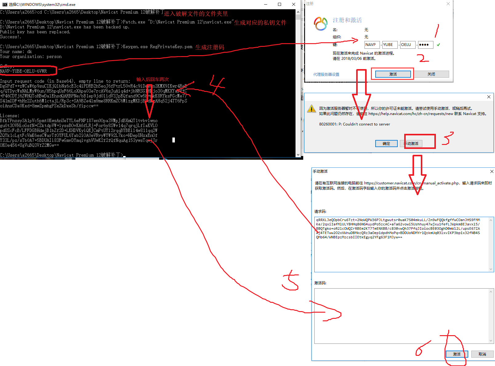
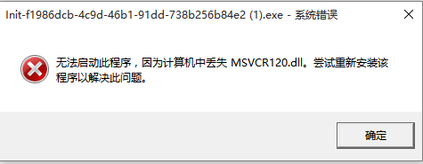

[](https://www.jianshu.com/p/5f693b4c9468?mType=Group)


总操作流程:
- 1、[下载文件](#navicat-01)
- 2、[破解](#navicat-02)

----------

`注意：操作要断开网络`

## 下载文件 <a name="navicat-01" href="#" >:house:</a>

[](https://pan.baidu.com/s/1FMB65oARRSCcOtakx0lRQQ)

[](https://pan.baidu.com/s/151_6s4z-_DjZRoq-FTDcMA)


## 破解 <a name="navicat-01" href="#" >:house:</a>
dos命令进入界面

```
cd C:\Users\a2665\Desktop\Navicat Premium 12破解补丁 #进入破解文件的文件夹里

Patch.exe "D:\Navicat Premium 12\navicat.exe" #生成私钥文件

Keygen.exe RegPrivateKey.pem #生成Navicat 12的注册码
```



>要是系統報msvcr120.dll丢失




[](https://pan.baidu.com/s/1GGMZ2j1a-18F3VgddxJlWQ)

