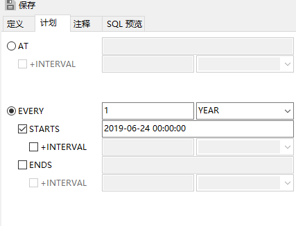

总操作流程：
- 1、创建表
- 2、设置
- 3、测试

***

## 创建表

>创建测试表
```sql
CREATE TABLE test  (
  testNo varchar(50),
  testName varchar(50),
  PRIMARY KEY (testNo)
)
```

>创建sequence表
```sql
CREATE TABLE sequence (
  id varchar(32),
  index_next int(10) NOT NULL,
  next int(3) NOT NULL,
  PRIMARY KEY (id)
)

INSERT INTO sequence VALUES ('trans_no', 0, 1);

```

## 设置

>1、创建事件:sequence_event

```sql
UPDATE sequence SET index_next=0 WHERE id='trans_no'
```



>2、创建函数:next_trans_num

```sql
CREATE DEFINER=`root`@`localhost` FUNCTION `next_trans_num`(seq_name varchar(30)) RETURNS int(11)
BEGIN
	#Routine body goes here...
  UPDATE sequence SET index_next=last_insert_id(index_next+next) WHERE id=seq_name;
	RETURN last_insert_id();
END
```

>3、创建函数:get_trans_num

```sql
CREATE DEFINER=`root`@`localhost` FUNCTION `get_trans_num`() RETURNS varchar(24) CHARSET gb2312
BEGIN
 DECLARE getval VARCHAR(24);
 SET getval =(SELECT CONCAT(DATE_FORMAT(NOW(), '%Y'), (SELECT next_trans_num('trans_no'))));
RETURN getval;
END
```

## 测试

```sql
INSERT INTO test(testNo,testName) VALUES(get_trans_num(),1);
```

