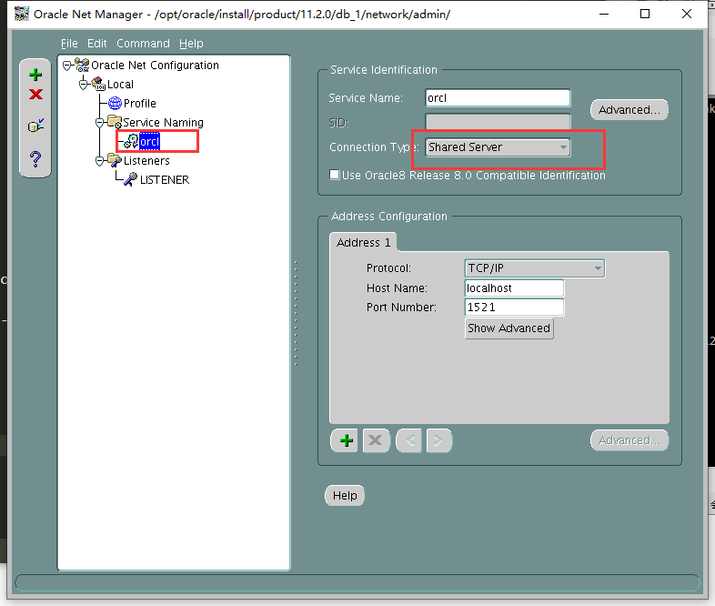
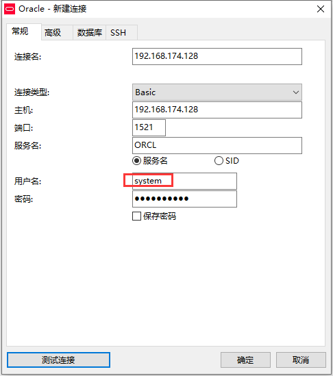

总操纵流程：
- 1、配置
- 2、测试


***

> 注意：本教程是虚拟机CentOS7系统下的Oracle

## 配置

> 防火墙对端口进行开放

- 使用admin用户登录

```shell
# 查看监听器的状态,获取端口
lsnrctl status

# 切换到root用户
su 

# 防火墙对端口开放
firewall-cmd --permanent --zone=public --add-port=1521/tcp
firewall-cmd --reload
firewall-cmd --zone=public --query-port=1521/tcp
```

> 给数据库实例外连接设置

```
netmgr
```




## 测试



