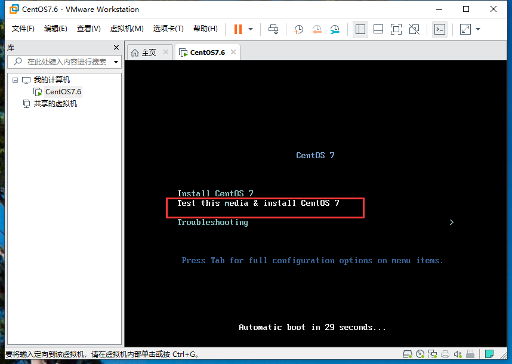

总操作流程：
- 1、[制作u盘](#Linux-01)
- 2、[安装](#Linux-02)
- 3、[测试](#Linux-03)

***

## 制作u盘 <a name="Linux-01" href="#" >:house:</a>

- 使用Win32DiskImager软件刻录
[](https://sourceforge.net/projects/win32diskimager/files/latest/download)


## 安装 <a name="Linux-02" href="#" >:house:</a>




> 自定义分区建议分（都是标准分区）

- / 大小：100 GiB 格式：ext4
- /swap 大小：物理内存x2 GiB 格式：swap
- /var 大小：20 GiB 格式：ext4
- /boot 大小：500 MiB 格式：ext4
- /boot/efi 大小：200 MiB 格式：ext4
- /biosboot 大小：2 MiB 格式：GPT
- /HOME 大小：剩下的 格式：ext4


## 测试 <a name="Linux-03" href="#" >:house:</a>

- 使用ssh远端桌面连接测试

- 更新

```
yum -y update
```


