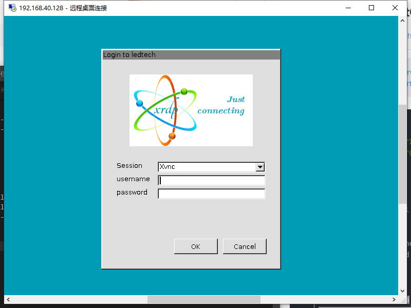

总操作流程：
- 1、[安装CentOS桌面](#Linux-01)
- 2、[安装xrdp](#Linux-02)
- 3、[添加防火墙](#Linux-03)
- 4、[测试](#Linux-04)

***

## 安装CentOS桌面 <a name="Linux-01" href="#" >:house:</a>

```shell
su

yum upgrade
yum -y groupinstall "X Window System" 
yum -y groupinstall "GNOME Desktop"
```
## 安装xrdp <a name="Linux-02" href="#" >:house:</a>

> 1、安装

```shell
yum install epel* -y
yum --enablerepo=epel -y install xrdp
```
> 2、开启
```
systemctl start xrdp
systemctl enable xrdp
netstat -tnlp | grep xrdp #查看端口
```

## 添加防火墙 <a name="Linux-03" href="#" >:house:</a>

```shell
firewall-cmd --permanent --zone=public --add-port=3389/tcp
firewall-cmd --reload
```

>防火墙命令

- 查看防火墙的开放的端口

```
firewall-cmd --permanent --list-ports
```

- 查询端口是否开放

```
firewall-cmd --query-port=3389/tcp
```

- 开放端口

```
firewall-cmd --permanent --add-port=3389/tcp
```

- 移除端口

```
firewall-cmd --permanent --remove-port=3389/tcp
```

- 重启防火墙

```
firewall-cmd --reload
```

## 测试 <a name="Linux-04" href="#" >:house:</a>




