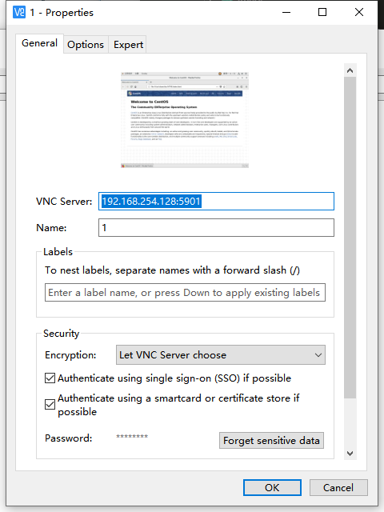
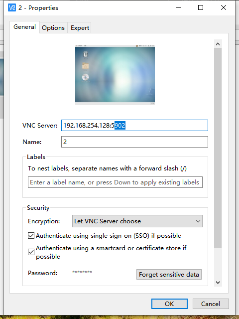

总操作流程：
- 1、[安装配置Tigervnc-server](#Linux-01)
- 2、[使用VNC Client连接到CentOS桌面](#Linux-02)

***

## 在CentOs7上安装Tigervnc-server <a name="Linux-01" href="#" >:house:</a>

### 配置第一个远程的

> 1、下载安装

```
yum -y install tigervnc-server
```

> 2、配置

```c
cp /lib/systemd/system/vncserver@.service  /etc/systemd/system/vncserver@:1.service

vim /etc/systemd/system/vncserver@\:1.service
```

```c
[Unit]
Description=Remote desktop service (VNC)
After=syslog.target network.target
[Service]
Type=forking
ExecStartPre=/bin/sh -c '/usr/bin/vncserver -kill %i > /dev/null 2>&1 || :'

#admin是你想使用VNC Server的用户名
ExecStart=/sbin/runuser -l admin -c "/usr/bin/vncserver %i -geometry 1280x1024"

#admin是你想使用VNC Server的用户名
PIDFile=/home/admin/.vnc/%H%i.pid 

ExecStop=/bin/sh -c '/usr/bin/vncserver -kill %i > /dev/null 2>&1 || :'
[Install]
WantedBy=multi-user.target
```

```c
reboot

su admin

systemctl daemon-reload
systemctl start vncserver@:1
systemctl status vncserver@:1
systemctl enable vncserver@:1
```

```
ss -tulpn| grep vnc # 查看端口

firewall-cmd --add-port=5901/tcp
firewall-cmd --add-port=5901/tcp --permanent
```

### 配置第二个远程的

> 1、下载安装

```
yum -y install tigervnc-server
```

> 2、配置

```c
cp /lib/systemd/system/vncserver@.service  /etc/systemd/system/vncserver@:2.service

vim /etc/systemd/system/vncserver@\:2.service
```

```c
[Unit]
Description=Remote desktop service (VNC)
After=syslog.target network.target
[Service]
Type=forking
ExecStartPre=/bin/sh -c '/usr/bin/vncserver -kill %i > /dev/null 2>&1 || :'

#admin是你想使用VNC Server的用户名
ExecStart=/sbin/runuser -l admin -c "/usr/bin/vncserver %i -geometry 1280x1024"

#admin是你想使用VNC Server的用户名
PIDFile=/home/admin/.vnc/%H%i.pid 

ExecStop=/bin/sh -c '/usr/bin/vncserver -kill %i > /dev/null 2>&1 || :'
[Install]
WantedBy=multi-user.target
```

```c
reboot

su admin

systemctl daemon-reload
systemctl start vncserver@:2
systemctl status vncserver@:2
systemctl enable vncserver@:2
```

```
ss -tulpn| grep vnc # 查看端口

firewall-cmd --add-port=5902/tcp
firewall-cmd --add-port=5902/tcp --permanent
```

## 使用VNC Client连接到CentOS桌面 <a name="Linux-02" href="#" >:house:</a>

[](https://www.realvnc.com/en/connect/download/viewer/windows/)





