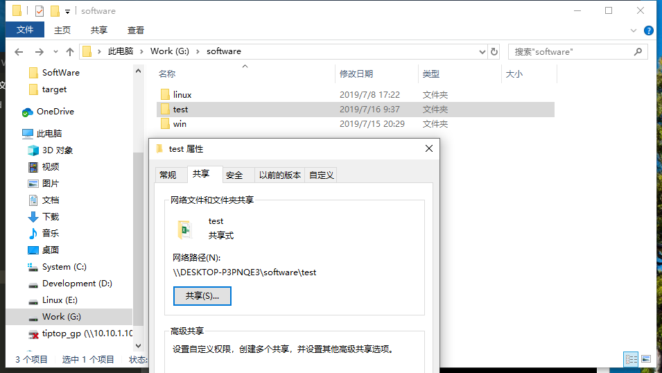

总操做流程：
- 1、[windows创建共享文件夹](#Linux-01)
- 2、[linux创建文件夹](#Linux-02)
- 3、[测试](#Linux-03)

***

## windows创建共享文件夹 <a name="Linux-01" href="#" >:house:</a>



## linux创建文件夹 <a name="Linux-02" href="#" >:house:</a>

```shell

mkdir /home/test

mount -t cifs -o username=admin,password=LEDDNS //10.10.2.176/software/test /home/test
```

## 测试 <a name="Linux-03" href="#" >:house:</a>

创建文件互相查看


