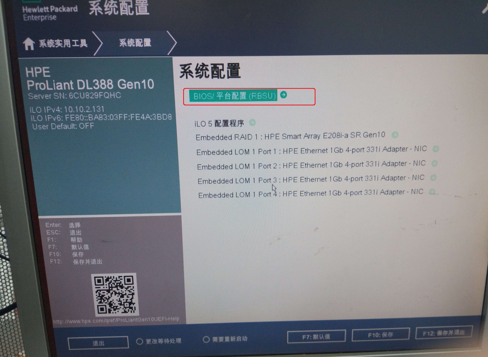
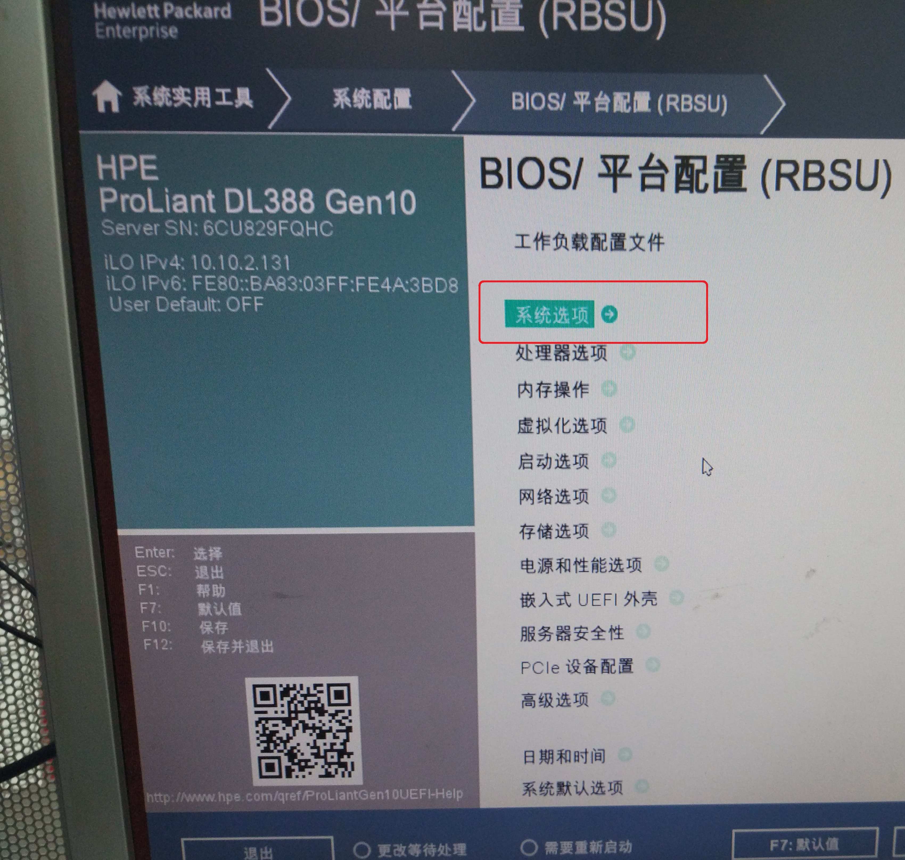
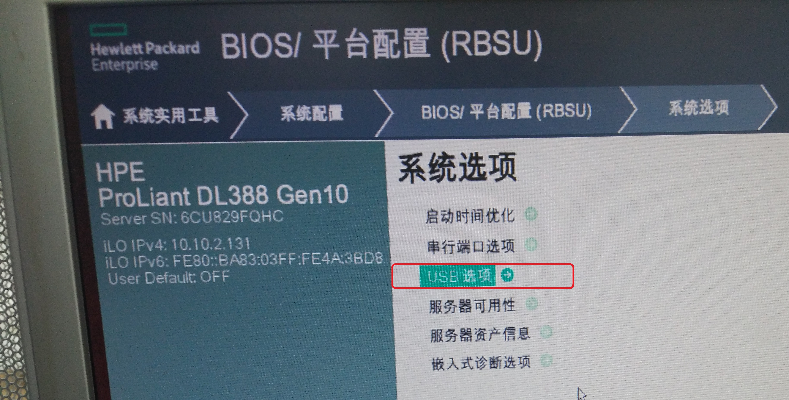
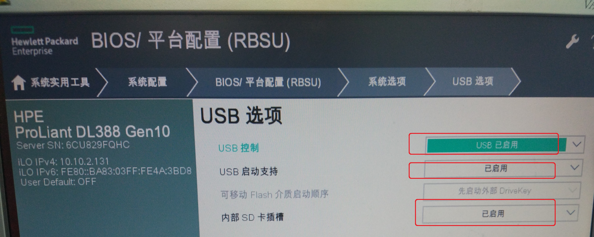
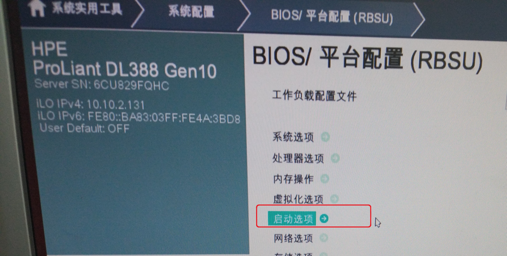
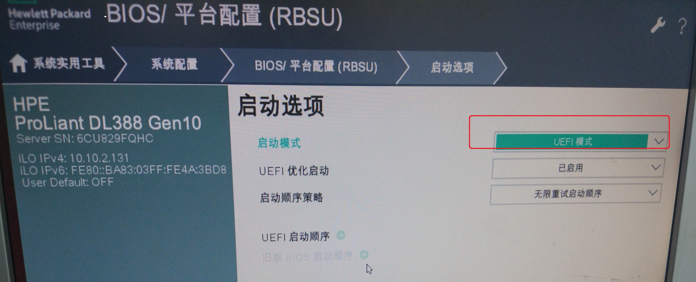
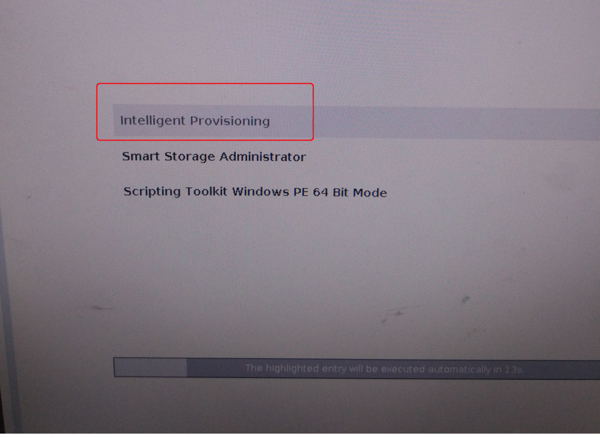
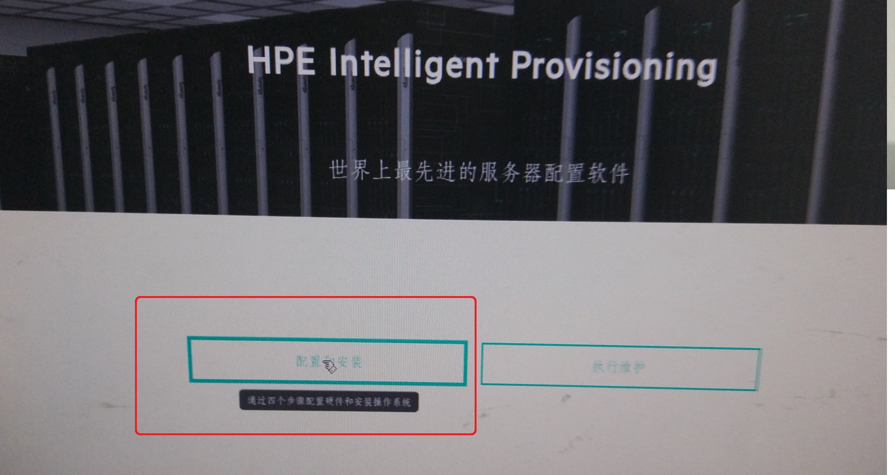
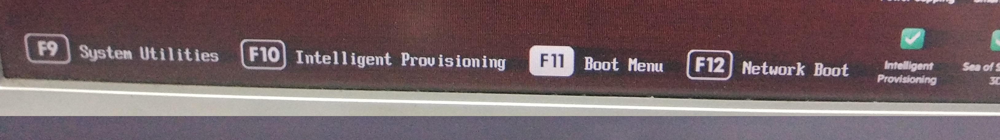
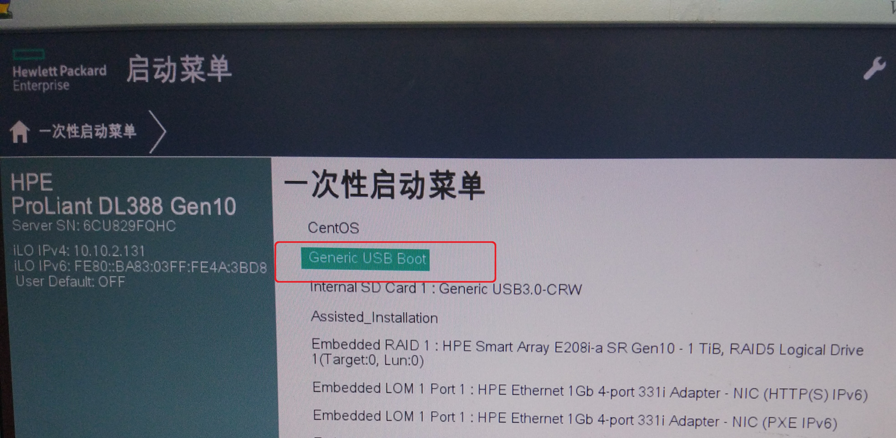

总操作流程：
- 1、[开启u盘启动](#Linux-01)
- 2、[设置安装源](#Linux-02)
- 3、[安装](#Linux-03)

***

## 开启u盘启动 <a name="Linux-01" href="#" >:house:</a>

## 设置安装源 <a name="Linux-02" href="#" >:house:</a>

> u盘要制作好

## 安装 <a name="Linux-03" href="#" >:house:</a>

