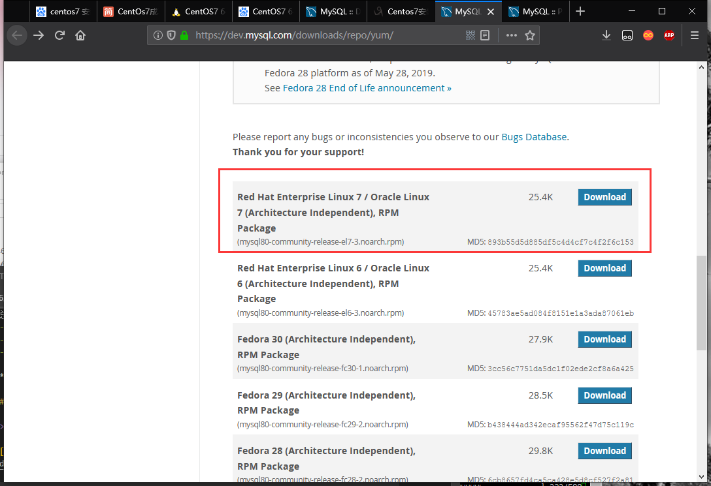
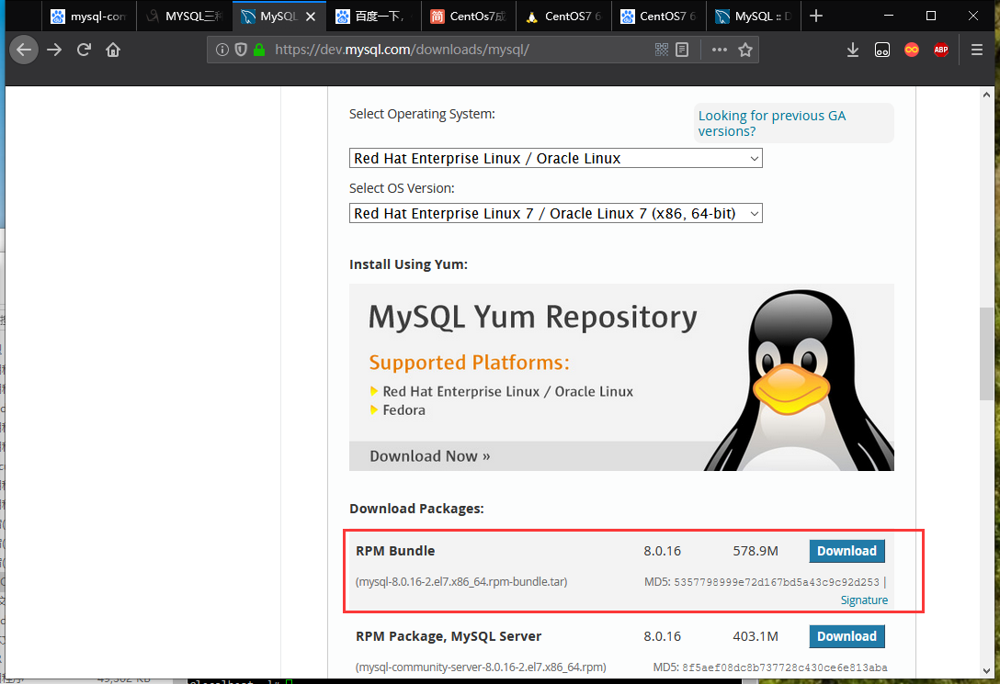

总操作流程：
- 1、[下载安装](#Linux-01)
- 2、[配置](#Linux-02)
- 3、[测试](#Linux-03)

***

## 下载安装 <a name="Linux-01" href="#" ></a>

> 1、下载

[](https://dev.mysql.com/downloads/repo/yum/)




[](https://dev.mysql.com/downloads/mysql/)



> 2、安装

```
cd /usr/local

yum localinstall mysql80-community-release*

yum repolist enabled | grep "mysql.*-community.*"

yum install mysql-community-common*

yum -y remove mariadb-libs

yum install mysql-community-libs*

yum install mysql-community-client*

yum install mysql-community-server*

mysql --version
```

> 3、修改mysql密码

```shell
service mysqld start #启动MySQL服务器

service mysqld status #检查MySQL服务器的状态

grep 'temporary password' /var/log/mysqld.log # 获取临时密码

# 查看mysql版本
mysql -V

mysql -u root -p # 使用临时密码登录

#修改root账户的密码，密码：DKLi123456! 
# 如果您有MySQL 5.7.6及更高版本或MariaDB 10.1.20及更高版本
mysql > update user set password=password("123456") where user="root";
# 如果您有MySQL 5.7.5及更早版本或MariaDB 10.1.20及更早版本
mysql > update user set authentication_string=password("123456") where user="root";
mysql > flush privileges;
mysql > quit;

service mysqld restart #重启mysql
```

> 4、加入防火墙

```
firewall-cmd --permanent --zone=public --add-port=3306/tcp
firewall-cmd --reload
firewall-cmd --zone=public --query-port=3306/tcp #查看添加端口是否成功
```

## 配置 <a name="Linux-02" href="#" ></a>

> 1、创建一个远程用户，并赋予权限

```shell
mysql> CREATE USER 'dk'@'%' IDENTIFIED BY 'DKLi123456!';
mysql> flush privileges;
```

> 2、创建数据库，并赋予权限

```shell
mysql> create database ssm;
mysql> GRANT all privileges ON ssm.* TO 'dk'@'%' WITH GRANT OPTION;
mysql> flush privileges; 
mysql> quit;  

service mysqld restart
```
> 3、修改加密规则

```shell
mysql -u root -p

# 修改加密规则
mysql> ALTER USER 'dk'@'%' IDENTIFIED BY 'DKLi123456!' PASSWORD EXPIRE NEVER;

#更新一下用户的密码 
mysql> ALTER USER 'dk'@'%' IDENTIFIED WITH mysql_native_password BY 'DKLi123456!';

#刷新权限 
mysql> FLUSH PRIVILEGES;

#再重置下密码
mysql> alter user 'dk'@'%' identified by 'DKLi123456!';

mysql> FLUSH PRIVILEGES;

mysql> quit;

service mysqld restart
```


## 测试 <a name="Linux-03" href="#" ></a>

使用软件远程连接数据库
