[](https://www.cnblogs.com/muhehe/p/7816808.html)


操作总流程：
- 1、[安装的硬件要求](#Linux-01)
- 2、[安装Oracle前的准备](#Linux-02)
- 3、[下载安装](#Linux-03)
- 4、[测试](#Linux-04)

***
`注意：建议安装要在虚拟机下进行`

## 安装的硬件要求 <a name="Linux-01" href="#" >:house:</a>

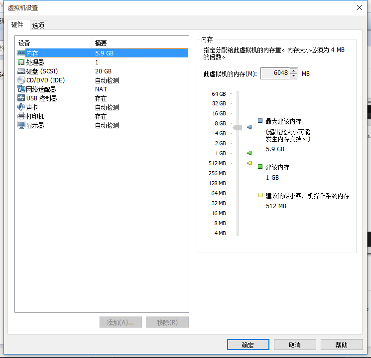

## 安装Oracle前的准备 <a name="Linux-02" href="#" >:house:</a>
### 1、创建运行oracle数据库的系统用户和用户组
```shell
su           #切换到root

groupadd oinstall
groupadd dba
```
### 2、创建oracle数据库安装目录
```shell
cd /.   
mkdir -p /opt/oracle/install
mkdir -p /opt/oracle/oraInventory
cd /opt/oracle
chown -R admin:oinstall /opt/oracle/install
chown -R admin:oinstall /opt/oracle/oraInventory

```
### 3、修改OS系统标识（oracle默认不支持CentOS系统安装，但是centos其实就是redhat）
```shell
cat /proc/version #查看CentOS系统版本

vim /etc/redhat-release
```
- 修改内容是(6是CentOS系统的版本，根据不同版本输入)
```shell
redhat-6
```
### 4、安装oracle数据库所需要的软件包
```shell
yum -y install binutils* compat-libcap1* compat-libstdc++* gcc* gcc-c++* glibc* glibc-devel* ksh* libaio* libaio-devel* libgcc* libstdc++* libstdc++-devel* libXi* libXtst* make* sysstat* elfutils* unixODBC*
```
### 5、关闭防火墙
```shell
systemctl status firewalld  # 查看防火墙状态

systemctl stop firewalld  # 停止防火墙
```
### 6、关闭selinux（需重启生效）
```shell
vim /etc/selinux/config
```
- 修改内容是：
```shell
SELINUX=disabled  # 此处修改为disabled
```
### 7、修改内核参数（加入斜体部分）
```shell
vim /etc/sysctl.conf
```
- 修改内容是：
最后添加
```shell
net.ipv4.icmp_echo_ignore_broadcasts = 1
net.ipv4.conf.all.rp_filter = 1
fs.file-max = 6815744 #设置最大打开文件数
fs.aio-max-nr = 1048576
kernel.shmmax = 2147483648 #最大共享内存的段大小
kernel.shmmni = 4096 #整个系统共享内存端的最大数
kernel.sem = 250 32000 100 128
net.ipv4.ip_local_port_range = 9000 65500 #可使用的IPv4端口范围
net.core.rmem_default = 262144
net.core.rmem_max= 4194304
net.core.wmem_default= 262144
net.core.wmem_max= 1048576
```
### 8、使配置修改内核的参数生效
```shell
sysctl -p
```
### 9、对oracle用户设置限制，提高软件运行性能（斜体为添加部分）
```shell
vim /etc/security/limits.conf
```
- 修改内容是：
```shell
#@student - maxlogins 4

oracle soft nproc 2047
oracle hard nproc 16384
oracle soft nofile 1024
oracle hard nofile 65536

# End of file
```
### 10、配置用户的环境变量（斜体部分为添加代码）
```shell
vim /home/admin/.bash_profile
```
- 修改内容是：
最后添加
```shell
# oracle的环境变量
export ORACLE_BASE=/opt/oracle/install #oracle数据库安装目录
export ORACLE_HOME=$ORACLE_BASE/product/11.2.0/db_1 #oracle数据库路径
export ORACLE_SID=orcl #oracle启动数据库实例名
export ORACLE_UNQNAME=orcl
export ORACLE_TERM=xterm #xterm窗口模式安装
export PATH=$ORACLE_HOME/bin:/usr/sbin:$PATH #添加系统环境变量
export LD_LIBRARY_PATH=$ORACLE_HOME/lib:/lib:/usr/lib #添加系统环境变量
export LANG=C #防止安装过程出现乱码
export NLS_LANG=AMERICAN_AMERICA.ZHS16GBK #设置Oracle客户端字符集，必须与Oracle安装时设置的字符集保持一致

```
### 11、使用户的环境变量配置立即生效
```shell
source /home/admin/.bash_profile

reboot #重启系统
```

## 下载安装 <a name="Linux-03" href="#" >:house:</a>
### 1、下载
[](https://www.oracle.com/downloads/index.html#database)

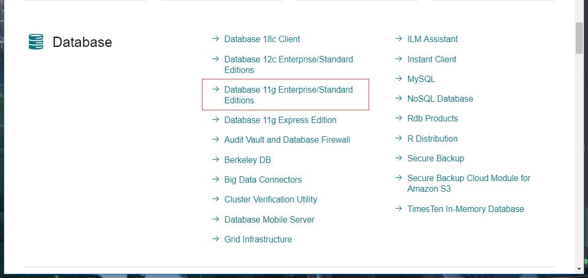


### 2、安装

- 创建oraInst.loc文件，放到/etc文件夹下

```
inventory_loc=/opt/oracle/oraInventory
inst_group=oinstall
```

```shell
su root

cd /usr/local/

#解压软件包

unzip linux.x64_11gR2_database_1of2.zip
unzip linux.x64_11gR2_database_2of2.zip

rm -rf linux.x64_11gR2_database_1of2.zip
rm -rf linux.x64_11gR2_database_2of2.zip

chmod 777 database

su admin 

cd /usr/local/database/

./runInstaller # 这步要是还不出现安装界面，到虚拟机的admin账号登陆进行安装
```

- Oracle图形界面选项展现关键步骤其他的默认
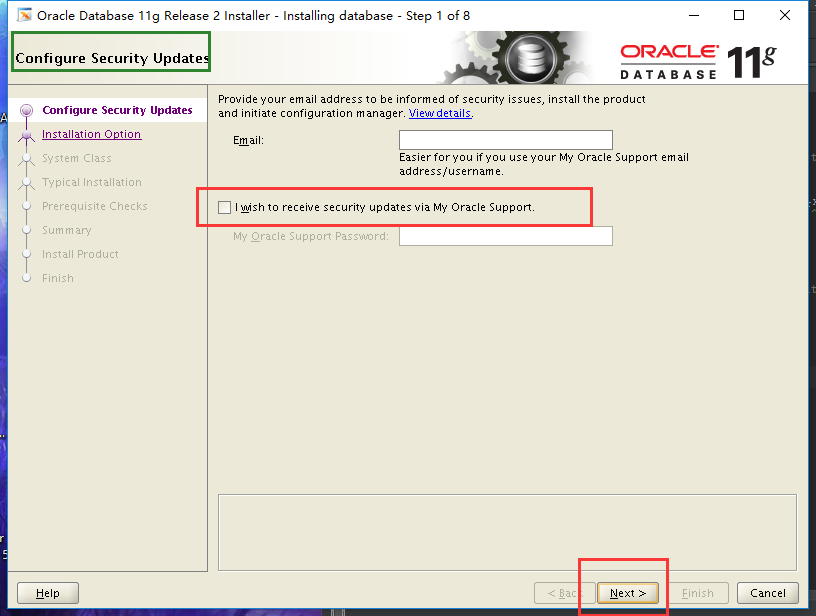

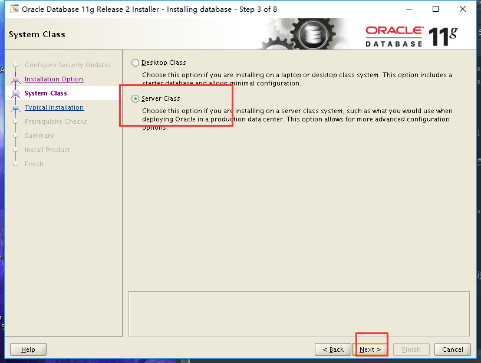

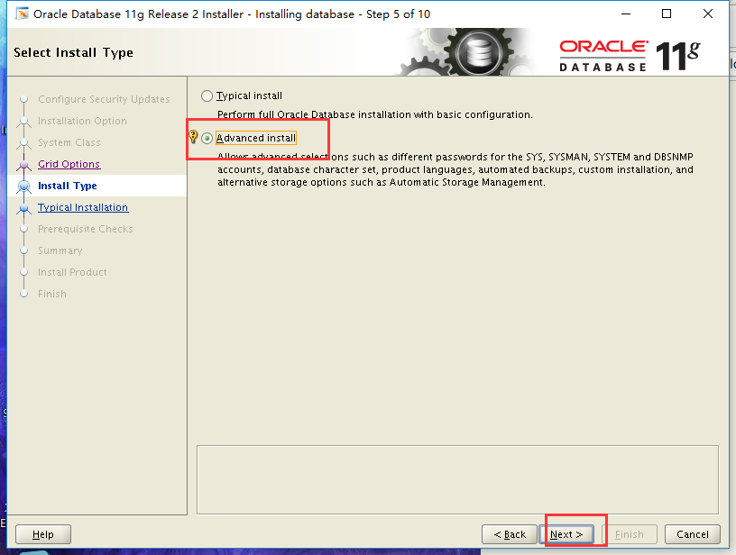

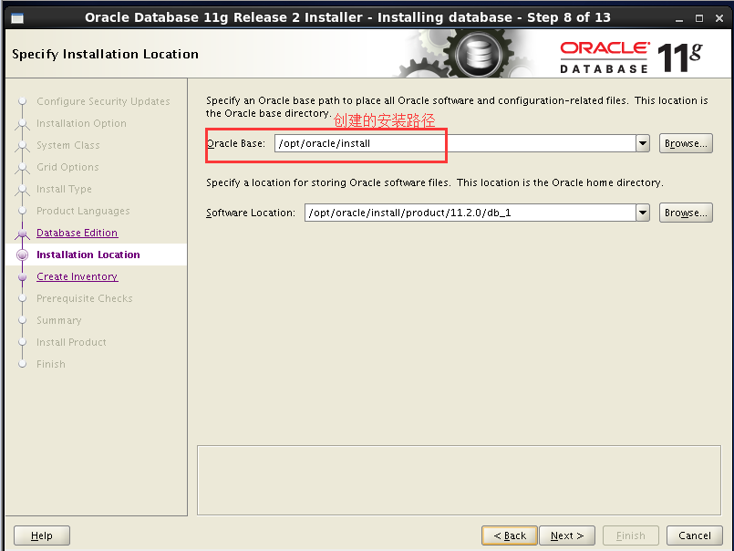

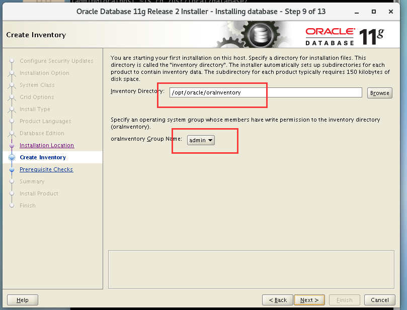

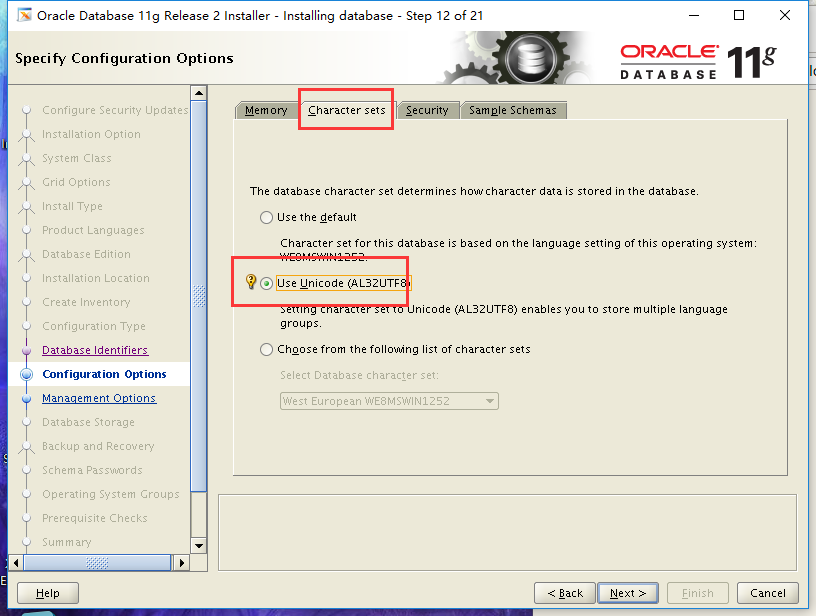

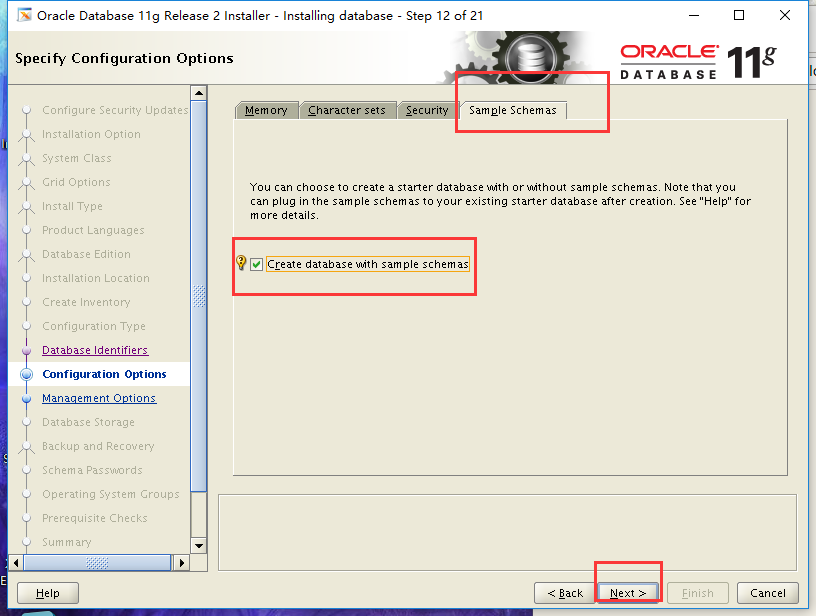

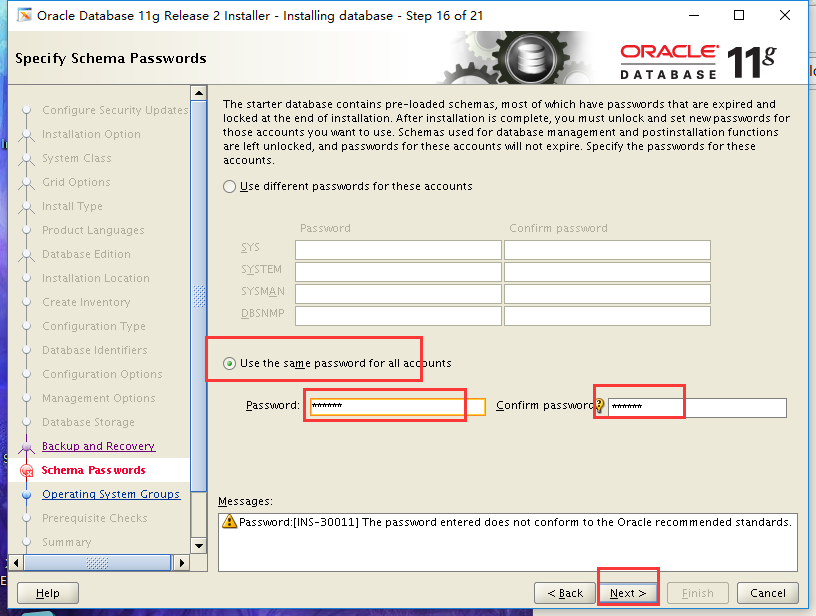

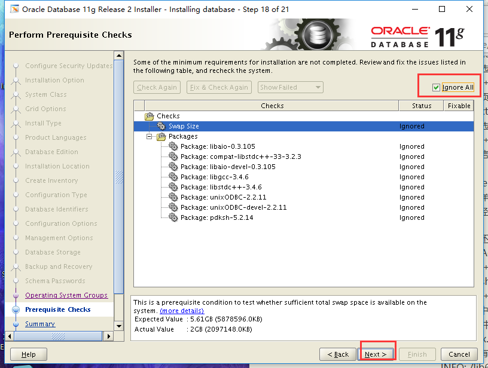

## 测试 <a name="Linux-04" href="#" >:house:</a>
```shell

cd /usr/local/src

rm -rf database

su oracle

sqlplus / as sysdba  #登陆oracle
```
