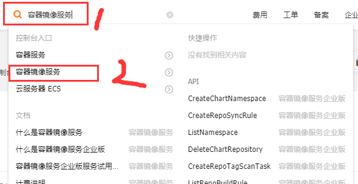

总操作流程：
- 1、获取加速连接
- 2、配置
- 3、测试

***

## 获取加速连接

> 阿里云的加速连接

[](https://cr.console.aliyun.com/cn-hangzhou/instances/mirrors)




## 配置

> 修改配置(配置一个阿里云的镜像加速)

```shell
vim  /etc/docker/daemon.json
```

```json
{"registry-mirrors":["https://xxx.mirror.aliyuncs.com"]}
```

> 修改配置(配置多个的镜像加速)

```shell
vim  /etc/docker/daemon.json
```

```json
{
    "registry-mirrors":[
                        "https://xxx.mirror.aliyuncs.com",
                        "https://dockerhub.azk8s.cn",
                        "https://reg-mirror.qiniu.com",
                        "https://registry.docker-cn.com",
                        "http://hub-mirror.c.163.com",
                        "https://docker.mirrors.ustc.edu.cn"
                       ],
                       "experimental":true
}
```

- Azure 中国镜像: https://dockerhub.azk8s.cn
- 七牛云加速器: https://reg-mirror.qiniu.com
- Docker中国区: https://registry.docker-cn.com　　 
- 网易: http://hub-mirror.c.163.com
- USTC: https://docker.mirrors.ustc.edu.cn

> 重启服务

```shell
systemctl daemon-reload
systemctl enable docker
systemctl restart docker
```
## 测试

> 下拉镜像

```shell
docker pull centos:7.6.1810
```

> 查看镜像

```shell
docker images
```